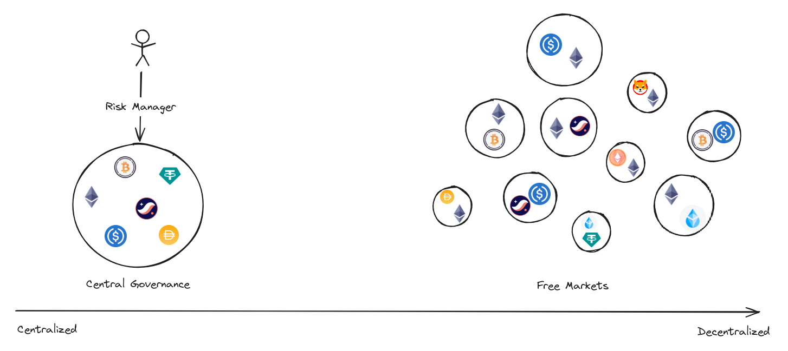
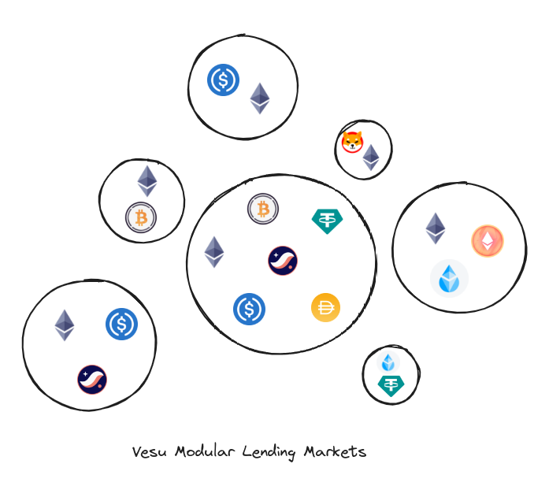

## DeFi’s Beginnings and Constant Evolution

In the ever-evolving landscape of DeFi, the paradigms of traditional financial services continue to be fundamentally challenged and redefined. Arguably, DeFi’s biggest and earliest widespread breakthroughs were the decentralized exchange (DEX) and on-chain borrowing and lending platforms. The evolution of the DeFi lending space has been marked by significant milestones, beginning with the launch of ETHLend in 2017. ETHLend introduced a peer-to-peer lending model on the blockchain, eliminating intermediaries and using ether as collateral, making lending more accessible and efficient.

Aave and Compound expanded on ETHLend's foundation, introducing liquidity pools and features like over-collateralization and flash loans, which revolutionized DeFi lending by offering more efficiency and composability. The pooled liquidity model further simplified the lending and borrowing process, ensuring security and ease of access for users. Compound is also known for its governance model which was one of the first to emphasize a decentralized decision-making process, as well as bringing the idea of “yield farming” mainstream.

The DeFi lending space continued to evolve with the introduction of adaptive interest rate models, oracle-less designs, and permissionless pool creation. The latter has been pushed by platforms like Morpho and represents the latest advancement in DeFi lending. It allows for the creation of new lending pools by anyone without a central governance unit deciding on supported assets and other risk parameters.

Lending protocols have become essential to any DeFi ecosystem and have continually rolled out efficiency advancements over the years. In today’s protocols, features like pooled liquidity, flash loans, and risk-mitigation techniques are commonplace. On the other hand, one can see two distinct design approaches with respect to how risk parameters are managed.

## DeFi Lending Market’s Two Primary Designs

Despite the multitude of parameters that can be tweaked in constructing different on-chain lending protocol designs, one element that cleanly segregates the market into two distinct camps is how the protocol ultimately handles risk management. The two competing approaches can be described as:

- **Central governance**: risk management is controlled by a central governance unit, generally a DAO, where parameters often are voted on, rolled out, and managed in a top-down manner (ex: Aave, Compound)
- **Free markets** (ungoverned): Protocols that actively repel and eschew central governance due to the attack vectors they enable and instead simply rely on smart contracts to adjust risk parameters and the free market (the users) to handle their own risk management (ex: Morpho Blue)

### Central Governance Model

The DAO-driven model relies on smart contracts for custody and general market mechanisms, yet also reintroduces central intermediaries to manage risk parameters. This hybrid model has allowed early lending platforms to create a moat of liquidity and users, yet it is also prone to shortcomings highlighting the challenge of scaling in a semi-decentralized context.

The arguments for a centrally governed model are that it enables the DAO to elect specialists to monitor on-chain activities and risk parameters that normal community members either will not or are incapable of doing. Protocols that have adopted this model typically defer to the specialist to adjust their risk parameters, ex: Loan-to-Value (LTV) ratios, as the market dictates. This approach not only aids in maintaining a unified liquidity pool but also ensures a “hands-off” experience for users who entrust the specialist with risk management on their deposits. In scenarios where the market environment deteriorates, it falls upon the specialist and the DAO to modify the protocol's parameters to better align with the changing conditions.

Despite its advantages, the central governance model of risk management is not without its shortcomings. DAOs, while pioneering in the DeFi space, are not immune to the operational, cyber and human risks that plague traditional organizations. Additionally, smart contract powered governance systems are vulnerable to the same design and technical flaws as the lending protocol itself as witnessed by past exploits resulting in losses of hundreds of millions USD. Furthermore, the politics within DAOs often mirror those of traditional entities, challenging the notion of neutrality and creating barriers to entry for newcomers. This political dynamic, coupled with governance bottlenecks, can significantly hinder the DAO's ability to make efficient capital allocation decisions, thereby limiting market scalability.

### Free Markets Model

The current alternative to the central governance model can be described as a hands-off, free-market approach to handling risk. The exploration of free market principles within the lending protocol landscape introduces a dynamic where lenders are empowered to navigate their own risk/reward pathways, essentially allowing market forces to dictate the equilibrium of risk parameters. This model hinges on the belief that free markets are better at allocating capital than any form of central governance and that only neutral, aka un-governed, technology empowers truly free markets.

Lenders and borrowers, under this regime, are granted the autonomy to select their liquidity pools based on personal risk tolerance or create new pools if the existing ones are not compliant with their tolerance. As one would expect, this creates a diverse array of lending and borrowing scenarios, catering to the varied needs of users.

At the protocol level, the absence of overarching governance simplifies the foundational codebase, making it more robust and secure. This design philosophy aims to streamline the core functions of the protocol, relegating complexity to use case specific peripheral modules.

However, the free market approach is not without its challenges. One significant issue is the fragmentation of liquidity, which can undermine capital efficiency. Isolated pools, while offering tailored risk/reward profiles, may struggle to achieve the same level of market penetration as their monolithic counterparts, primarily due to the need for continuous rebalancing across pools in order to optimize both borrowing cost and income from supplying assets. The requirement for borrowers to provide non-yielding collateral in many isolated markets exacerbates this issue, contrasting with monolithic models where assets can serve dual purposes—acting as collateral while still earning yield. The limitation on capital efficiency from the user perspective cannot be overstated, as users are more likely to make their decisions based on easy-to-comprehend KPIs rather than the nuanced trade-offs involving pooled vs. isolated liquidity.

## Introducing Vesu

Vesu, DeFi’s latest progression in the on-chain lending space, is a pioneering platform designed to facilitate fully permissionless, over-collateralized lending agreements. With its ambitious design, Vesu looks to combine the best aspects of both worlds: a liquidity monolith with permissionless, multi-asset lending compartments aka lending pools. Risk is isolated across lending pools and governance delegated to these pools individually. Vesu thus implements the free markets approach in that no central governance exists and lending pools can be created permissionlessly. Through its modular lending pool design, Vesu allows for a large degree of flexibility in terms of expressing different lending arrangements including a strict two asset design and more capital efficient multi-asset pools as known e.g. from Aave.

Moreover, one of Vesu’s biggest differentiators is the concept of extensions akin to Uniswap v4 hooks, empowering developers to create entirely new lending experiences. This flexibility positions Vesu not only as a lending protocol but also as a foundational platform for the development of new lending protocols. Additionally, because it is permissionless and there is no central governance adding friction and politics, Vesu offers a truly neutral technology for “free market competition” amongst lending markets.

At its core, Vesu addresses the limitations of existing protocols while introducing innovative features that cater to the needs of a broad spectrum of users. Its modular, permissionless, and scalable architecture, coupled with a focus on simplicity and security, positions Vesu as a cornerstone of the next generation of DeFi lending platforms.