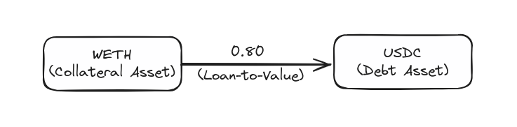
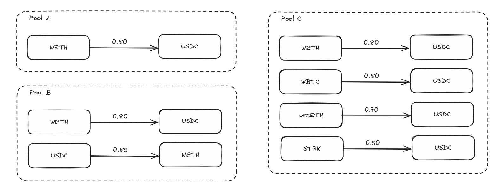
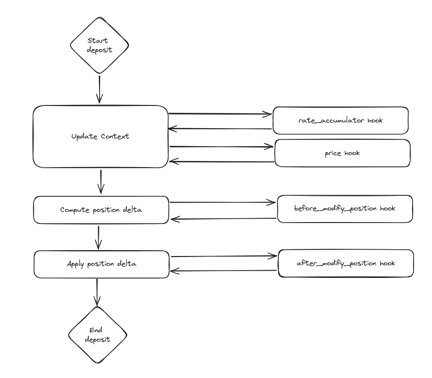

## Introduction

Vesu is the latest innovation in DeFi’s lending sector, enabling fully permissionless, over-collateralized lending markets that combine the strengths of both pooled and isolated liquidity systems. It integrates Aave-inspired lending pools to enhance efficiency, alongside the provision for permissionless pool creation, thereby removing the governance overhead found in existing lending markets and maximizing decentralization. At its core, Vesu delivers an experience reminiscent of Aave, offering users access to aggregated liquidity in lending markets. This framework facilitates the lending and borrowing of designated assets under specific conditions. However, Vesu diverges from Aave in its unwavering commitment to unpermissioned, truly neutral protocols. By adopting this stance, Vesu allows the “free markets” to coordinate around capital allocation instead of a central governance unit.

But beyond the “free markets” approach, Vesu also offers numerous technical advantages to provide users with the best user experience and rates. Let’s take a look at a few of these features.

## Lending Pool Design

Much like market leader Aave, Vesu is designed to support maximal liquidity pooling and capital efficiency. However, other than Aave, Vesu is a modular protocol and supports permissionless pool creation. While all liquidity is managed in a monolith, risk is isolated between pools. To better understand the benefits of such a design, let’s first back up and understand the different, specific elements that come together to form a lending protocol, such as a position, a lending pair, and a lending pool. 

The deposits and debts of the Vesu protocol are tracked by “positions”. A single position keeps track of the collateral assets supplied and debt assets borrowed by the position owner in a specific lending pair. Unlike platforms like Aave, which utilize a global account model to track interactions within a pool, Vesu allows users to maintain distinct positions for each lending pair, facilitating precise oversight of individual pairs. This design enables the enforcement of pair-specific loan-to-value (LTV) ratios, directly addressing the unique risk profiles associated with each lending pair. Opting for simplicity, Vesu's approach further reduces implementation complexity and increases security. 

A lending pair constitutes a one-way lending agreement, enabling participants to deposit a designated collateral asset (e.g., WETH) in exchange for borrowing a specific debt asset (e.g., USDC). In Vesu, this process is governed by a predetermined loan-to-value (LTV) ratio, underpinned by liquidation protocols to enforce compliance. Due to the permissionless nature of Vesu’s pools, lending pairs are configurable during the creation of a new lending pool.

Expanding from the foundation laid by lending pairs, lending pools facilitate more elaborate lending configurations through the amalgamation of multiple lending pairs. This arrangement allows for the pooling of assets, thus serving as collective liquidity for all constituent lending pairs within a pool. This design principle not only enhances capital efficiency but also maintains liquidity isolation across different lending pools, effectively segmenting risk (more on this later). 

Illustrating the versatility of lending pools:

- Pool A exemplifies the simplest form of a lending pool configuration, comprising a single lending pair. This arrangement allows for the borrowing of USDC against WETH collateral, adhering to a maximum loan-to-value ratio of 80%.
- Pool B introduces a bi-directional configuration, where collateral assets are interchangeable with debt assets. This mirrors the traditional financial practice of rehypothecation, wherein collateral assets are reused to augment capital efficiency. However, this practice inherently introduces additional risks through the creation of collateral chains. While Vesu lending pools do not inherently offer borrowers the option to opt out of their collateral being rehypothecated, the utilization of uni-directional lending pairs provides a nuanced level of control over the activation of collateral rehypothecation at the pool level.
- Pool C unveils a configuration that accommodates the borrowing of USDC with various collateral assets. Each lending pair within this pool prescribes a specific, collateral-dependent maximum loan-to-value ratio crucial for balancing capital efficiency against the safety nets provided by liquidation protocols.

## Risk Isolation

Isolated pools represent discrete lending environments that cater to a specific assortment of assets. This approach is notably different from a unified cross-collateral pool where any asset might be borrowed against another. While isolated pools do not eliminate risk, they do confine it to the individual pool instead of the protocol's entire total value locked (TVL). In this design, each pool has its own liquidity and risks, separate and apart from the other pools in the Vesu ecosystem. This mechanism acts as a form of risk containment for assets deemed as higher risk. Moreover, the advent of isolated pools allows for the introduction of a broader range of assets and the adoption of more daring operational parameters.

“Bad debt” occurs within a lending pool when the liquidation process fails to cover the total outstanding debt when selling the collateral tied to a position. This scenario is akin to traditional bank runs, where even the mere anticipation of bad debt, irrespective of its actual presence, can trigger a rush to withdraw the remaining liquidity from a pool. A proven strategy to counteract the risk of such liquidity crises involves the communal absorption of any developing shortfall among the liquidity providers of the pool. Vesu takes a similar approach. Consequently, any emerging shortfall is apportioned among the liquidity providers according to their share of the liquidity pool and executed within the same transaction that sees the shortfall arise. This method of immediate “bad debt” absorption stops a potential “bank run” scenario.

## Price Oracle

The assessment of a position's solvency is crucial for the stability and trustworthiness of lending protocols. This assessment hinges on whether the value of the collateral within a position is adequate to cover its debt should the borrower default. Traditionally, this solvency check is conducted using external data feeds known as oracles, which supply real-time price data. Recognized for their efficiency, oracles are central to most lending protocol designs. However, alternative methodologies exist that utilize internal mechanisms for price discovery. Within this framework, Vesu positions itself by outsourcing the oracle functionality to the extensions (more on that below) associated with each lending pool. This delegation of oracle price feeds to the extension allows pool designs to continuously innovate on the oracle solution.

## Lending Hooks

The introduction of "lending hooks" by Vesu represents a significant stride toward flexibility and innovation. Lending hooks operate much in the same way than Uniswap v4 hooks with triggers after certain actions. These hooks are essentially separate programs that are invoked at various stages of user interaction with the lending protocol. Specifically, Vesu offers the following lending hooks:

- price
- rate_accumulator
- before_modify_position
- after_modify_position
- before_liquidate_position
- after_liquidate_position

These hooks serve as entry points for user-defined custom logic and functionalities, ranging from oracle price feeds to interest rate calculations, position modifications and liquidations. The flexibility offered by these hooks allows developers to tailor lending pool behaviors to specific needs or market conditions, thereby enhancing the protocol's utility and appeal.

## Flash Loans

One of DeFi’s most innovative “unlocks” that separate it from TradFi has been the creation and evolution of flash loans. Flash loans, by design, are unsecured loans that must be repaid within the same transaction or the transaction is reverted. Vesu's particular integration of flash loans into its protocol allows flash loan users to access its protocol-wide liquidity rather than being confined to the liquidity available within individual pools. This access to global liquidity enables a plethora of advanced financial strategies, such as more efficient liquidations and sophisticated position rebalancing, that is not possible on other lending protocols. Another unique aspect of flash loans on Vesu is that users can utilize them without facing any fees. This fee-less approach underpins Vesu’s commitment to fostering an open and inclusive financial ecosystem. 

## Conclusion

Vesu aims to set a new standard in the DeFi lending space by offering a unique amalgamation of pooled and isolated liquidity systems to create a modular, efficient, and fully decentralized lending protocol. Drawing inspiration from the current market leaders, Vesu enhances user experiences by facilitating access to aggregated liquidity and permitting permissionless pool creation. Its modular pool design and the incorporation of strict risk isolation coupled with Uniswap v4-style hooks offer a flexible and secure environment for users to freely create and experience a new wave of lending markets. By championing the principles of permissionless innovation and free-market capital allocation, Vesu not only addresses existing challenges within DeFi lending but also paves the way for a more inclusive, secure, and user-centric future in decentralized finance.