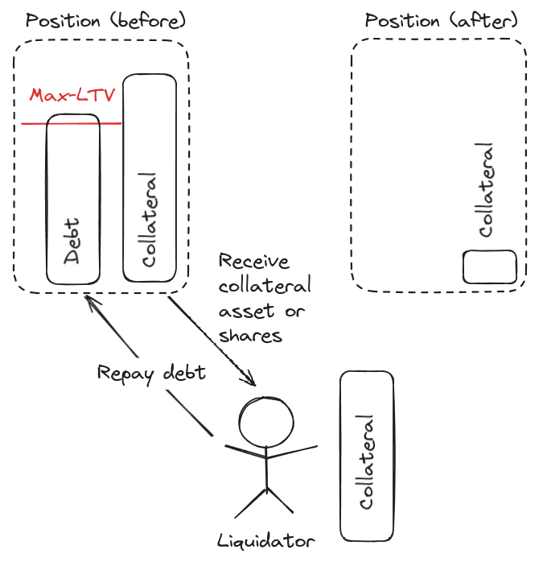

## Intro

Vesu is a fully permissionless lending protocol and is reshaping how lenders, borrowers, and developers envision the future of onchain lending. At its essence, Vesu is engineered to overcome the challenges faced by traditional protocols, providing a neutral, efficient, and secure platform for global and borderless lending markets. 

At the heart of Vesu’s approach is:

- a governance-free model ensuring efficiency and global access,
- permissionless, risk-isolating lending pools, 
- efficient, market-driven rates, and
- Uni v4-inspired lending hooks for unparalleled optionality.

Read more about Vesu's foundational concepts in our [previous article](../2024-03-15-vesu-protocol/index.md). This article will focus on this last bullet point around “lending hooks,” explaining what they are, how they’re implemented into Vesu’s design, and what ramifications this revolutionary approach may have on users as it looks to change the standards for onchain lending.

## Vesu Lending Hooks

One of Vesu’s biggest differentiators in the lending space is the concept of programmable extensions and lending hooks. Extensions are separate programs that can be created and implemented for individual pools. These programs are invoked via “lending hooks.” Hooks, a term popularized by [Uniswap v4](https://docs.uniswap.org/contracts/v4/overview), are code segments triggered during various stages within the extension/liquidity pool. These programmable features empower developers to use their creativity to launch entirely new lending experiences using the same battle-tested platform to settle lending transactions. The flexibility offered by these hooks allows developers to tailor lending pool behaviors to specific needs or market conditions, thereby enhancing the protocol's utility and appeal for all crypto users.

In the case of Vesu, hooks integrate into each specific pool through distinct triggers initiated by user actions. Specifically, Vesu offers the following hooks

- price
- rate_accumulator
- before_modify_position
- after_modify_position
- before_transfer_position
- after_transfer_position
- before_liquidate_position
- after_liquidate_position

These hooks serve as entry points for the extensions to implement customized logic and functionalities, ranging from interest rate calculations to position modifications and liquidations. At launch, Vesu will provide pools with a “baseline” setting, entitled the “factory extension.” This factory extension is created by the Vesu team and audited together with the Vesu protocol. Below, we review the features encoded in the factory extension and their implications for a lending pool and its users.

## Factory Extension

### Adaptive Interest Rates

Interest rates serve as a pivotal mechanism in lending markets, facilitating the alignment of supply and demand for specific assets. The primary aim of a lending market is to enable the efficient discovery of an equilibrium rate through the interplay of supply and demand. This is especially true for Vesu’s “free market” approach to lending pools. Consequently, the design of an interest rate model is fundamental to the architecture of any lending market. Because of that, a diverse array of interest rate models have been explored, with most relying on a governance mechanism to fine-tune the interest rate parameters to changing market conditions. This is inefficient and problematic as it adds centralization vectors in the protocol design instead of allowing markets to arrive at an equilibrium.

Vesu removes reliance on governance processes for rate adjustments or the fine-tuning of rate model parameters. Instead, the factory extension adopts an autonomous, adaptive interest rate model. This model is composed of two principal components: a utilization-based interest rate curve and a controller mechanism designed to modify the interest rate curve in reaction to market imbalances. While adaptive models represent a relatively new DeFi frontier, the chosen controller design has been in use in [Fraxlend markets](https://docs.frax.finance/fraxlend/fraxlend-overview) and has offered robust, market-driven rates across a variety of market regimes.

The factory extension's specific controller design is predicated on a half-life growth (decay) rate. The model's curve controller dynamically adjusts the maximum interest rate and the target rate based on the time-weighted deviation of current utilization from the target utilization. The applicable interest rate is then determined from this adjusted curve, taking into account the present utilization level. This mechanism underscores the model's capacity to adapt to changing market conditions, thereby ensuring the lending market's responsiveness and resilience.

This model marks a significant shift towards fully automated, real-time interest rate adjustments, addressing market imbalances without human intervention. Beyond that, this governance-less approach epitomizes simplicity, favoring straightforward, proven strategies over complex, untested alternatives. By automatically adjusting the interest rate curve based on the utilization rate's deviation from a predetermined target, the model ensures adaptability and responsiveness to market dynamics, a critical feature illustrated in the provided diagram.

### Autonomous Oracle

The assessment of a position's solvency is crucial for the stability and trustworthiness of lending protocols. This assessment hinges on whether the value of the collateral within a position is adequate to cover its debt should the borrower default. This solvency check, for most lending protocols, is conducted using oracles, external data feeds that supply real-time price data. 

Similarly, the factory extension, through the “price” hook, uses the [Pragma oracle](https://www.pragma.build/) solution to inform the protocol about position solvency. Pragma is Starknet’s leading oracle solution and secures over $250M at the time of writing this article. Pragma distinguishes itself by offering a more decentralized and transparent design by pushing individual data points directly onchain allowing for the onchain aggregation through smart contracts. It thereby allows for the use of a variety of powerful aggregation methods, such as the median, TWAP or volatility. 

Furthermore, Pragma provides a richer set of contextual data—such as the number of active data providers and the timestamp of the latest data point—that enhances the reliability of the price feeds. This transparency and depth of data empower the Vesu factory extension to perform advanced sanity checks and implement oracle fail-safes, thus elevating the platform's resilience to inaccuracies or manipulations in price feeds.

The factory extension utilizes this rich data set in two pivotal ways. Firstly, it computes a robust oracle price using the Median aggregator, ensuring that outlier data points do not skew valuations. Secondly, it leverages contextual data to construct an oracle trust score, which evaluates the reliability of price feeds based on the diversity of data sources and the timeliness of data. This score is instrumental in determining whether prices are trustworthy or if the lending pool should be paused to protect against potential risks stemming from stale or manipulated data. 

### Liquidation Strategy

The management of insolvent positions through liquidation is a delicate balancing act in DeFi protocols between optimizing for lender and borrower protections. 
The strategy's design is notably pragmatic, allowing liquidators to purchase all or part of an insolvent position's collateral at a discount. This discount serves as an incentive for liquidators to participate in the process, facilitating the rapid recovery of debts and minimizing the probability for a shortfall affecting lenders in the market. 

By enabling partial liquidations, the Vesu factory extension addresses the challenge of liquidating large positions in markets where collateral or debt assets may have limited liquidity. This methodical approach ensures that insolvent positions can be gradually resolved, preventing sudden market shifts that could arise from the forced liquidation of large positions.

The liquidation strategy further allows a liquidator to receive collateral shares instead of assets. Thereby, the factory extension enables liquidations to function properly in the scenario where collateral assets are not available. While unlikely, this is possible in markets where the rehypothecation of collateral assets, as liquidity for borrowers of the same asset, is enabled.

### Bad Debt Redistribution

The liquidation strategy serves as the protocol’s main safeguard against a shortfall, or bad debt, incurred by lenders. While the strategy’s design focuses on safety for market participants, and in particular lenders, the possibility of bad debt events cannot be fully eliminated. In fact, the likelihood of such events is largely driven by the risk parameters of individual lending pools which for permissionless markets, like Vesu, is outside of the protocol’s control.

The factory extension thus implements an effective strategy for the redistribution of “bad debt.” If/when liquidations fail to cover the outstanding debt fully, this strategy employs a method of “socializing the loss,” a tactic found in many DeFi applications to mitigate liquidity run risks. This approach involves spreading the accumulated shortfall across the pool's liquidity suppliers, allocating losses in proportion to their share in the pool. This immediate redistribution of losses ensures that any shortfall is promptly reflected in each supplier's claim on the remaining assets, thus reducing the risk of panic withdrawals and preserving the pool's overall stability.

In essence, the factory extension's liquidation and bad debt redistribution strategies adhere to the principle of preferring simplicity over complexity, offering prudent measures designed to maintain liquidity and confidence within the lending pool ecosystem. By enabling manageable liquidation processes and equitable loss distribution, these mechanisms safeguard against the systemic risks posed by insolvent positions and potential liquidity crises, notably in a fully autonomous manner without requiring any form of external intervention.

### Pause Mode

This extension implements an autonomous Pause Mode mitigating potential financial risks and preventing liquidity crises, commonly referred to as a "bank run." The mechanism's primary objectives are to limit the accumulation of losses within a pool and to avert race conditions that can lead to such panics.
Central to this approach is the concept of measuring pool health through aggregate solvency, analogous to individual positions within the pool, and oracle liveness. The extension autonomously initiates a pause and, if necessary, a shutdown of a lending pool upon detecting an unhealthy state among any of its lending pairs.

Upon entering an unhealthy state, the pool transitions into a "pause" mode, during which interactions that could potentially worsen its financial health are restricted. Instead, activities that contribute to improving solvency - such as collateral deposits or debt repayments - are encouraged. This phase aims to allow the pool an opportunity to return to solvency within a specified recovery period. Failing to achieve solvency within this timeframe results in the pool entering a shutdown mode, which precludes the possibility of recovery. Instead, the shutdown mode enables an orderly withdrawal of deposited assets for pool participants.
In essence, this shutdown mechanism provides a systematic approach to winding down insolvent lending pools within immutable protocols, prioritizing the recovery of solvency where possible and facilitating an organized asset redemption process in cases where recovery is unattainable. 

## Conclusion

Through its unique governance-free model, permissionless lending pools, and the implementation of versatile lending hooks inspired by Uniswao v4, Vesu provides a neutral, efficient, and secure lending environment that addresses the dynamic needs of lenders, borrowers, and developers. The factory extension's adaptive interest rate model, reliable oracle design, and effective liquidation strategy underscore its commitment to optimizing user experience and market stability. Moreover, the bad debt redistribution and pause mode features reflect Vesu's proactive approach to managing financial risks and ensuring the protocol's resilience. As Vesu continues to evolve and its lending hook implementations further diversify, it stands poised to redefine the standards of onchain lending, offering a blueprint for future innovations in the DeFi space.