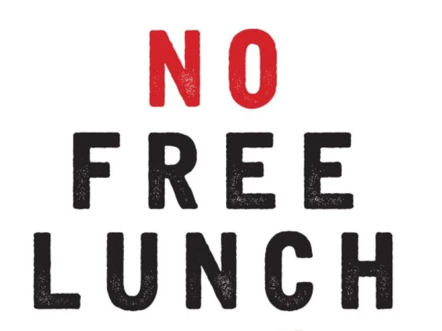
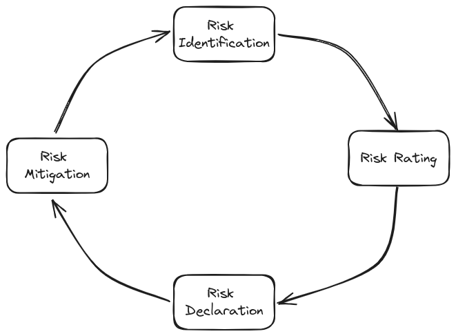
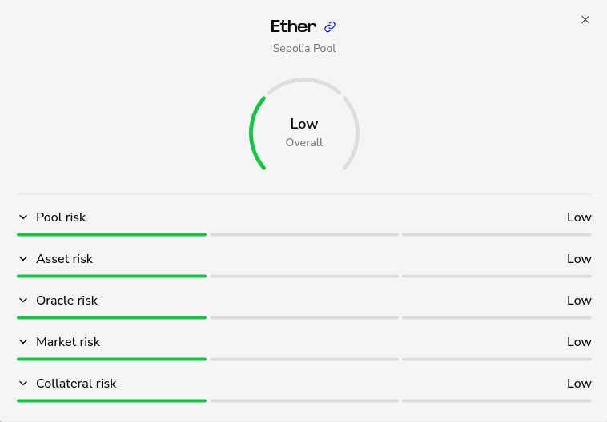

## Intro

Vesu democratizes access to financial infrastructure, enabling anyone to lend, borrow, and create new lending markets. This "free markets" approach places risk management squarely in the hands of users, underscoring the importance of transparency and informed decision-making. Technological vulnerabilities, counterparty risk, and market volatility are among the key concerns. Vesu thus equips users with a comprehensive _Risk Framework_ creating a transparent and safe environment for lenders, borrowers alike.

This article delves into the intricacies of Vesu's Risk Framework and the methodologies employed to assess and communicate risks, empowering users to safely navigate this new open and permissionless world.

## Main Idea Behind the Risk Framework

"There is no free lunch" is a key principle of finance hinting to the fact that financial opportunities generally come with a risk for investors. This also applies to DeFi and may even be amplified by the open and permissionless nature of these new markets. 

_Source: https://mises.org/mises-wire/why-there-no-free-lunch_

The inherent risks within DeFi lending markets are multifaceted, encompassing smart contract vulnerabilities, dependencies on external price oracles, market volatility and liquidity issues, and counterparty concerns, among others. These elements underscore the pressing need for a comprehensive risk framework capable of addressing the unique characteristics of DeFi protocols. Such a framework would not only facilitate the accurate measurement of risk for a specific lending pool but also transparently and intuitively communicate these risks to users. In doing so, it could significantly improve user's decision making and diminish barriers to entry for new users.

A successful risk assessment methodology for lending markets must be adaptive, reflecting the highly dynamic essence of the sector. It should provide a structured approach to identifying and quantifying risks, incorporating both quantitative and qualitative analysis to offer a holistic view of the exposed risk levels within a lending pool. Moreover, this framework must evolve in tandem with the innovation of new lending models and the DeFi ecosystem itself, accommodating new risks as they arise. 

Vesu’s risk framework is a step in that direction, offering a comprehensive methodology for evaluating and conveying the risks associated with depositing assets into a specific market, through an intuitive risk rating. This framework empowers lenders and borrowers to assess lending markets accurately, identify those that align with their risk profiles, and make informed decisions regarding their asset allocations. Developers can leverage the risk framework to make informed decisions when creating new lending markets or building extensions, ensuring the longevity and sustainability of the protocol.

## Methodology

Our methodology builds on the general risk concept that suggests that `risk = likelihood x impact`. It focuses on a single risk impact metric: `impact := "loss of funds"`. Risk assessment thus relates to the estimation of a risk event's likelihood.

The risk methodology involves a continuous process resulting in a) identification of relevant risk events, b) risk rating, c) communication of risks, and d) mitigation measures.

### a) Risk Identification

This step involves compiling a list of risk events related to a lending market and resulting in the aforementioned impact: "loss of user funds". Risk events can stem from the design, implementation, or configuration of a lending market or the respective asset and includes technical, economic, and counterparty risks. 

The main risk events, or categories respectively, identified in Vesu’s model are:

- __Pool Risk__: Pool risk includes the technical risks innate in smart contract code, including potential flaws in the framework or execution of the pool or its extension's logic. Additionally, counterparty risk in a pool can arise from central points of control within the pool's operational structure and the management procedures surrounding them.

- __Asset Risk__: This event deals with the risks tied to the specific asset being deposited into a pool. It covers the potential for flaws within the smart contract, as well as depeg risk. Furthermore, counterparty risks are highlighted, stemming from centralized control points within the token's framework, its dependencies, and the governance mechanisms that oversee these aspects.

- __Oracle Risk__: Decentralized lending mechanisms, such as Vesu's pool model, are susceptible to targeted economic attacks, particularly through price oracle manipulation. Malevolent actors may exploit the oracles by artificially inflating the prices of certain tokens. Such maneuvers involve the use of less liquid tokens to distort their value, subsequently leveraging this inflated valuation to maximize borrowings. This practice burdens the protocol with unsustainable debt, highlighting the critical need for robust security measures and vigilant monitoring of oracle activities to deter manipulation.

- __Market Risk__: The DeFi sector is no stranger to the whims of market volatility, which poses a substantial risk to participants. Sharp declines in the value of collateral can precipitate situations where collateral ratios plummet to 100% or lower, triggering liquidation cascades. Similarly, market liquidity is another driver of market risk effectively defining a market's ability to absorb liquidations. If not properly accounted for, these factors can result in failed liquidations leading to _bad debt_ and losses incurred by lenders in a market.

- __Collateral Risk__: This parameter highlights how risks can transfer across different assets via a sequence of collateralized positions or collateral chains. Even if the primary asset appears secure, it might absorb the risks associated with the assets used as its collateral, or the collateral asset's collateral. Collateral chains thus serve as an important risk translation mechanism that can only be mitigated by isolating collateral from liquidity assets in a pool.

### b) Risk Rating

Remember, `risk = likelihood x impact`. This step concerns allocating a risk rating to the identified risk events. This rating relies on estimating a risk event's likelihood, or how likely the event is to occur. For some risk events, the likelihood can be expressed as a statistical probability of occurrence within a given time period. However, in most cases, a qualitative approach is necessary due to a lack of data.

Our risk rating methodology uses a qualitative likelihood score consisting of four likelihood levels as shown in the table below.

| Likelihood | Description                                           |
| ---------- | ----------------------------------------------------- |
| Neutral ⬜ | Impossible for the risk event to occur                |
| Low 🟩     | Risk event is unlikely to occur                       |
| Medium 🟨  | Risk event is unexpected but possible to occur        |
| High 🟥    | Risk event is expected or unable to assess likelihood |

Applied to each of the identified risk events, these scores result in a multidimensional _Risk Scorecard_ providing full risk transparency on Vesu markets. We further aggregate these scores into a __holistic rating__ reflecting the likelihood for any of the risk events to occur in a certain market. This holistic risk rating caputures the __worst score across all events__. Consequently, a Vesu market's overarching risk rating mirrors the worst-case risk across all events.

### c) Risk Declaration

Risk declarations form the third step in our methodology. The objective of this step is to communicate risks in a transparent and intuitive way towards users and other stakeholders. For this purpose, the results of the risk assessment are published in a dedicated section in the Vesu docs and are thus accessible to anyone. Furthermore, the risk scorecards and holistic rating (see Screenshot below) for each market are available in the Vesu app for full transparency.

Users and the community thus have full visibility on the identified risks allowing everyone to make informed decisions when interacting with Vesu markets.

### d) Risk Mitigation

Vesu is a fully open and permissionless protocol allowing anyone to create new lending markets. The absence of protocol governance means that only the creator can control the risk exposed by a lending market. Risk mitigation thus has to be implemented on different levels as shown in the following table.

| Level    | Owner             | Mitigation Strategy                                 |
| -------- | ----------------- | --------------------------------------------------- |
| Protocol | Market creator    | Configure markets targeting appropriate risk rating |
| Frontend | Frontend provider | Curate list of markets with acceptable risk rating  |
| User     | User              | Deposit in markets with acceptable risk rating      |

As a frontend provider, we play an important role in facilitating access to the Vesu protocol in a secure and risk-aware manner. The Vesu frontend will thus curate the list of lending markets exposing only markets with a well understood risk profile. That said, since a frontend is only an optional access point, users may still chose to access non-listed markets directly, bypassing the Vesu frontend.

## Conclusion

The Vesu protocol is a fully open and permissionless lending protocol that empowers users to lend, borrow, and create new lending markets without restrictions. As with any lending platform, Vesu users face inherent risks. To address this, the Vesu Risk Framework introduces a risk assessment method inspired by established risk management best practices. At the heart of this methodology is a comprehensive risk rating system, designed to evaluate and convey the various risks associated with each lending market. Using this rating system, risks are transparently and intuitively communicated to users and the community, thereby facilitating well-informed decision-making.

