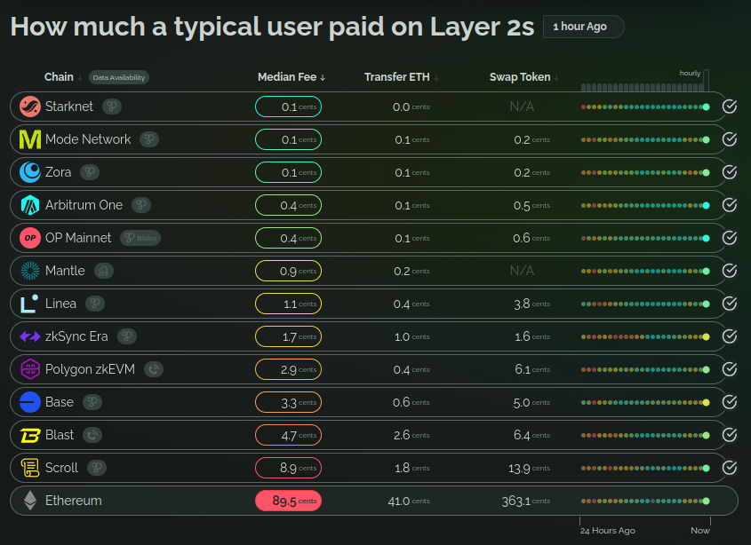
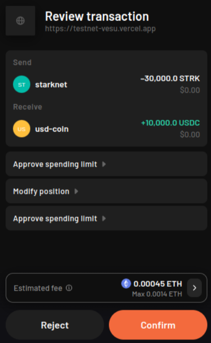
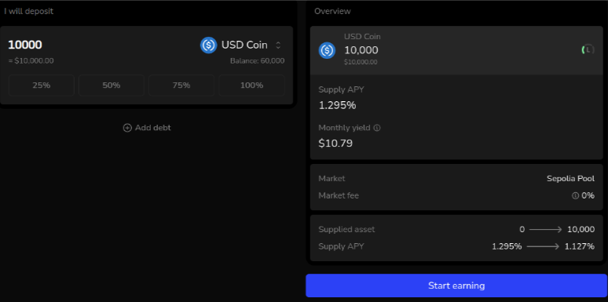

## Intro

The evolution of blockchain technology from its niche presence to a mainstream technology underscores a critical need: enhancing user experience (UX) to meet the standards of conventional digital platforms.

This requirement is even more pronounced in the decentralized finance (DeFi) sector, where current interfaces often present usability challenges and expose users to significant financial risks.

Vesu aims to offer a superior UX comparable to that of FinTech apps while leveraging the power of DeFi technology “under the hood”. To achieve this goal, Vesu has partnered with [Argent](https://argent.xyz), the leading Wallet on Starknet and Web3 UX champion.

## DeFi UX Challenges

The blockchain ecosystem traditionally demands a high degree of technical understanding from its users. Engaging with blockchain technologies involves navigating complex cryptographic processes and managing transparent yet intricate transactions, which can render DeFi apps practically unusable and deter novice users. 

The following presents a (incomplete) list of key UX challenges in DeFi apps:

* **Self-custody** requires users to securely store (and backup) their private keys in order to not lose access to their assets. This can be both a feature and a bug if users lack the appropriate tools e.g. for key recovery (hint to Web3 wallets).
* **Transaction fees** pose a significant barrier to interact with DeFi apps. The fact that each interaction with an app can be very costly and has to be paid in a blockchain’s native token makes it currently impossible for DeFi to scale.
* **Token spend approvals** are required for most interactions. Oftentimes DeFi apps require explicit approval transactions making the use less convenient and more expensive. Furthermore, unused approvals pose a significant security risk for users as evidenced by billions of USD hacked over the past years.
* **Transaction decoding**, in Web3 wallets, is required for users to understand the result of a signed transaction. This poses a significant risk of "blind signing," where users approve transactions presented as indecipherable hashes and thus mislead users into approving unintended actions potentially leading to "wallet drains."
* **Wallet Compatibility**: User deposits in DeFi apps are often tracked with internal positions. However, these positions are not represented using standard interfaces and thus are not compatible with Web3 wallets. As a result, wallets are not able to show a user’s positions across DeFi apps requiring users to connect to the individual apps.
* **Transparency on risks and fees** is mostly insufficient, meaning that users are unable to make informed decisions. As a result, users are at risk of incurring unexpected losses or costs when interacting with a DeFi app.

Clearly, these challenges are not solved by a single player but require careful orchestration across different layers in the DeFi stack such as wallets, protocols and apps. 

Argent Wallet has been a driving force in improving Web3 UX with innovations like “account abstraction,” “social recovery” and an early L2 roadmap.

Vesu too strives to be at the forefront of DeFi UX. Together with Argent we have therefore identified a number of UX principles that will benefit Vesu users with a seamless and secure lending experience. 

## Vesu UX Principles

### 1. Minimize gas fees

We built Vesu on Starknet because it offers the best “decentralization - security - scalability” (aka the blockchain trilemma) tradeoff. Starknet boasts the lowest transaction fees across L2s (see comparison below), and its roadmap offers a clear path towards unlocking more scaling improvements.

_Source: [GrowThePie](https://fees.growthepie.xyz)_

This means that Vesu users don’t have to worry about spending more on transactions than earning on deposits.

### 2. Transaction Bundling

On Vesu multiple actions are always bundled in a single transaction using Starknet’s native multicall protocol. For example, token spend approvals are always bundled with the actual position action on Vesu. 

With Starknet's native account abstraction and multicall features, this in fact results in minimal overhead and results in a seamless UX.

As a result, Vesu users are never required to sign, and pay for, multiple transactions even if an interaction requires multiple steps.

### 3. Revoke Spend Approvals

A key UX principle is automatically revoking unused token spend approvals when a user exits the app. Therefore, users are either asked to approve only a known amount of tokens spent, or an approval reset is appended to the transaction.

This proactive measure ensures that malicious bugs or attackers do not create openings for potential fund drainage, safeguarding users' assets more effectively than many other protocols.

### 4. ERC-4626 Deposit Tokens

Vesu pools, through the [factory extension](https://docs.vesu.xyz/blog/2024-04-03-vesu-lending-hooks#factory-extension), issue a yield-bearing token reflecting the deposited assets and the accumulated interest. This token implements the ERC4626 interfaces, a “tokenized vaults” standard that extends the ERC20 token standard and has found widespread use in the Ethereum ecosystem. Apart from the ERC20 transfer-related and metadata interfaces, this standard also enables convenience around wallet integration and overall UX improvements.

_Source: [Covalent Blog](https://www.covalenthq.com/docs/unified-api/guides/what-is-erc-4626-the-tokenized-vault-standard/)_

In order to unlock similar improvements and security across Starknet’s DeFi ecosystem we have created a Starknet Improvement Proposal (SNIP) which can be found [here](https://github.com/starknet-io/SNIPs/pull/85).

### 5. Transparency

Vesu values clarity and transparency in user interactions, especially regarding the critical aspects of risks, rewards, and fees associated with lending and borrowing activities. 

This commitment is summarized by the following principles:

* **Show effective APYs** and borrow cost, instead of current (irrelevant) numbers
* **Continuous risk assessment** and mitigation (read more [here](https://docs.vesu.xyz/blog/2024-04-23-vesu-risk-framework))
* **Full fee transparency** means Vesu users have visibility on all fees

By presenting this information user-friendly and intuitively, Vesu ensures that users are fully informed and can make decisions with a clear understanding of potential outcomes.

### 6. Optimistic Position Updates 

Vesu leverages optimistic position updates to enhance the UX and create a seamless user journey. This means that users see their position updates immediately, without waiting for the transaction to finalize on the blockchain. 

This real-time feedback eliminates the latency typically associated with the underlying blockchain transactions. If a transaction fails, these updates are automatically reverted, ensuring the information users see is always accurate and up to date.

This innovative feature improves general usability, bringing Vesu one step closer to the looks and feels of a FinTech app.

## Conclusion

The evolution of blockchain technology, particularly in the DeFi sector, demands an emphasis on user experience to drive wider adoption and improve security. 

Vesu mitigates the complexities and risks traditionally associated with blockchain and DeFi interactions by leveraging Starknet’s low transaction fees and unique capabilities, and systematically bundling user transactions. This approach not only simplifies the onboarding and transaction processes for users but also establishes a new standard for transparency and user engagement in the DeFi landscape.

As the Starknet ecosystem continues to evolve, platforms like Vesu are crucial in bridging the gap between cutting-edge DeFi technology and the usability standards expected by everyday users.