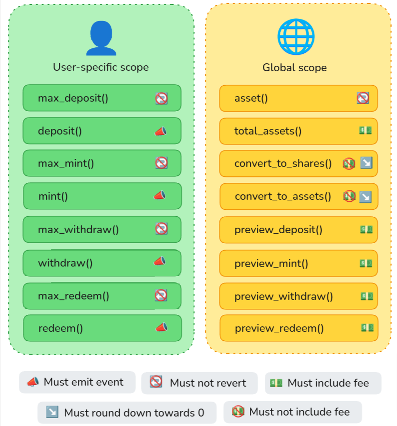

### Announcing SNIP-22: Tokenized Vaults on Starknet

Starknet is continuously evolving to support the diverse needs of DeFi applications and Vesu is at the forefront of these developments. Today we are happy to announce that the **Tokenized Vaults** Starknet Improvement Proposal, [SNIP-22](https://github.com/starknet-io/SNIPs/blob/main/SNIPS/snip-22.md), authored by the Vesu team, has been merged to the official repository of Starknet standards. This proposal aims to extend the existing fungible token standard, SNIP-2, by incorporating new functionalities for tokenized yield-bearing vaults, unlocking efficiency, security and better experience for Starknet developers and users.

### What is SNIP-22?

SNIP-22 introduces a standardized framework for creating tokenized, yield-bearing vaults on Starknet. These vaults represent shares of an underlying asset, allowing users to perform various operations such as deposit, withdrawal, and converting between shares and asset balances. Other than _rebasing_ tokens, like stETH or Aave's aETH, aUSDC, etc., SNIP-22 tokenized vaults accumulate yield through a growing conversion rate between vault shares and the underlying asset allowing holders to redeem their shares for an increasing amount of the asset. The proposal is heavily inspired by Ethereum's [EIP-4626](https://eips.ethereum.org/EIPS/eip-4626), which has found wide adoption in the Ethereum ecosystem.

")

### Motivation and Benefits

Tokenized vaults are a fundamental component of many DeFi applications, including lending markets, yield aggregators, and interest-bearing tokens. However, the current implementations often expose diverse and non-standardized interfaces, leading to increased integration effort and potential security risks.

SNIP-22 addresses these challenges by proposing a standard API for tokenized vaults that would:

1. **Foster composability**: Composability is achieved by well-defined, open interfaces and SNIP-22 has the potential to unlock similar innovation and growth than what SNIP-2 (or ERC-20) has brought for standard fungible tokens.
2. **Lower Integration Efforts**: With a standardized interface, developers of DeFi protocols, aggregators, and wallets can more easily integrate tokenized vaults, thereby reducing development time and costs.
3. **Enhance Security**: Standardization requires less custom code for integrations and adapters and thereby lowers the likelihood of introducing security vulnerabilities.
4. **Improve User Experience (UX)**: A consistent approach across different vaults ensures a smoother experience for end-users holding vault shares in their wallet or interacting with various DeFi applications.

### Key Specifications

Here are some of the essential aspects of SNIP-22:

- **SNIP-2 Compatibility**: All tokenized vaults must implement the SNIP-2 standard. This ensures that existing infrastructure and tools that already support SNIP-2 can seamlessly integrate with tokenized vaults.
  
- **Vault Metadata**: SNIP-22 requires vaults to expose a number of metadata including the optional SNIP-2 metadata and the address of the vault's underlying (`asset`).

- **Asset and Shares Management**: The standard defines a comprehensive set of functions for the retrievel of basic vault data (`total_assets` and `total_supply`) and the management of shares and assets (`deposit`, `withdraw`, `mint` and `redeem`).

- **Conversion and Preview**: Tokenized vaults must further provide functions for the conversion between shares and assets (`convert_to_shares` and `convert_to_assets`) and simulation or preview of interactions (`preview_deposit`, `preview_mint`, etc.).

### Security Considerations

While SNIP-22 provides a robust framework for creating and managing tokenized vaults, it is essential to note that the standard itself does not govern the safety of the underlying assets or the associated yield-generating strategies. It further does not ensure safety of certain implementations of the tokenized vault standard. Therefore, developers and users must carefully evaluate the specific implementations and the yield strategies to ensure consistency and security.

### Reference Implementation

Vesu's _vTokens_ are the first tokenized vaults on Starknet to implement the SNIP-22 standard. Our vToken implementation is audited by ChainSecurity and CairoSecurityClan and can be found [here](https://github.com/vesuxyz/vesu-v1/blob/main/src/v_token.cairo). While certain functions are specific to our use case, we hope that the implementation can serve other teams as a reference and unlock more innovation across Starknet's growing DeFi ecosystem.

### What's Next

The inclusion of SNIP-22 in Starknet's official standards repository marks the first step in growing the awareness and adoption of the tokenized vault standard on Starknet.

An important next step is to provide a neutral and secure reference implementation for the tokenized vault standard. Similar to the `ERC4626.sol` extension in their Solidity library, we will advocate for a SNIP-22 extension in OpenZeppelin's cairo-contracts library.

Furthermore, the [4626 Alliance](https://erc4626.info/) has done an outstanding job at creating awareness and pushing adoption of the tokenized vault standard on Ethereum and EVM chains. Their webiste and repository of existing vaults is a great place draw inspiration for battle tested vault architectures and new use cases. For Starknet it can serve as a great place to showcase our implementations and growing DeFi ecosystem.

Finally, we invite everyone to provide feedback and join the conversation on the [Starknet Community Forum](https://community.starknet.io/t/snip-22-tokenized-vaults/114457).

Happy building!