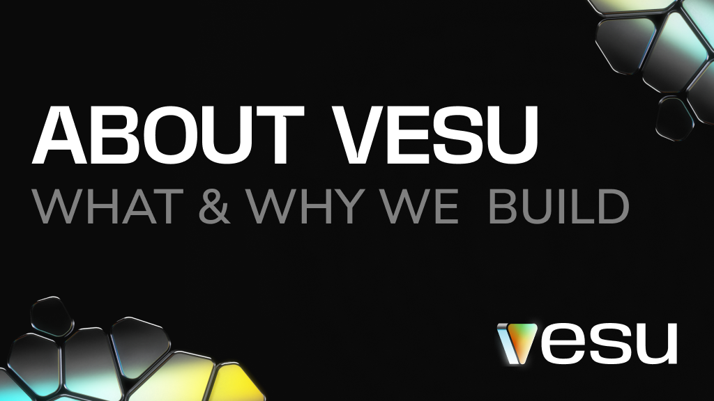
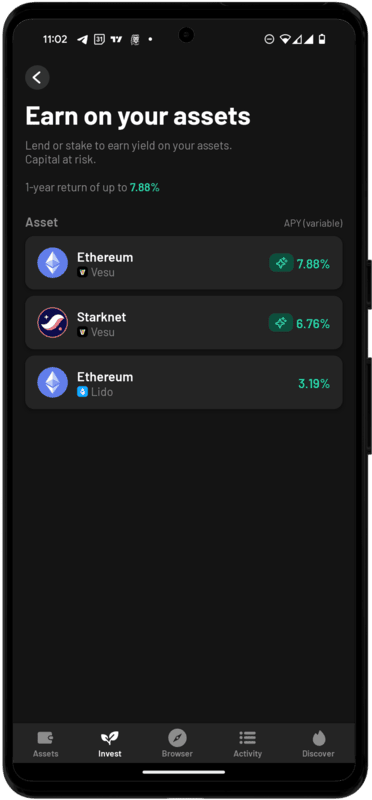
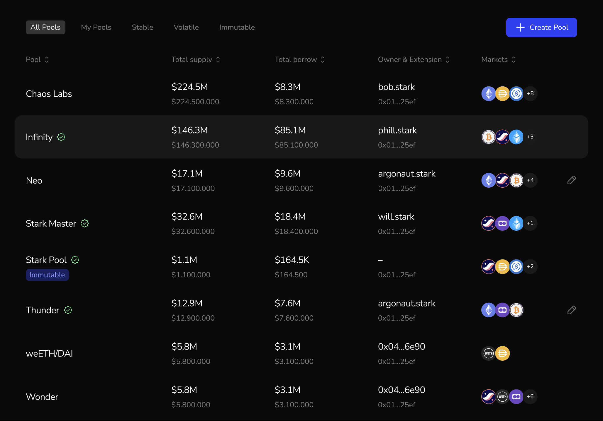

:::note
We know that DeFi can be complex, and while we’ve shared technical deep dives before, this post is different. Think of it as our manifesto — a clear, simple guide to understand Vesu and why we’re building it. We want to walk you through our purpose, our platform, and what we aim to achieve.
:::

# About Vesu: Why & What We Build

DeFi is transforming the future of finance, with the Total Value Locked (TVL) reaching $177 billion in 2023 (Source: DefiLlama). But compared to the trillions of dollars in Assets under Management (AUM) within traditional finance, there’s still vast room for DeFi to grow. Vesu is here to drive that expansion  with a platform that is **secure, user-friendly, and built for innovation**.

## Our Purpose

We are building an open platform that empowers both users and developers. By providing the foundational infrastructure and tools to create new features and integrate with other platforms, we are driving the evolution of decentralized finance.

## What We Offer

Our platform allows users to:

- Supply: Earn passive income by supplying your crypto assets.
- Borrow: Access capital without the need for intermediaries.
- Build with us: Create your own markets. Innovate and build on top of our infrastructure.

## Why choose Vesu?

Here’s what makes Vesu different and how we aim to improve DeFi:

- **Security**: Keeping user funds safe is our highest priority. We have [multiple audits](https://docs.vesu.xyz/security/security-audit) and a [$100,000 Immunefi bug bounty](https://immunefi.com/bug-bounty/vesu/information/). Our risk isolation design keeps problems contained within individual pools, ensuring platform stability. With our [risk framework](https://docs.vesu.xyz/risk/risk-framework), users can make informed decisions confidently. Our publicly known team is based in Europe, with strong security practices. We take these and many more steps to keep Vesu safe and secure.

- **User Experience**: We aim to provide a **FinTech-like experience** using Ethereum’s decentralization and security as the foundation. By leveraging Starknet features like multicalls and collaborating with partners like Argent, we make DeFi accessible and user-friendly. One example is the integration directly into the Argent smart wallet, allowing users to easily manage their assets and access yield within the app. For more, read our [UX principles](https://docs.vesu.xyz/blog/2024-05-17-vesu-ux-principles).

- **Lending Hooks**: Our customizable lending hooks allow developers to create unique lending markets and more. Inspired by Uniswap v4, these hooks allow developers to set up specific features for each pool, like custom interest rates, oracles, and security settings. Our lending hooks enhance composability, enabling new integrations and use cases within the DeFi space. Learn more in our blog post about [Lending Hooks](https://docs.vesu.xyz/blog/2024-04-03-vesu-lending-hooks).

- **Governance-Free & Algorithm-Driven**: Vesu operates without governance, relying purely on algorithms to make decisions. We trust mathematical models, not intermediaries, ensuring transparent and fair outcomes. For example, our dynamic interest rate model adjusts rates automatically based on market conditions, providing efficiency without manual oversight. Learn more in our first blog post [here](https://docs.vesu.xyz/blog/2024-03-06-welcome#free-markets-model).

## Next Steps

### Multiply Improvements & Automation Features

We are continuously refining the Multiply feature based on feedback from our community. Our goal is to make managing your positions even easier and more secure. Upcoming improvements will include automation features designed to help users maintain for example a healthy Loan-to-Value (LTV) ratio, reducing the risk of liquidation.

### Custom Pools Page

While it’s already possible to create new markets on Vesu, we are working on a Custom Pools page with an intuitive interface. This new frontend will make it easy for anyone to create and manage their own lending pools. An exclusive preview screenshot is available below.

## Conclusion

In a rapidly evolving DeFi landscape, Vesu stands out as the most aligned lending market on Starknet, built with a focus on decentralization, security, and user empowerment. By embracing core crypto values like permissionless innovation and transparency, Vesu gives users full control over their assets.

Whether you’re looking to earn yield, access liquidity, or create new custom markets, Vesu is the platform for you.

We’re always looking to improve and innovate. Your feedback, ideas, or collaboration could help shape the future of Vesu. 

Join us, share your thoughts, and let’s build the future of finance together!

- Follow us on X: https://x.com/vesuxyz
- Join our Discord: https://discord.com/invite/G9Gxgujj8T
