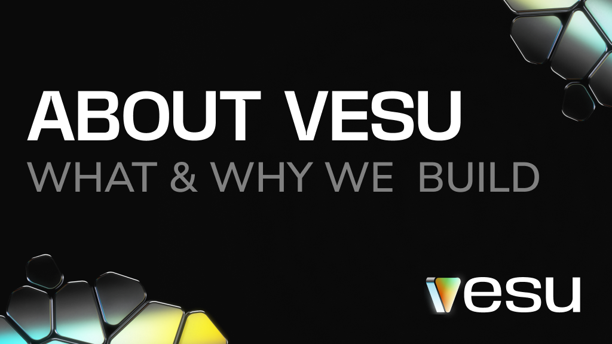
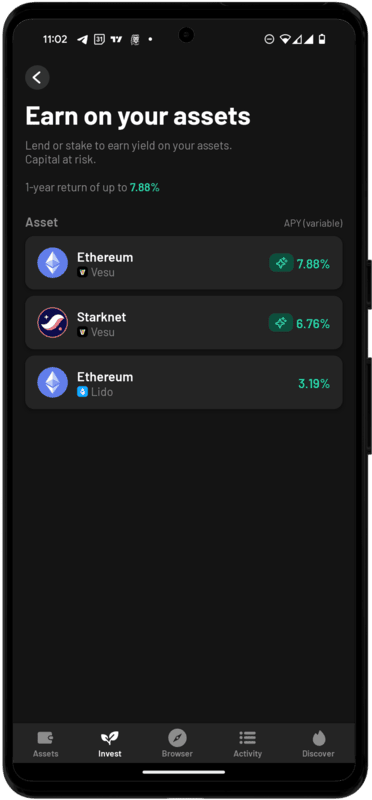
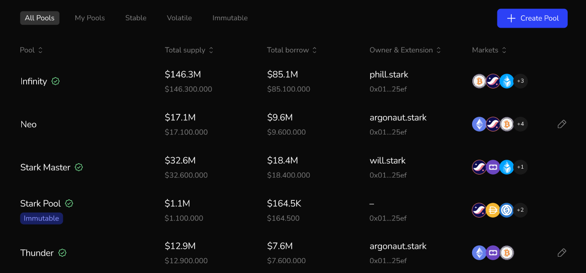

:::note
In this post, we’ll walk you through what sets Vesu apart, our purpose, and the key features we’re bringing to life.
:::

# About Vesu: What & Why We Build

DeFi is transforming the future of finance, with the Total Value Locked (TVL) reaching $177 billion in 2023 (Source: DefiLlama). But compared to the trillions of dollars in Assets under Management (AUM) within traditional finance, there’s still vast room for DeFi to grow. Vesu is here to drive that expansion  with a platform that is **secure, user-friendly, and built for innovation**.

## Our Purpose

We are building a secure lending platform that opens decentralized finance to everyone.
Lenders and borrowers gain access to optimal market conditions, backed by a user experience that rivals leading FinTech platforms.

With Vesu's robust infrastructure and developer tools, we’re driving the evolution of DeFi—empowering developers to innovate, create new features, and seamlessly integrate with other platforms.

## What We Offer

Vesu allows users to:

- Supply: Earn passive income by supplying your crypto assets.
- Borrow: Access capital without the need for intermediaries.
- Build with us: Create your own markets. Innovate and build on top of Vesu’s infrastructure.

## Why choose Vesu?

Here’s what makes Vesu different and how we aim to improve DeFi:

- **User Experience**: Vesu delivers a FinTech-like experience with the security of Ethereum, using Starknet features like multicalls to make DeFi accessible and user-friendly. With our direct integration into the Argent smart wallet for example, users are able to manage their assets and earn yield directly within the wallet. Learn more about our [UX principles](https://docs.vesu.xyz/blog/2024-05-17-vesu-ux-principles).

- **Better Rates**: Vesu’s rates are set by a dynamic interest rate model that automatically adjusts based on real-time demand, ensuring fair and efficient rates without the need for slow, manual governance. This approach allows the market to naturally balance supply and demand, so users always get the best possible borrowing conditions.
- **Better Risk Control**: All lending pools have separate risks that don’t affect other pools. Within a pool, depositors share risk only with others in the same pool. Each pool has a specific maximal loan-to-value (LTV) ratio, set by the pool creator, which is critical for enabling both capital efficiency and liquidation safety.
- **Innovation**: By creating a flexible and open infrastructure we enable continuous development and innovation, allowing both our team and external developers to build on top of Vesu’s platform. Examples of this include features like Multiply and the upcoming Automations.
- **Create New Market**: Anyone can create new markets tailored to their preferences, including custom settings like loan-to-value (LTV) ratios, interest rate models, or oracle choices, among others.
- **Security**: Keeping user funds safe is the highest priority. We have [multiple audits](https://docs.vesu.xyz/security/security-audit) and a [$100,000 Immunefi bug bounty](https://immunefi.com/bug-bounty/vesu/information/). The Vesu team is publicly known, with strong security practices. We take these and many more steps to keep Vesu safe and secure.

## Next Steps

### Multiply Improvements & Automation Features

We are continuously refining the Multiply feature based on feedback from our community. Our goal is to make managing your positions even easier and more secure. Upcoming improvements will include automation features designed to help users maintain for example a healthy Loan-to-Value (LTV) ratio, reducing the risk of liquidation.

### Custom Pool Creation

While it’s already possible to create new markets on Vesu, we are working on a Custom Pools page with an intuitive interface. This new frontend will make it easy for anyone to create and manage their own lending pools. An exclusive preview screenshot is available below.

### Vesu API

We are expanding our API to ensure smooth integration with other platforms and wallets. This will enhance the user experience by adding features like notifications for borrowers when their positions are at risk.

## Conclusion

In a rapidly evolving DeFi landscape, Vesu stands out as the most aligned lending market on Starknet, built with a focus on decentralization, security, and user empowerment. By embracing core crypto values like permissionless innovation and transparency, Vesu gives users full control over their assets.

Whether you’re looking to earn yield, access liquidity, or create new custom markets, Vesu is the platform for you.

We’re always looking to improve and innovate. Your feedback, ideas, or collaboration could help shape the future of Vesu. 
Join us, share your thoughts, and let’s build the future of finance together!

- Follow us on X: https://x.com/vesuxyz
- Join our Discord: https://discord.com/invite/G9Gxgujj8T
