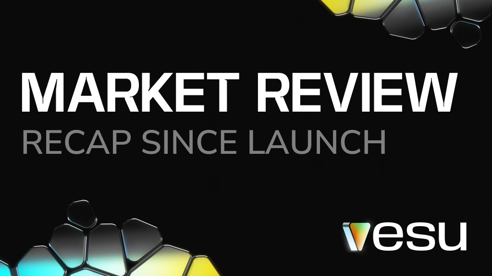
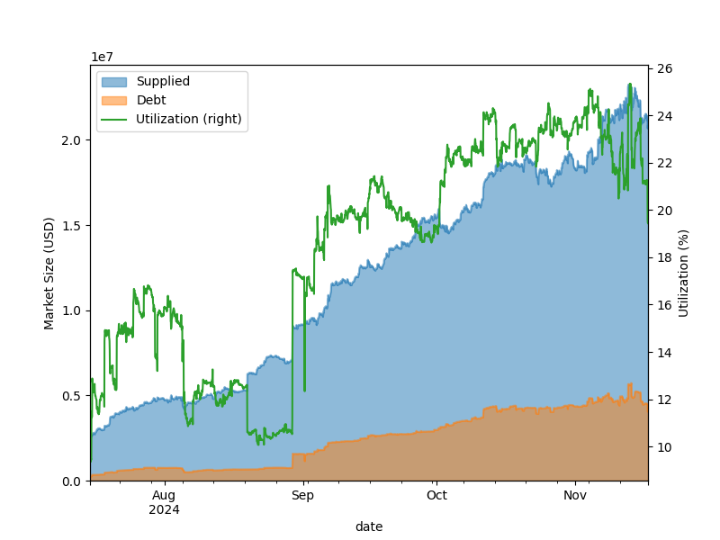
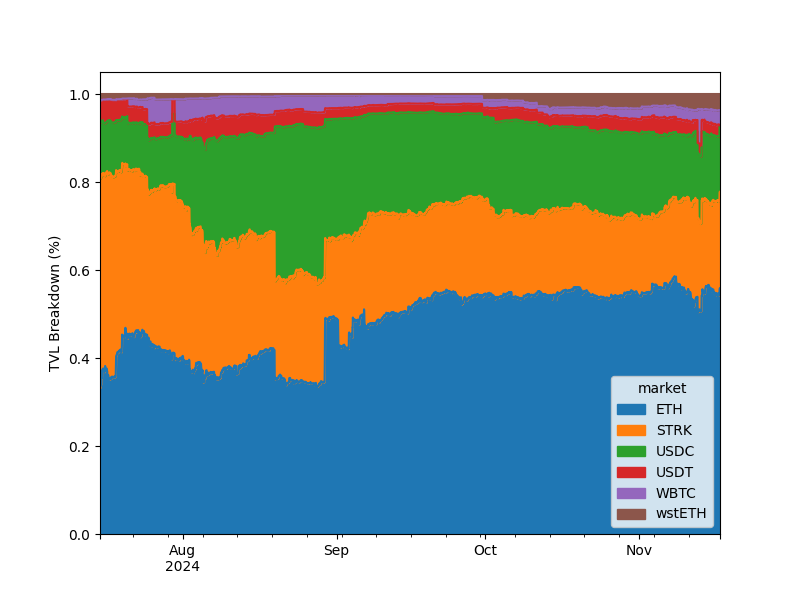
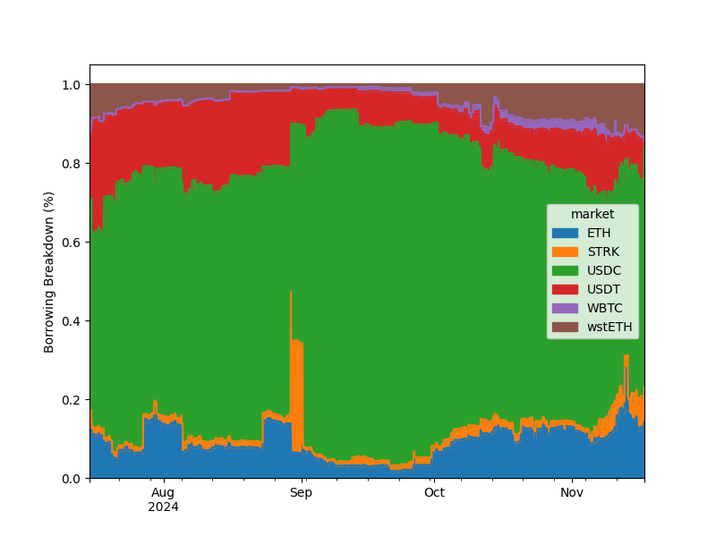
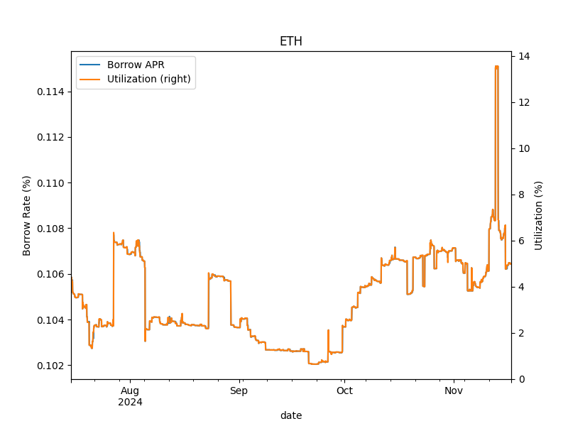
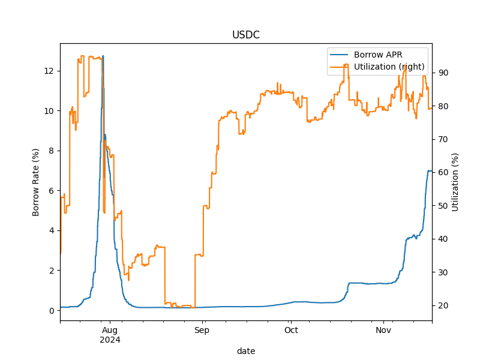
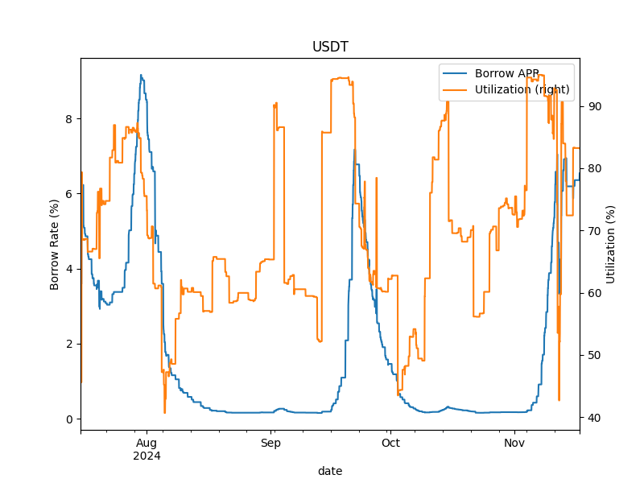
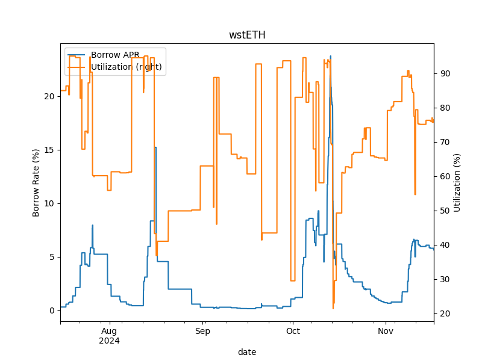
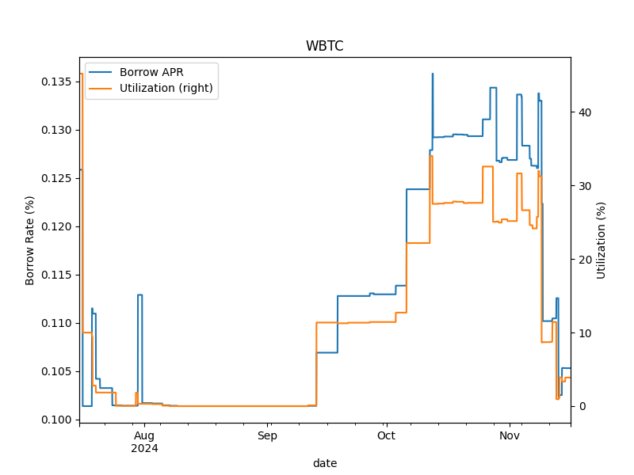
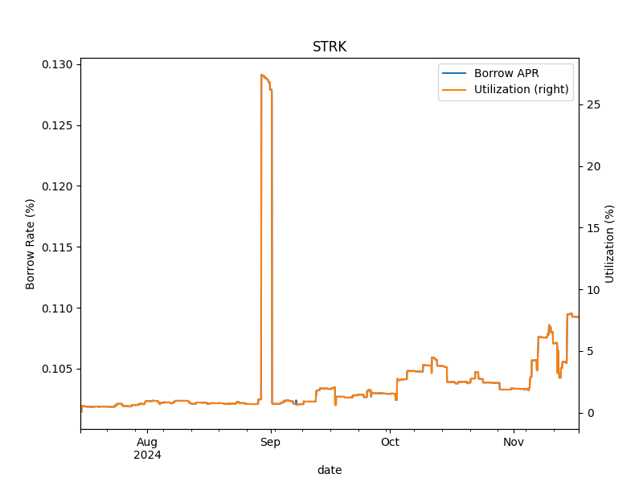

## Summary

Vesu has been live for more than four months and has grown to the fourth-largest DeFi protocol on Starknet. 
Time for a recap!

In this blog post, we will review the past four months of lending and borrowing activity on Vesu markets and the performance of the autonomous lending pools.

:::info
For a refresher on Vesu's autonomous lending pools refer to this [blog post](https://docs.vesu.xyz/blog/2024-03-15-vesu-protocol).
:::

## Market Overview

We start with an overview of the Vesu lending markets. 
Figure 1 below shows the evolution of the total value locked (TVL), total borrowed amount and average utilization on Vesu markets during the past four months.
We find that both TVL and total borrowed amount have grown consistently over the observed period arriving at about $22M TVL and $4.5M borrowed at the time of writing this post (note the primary y-axis scale of 10^7).
Similarly, the average utilization across all markets has more than doubled from about 10% to around 24% at the same time. This indicates that the liquidity on Vesu is increasingly being used by borrowers on Starknet establishing Vesu as an important component of the Starknet DeFi ecosystem.

_Figure 1: Evolution of liquidity, borrowings and average utilization on Vesu since launch._

## Market Breakdown

Next, we highlight the breakdown of Vesu markets in terms of their contribution to the overall TVL. Figure 2 gives the percentage breakdown across the six initial markets _ETH_, _STRK_, _USDC_, _USDT_, _WBTC_, _wstETH_. 
The first observation is that the overall TVL on Vesu is mostly driven by the _ETH_, _STRK_ and _USDC_ markets. These three markets combined account for more than 90% of the overall Vesu TVL at the time of writing this post.
The figure further shows that the _ETH_ market share has continuously grown since launch and is currently at over 50%. Over the same period the market share of _STRK_ has decreased significantly. To one part, these observations are driven by the market prices of the respective assets. However, they also reflect a consistent net inflow of _ETH_ into Vesu.

_Figure 2: Breakdown of TVL in Vesu markets since launch._

Similarly, let us also review the borrowing activity for the Vesu markets. Figure 3 shows the breakdown of borrowing activity, in USD, per the different markets. The figure shows that borrowing is highly concentrated around the _USDC_ market which peaked at more than 80% of total amount borrowed in September and currently accounts for around 60% of the outstanding debt. We further find that in recent weeks borrowing activity in _ETH_ and _wstETH_ has increased and, combined, currently represent some 25% of the total debt. On the other hand, both _STRK_ and _WBTC_ have not seen a lot of borrow demand which may be explained by a generally optimistic outlook on the respective markets and thus no interest in entering "short" positions.

_Figure 3: Breakdown of borrow activity in Vesu markets since launch._

In the following sections, we take a closer look at the individual markets.

## ETH Market Insights

Ethereum is the biggest Vesu market in terms of supplied liquidity. At the same time, we have seen that the borrow activity on the _ETH_ market is limited (it accounts for "only" about 15% of the overall debt outstanding). This is confirmed by Figure 3 which shows the _ETH_ utilization over time in orange (right y-axis) and the market's interest rate in blue (left y-axis). We find that the _ETH_ utilization remained consistently in the lower single-digit range throughout most of the observed period. This can be explained by the generally optimistic outlook on Ethereum over the past months with users unwilling to "short" the asset (which entering a borrow position in ETH effectively results in).

_Figure 4: Utilization and borrow rates in the ETH market since launch._

Furthermore, the _ETH_ market's borrow rate is indicated with a blue line and scale on the primary y-axis (left side). This blue line is hidden under the orange line for utilization for almost the entire observation period. This is due to the fact that utilization has been below the market's target utilization (which is 80%) throughout the period. Hence, the interest rate curve has not been adjusted by the _Curve Controller_ and the borrow rate has only "moved" on the linear range of the curve below target utilization. This relationship resulted in the _ETH_ borrow rate stay at very low levels close to the curve's 0%-utilization rate of 0.1%.

:::info
If you need a refresher on Vesu's adaptive interest rate model please refer to this [blog post](https://docs.vesu.xyz/blog/2024-04-03-vesu-lending-hooks#adaptive-interest-rates).
:::

## USDC Market Insights

Turning to the _USDC_ market we find a completely different picture as shown in Figure 5. Shortly after launch (in July 2024) utilization on the USDC market reached a level of more than 90% reflecting the strong demand for USDC as a borrow asset.

With utilization consistently above the market's target utilization of 80%, the _Curve Controller_ shifts the interest rate curve upwards at an increasing rate during the last week of August until the interest rate reaches a level of more than 12% by the end of August. At this point, the market's interest rate seems attractive enough for LPs to supply more USDC (and borrowers repay debt) thereby reducing the utilization again. As utilization falls below the market's target utilization, the _Curve Controller_ too starts to shift the curve downwards.

_Figure 5: Utilization and borrow rates in the USDC market since launch._

Similarly, in the second half of the observation period, utilization on the _USDC_ market has picked up again reaching a level of 80% and above by the end of September. Throughout the remaining period utilization fluctuates around some 85% utilization. In instances, where utilization exceeds the target of 80%, the _Curve Controller_ shifts the curve resulting in a slow but steady upward trend. By the end of the observation period interest rate reaches a level of more than 6% with a utilization at about its target of 80%.

These insights highlight the important role of Vesu's adaptive interest rate model in allowing the market participants to coordinate around the optimal use and allocation of capital. Note that in "traditional" DeFi lending markets, which do not make use of an adaptive interest rate model, "operators" manually update parameters in ad-hoc market interventions in order for the participants to find an equilibrium. This does not only result in less efficient markets but also introduces operational risks.

## More Insights

We here briefly discuss more insights gathered from the _USDT_ (Figure 6), _wstETH_ (Figure 7), _WBTC_ (Figure 8), and _STRK_ (Figure 9) markets. In both the _USDT_ and _wstETH_ markets we can find consistenlty high utilization resulting in regular _Curve Controller_ activity and shifting of the interest rate curve. In response, utilization generally adjusts downwards reflecting market corrections in terms of net liquidity inflows or repayment of outstanding debt.

_Figure 6: Utilization and borrow rates in the USDT market since launch._

_Figure 7: Utilization and borrow rates in the wstETH market since launch._

On the other hand, the _WBTC_ and _STARK_ markets highlight low utilization over the observation period indicating low borrowing demand. The interest rates on these markets are thus characterized by a perfectly synchronous relationship with the utilization due to fact that the _Curve Controller_ does not actively adjust rates.

_Figure 8: Utilization and borrow rates in the WBTC market since launch._

_Figure 9: Utilization and borrow rates in the STRK market since launch._

## Conclusion

Vesu proudly reflects on four months of steady growth and progress. In this blog post, we reviewed the performance of Vesu markets over the past months. Both lending and borrowing activity have consistently grown, with the average utilization reaching around 24% in November.

Both lending and borrowing activity varies greatly between the different markets with _USDC_, _ETH_ and _wstETH_ being the most demanded borrow assets in terms of the outstanding debt. Utilization on certain markets has reached over 90% over sustained time periods. This has resulted in frequent adjustments of the interest rate curve through Vesu's autonomous _Curve Controller_.

This blog post has provided important insights into the dynamics of Vesu markets. The data presented validates that Vesu's adaptive interest rate model is capable of autonomously balance supply and demand of liquidity on Vesu markets allowing the participants to efficiently and safely coordinate around the optimal allocation of capital on Starknet.