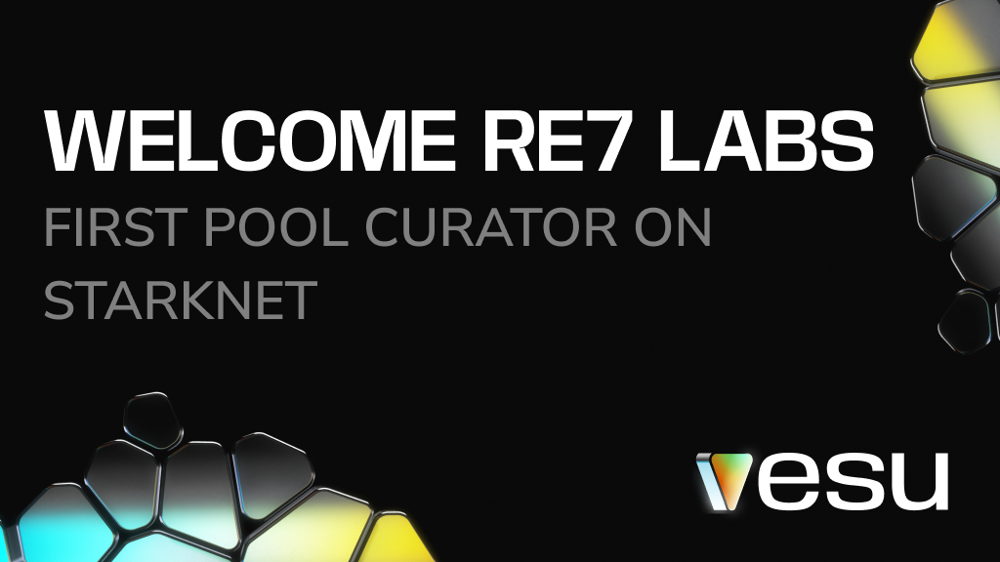

## **Next Level DeFi with Re7 Labs**

We’re thrilled to welcome **[Re7 Labs](https://x.com/Re7Capital)** to the Starknet ecosystem! As a leading investment firm, they are known for their expertise in crypto yield strategies and DeFi. Re7 Labs is recognized as one of the top vault curators, having played a key role in driving TVL to $3B on Morpho.

Joining Vesu as the first pool curator thus signifies a major step for the entire Starknet ecosystem. This collaboration will allow Vesu and Starknet to expand to new use cases and further drive adoption and growth.  

### **Introducing The New Pools**

Right in time for the launch of STRK staking and the new liquid staking token (LST), Re7 will create three new pools on Vesu:

- **Re7 STRK/xSTRK**  
Collateral Assets: xSTRK  
Borrow: STRK 
    
- **Re7 STRK/sSTRK**  
Collateral Assets: sSTRK  
Borrow: STRK  
    
- **Re7 USDC**  
Collateral Assets: ETH, wstETH, wBTC, STRK  
Borrow: USDC 
    
With these pools, Re7 Labs and Vesu are unlocking new use cases for the LST from Endur.fi and Nimbora. By adding liquidity and enabling innovative DeFi strategies on a neutral platform, we’re laying the foundation for a successful launch of STRK LSTs and fostering a healthy STRK staking ecosystem.

At Vesu, providing permissionless and secure access to liquidity has always been central to our mission. We’re thrilled to take this next step alongside our incredible partners!

### **What’s Next?**

The new pools are currently finalized and launched publicly together with Vesu’s new pools page in the coming days. At this point, everyone will be able to further support Starknet’s staking and LST landscape as well as to create new lending pools on Vesu.

If you’re interested in creating a lending pool for your community, we’re here to help!

Stay tuned for more updates as we continue to grow the DeFi landscape on Starknet.

**Links**  
**Vesu.xyz**: [Earn, Borrow, Multiply!](https://vesu.xyz/)  
**X/Twitter**: [Follow us!](https://twitter.com/vesuxyz)  
**Discord**: [Join the community!](https://discord.com/invite/G9Gxgujj8T)  