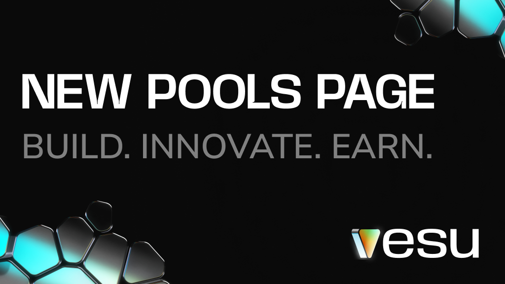
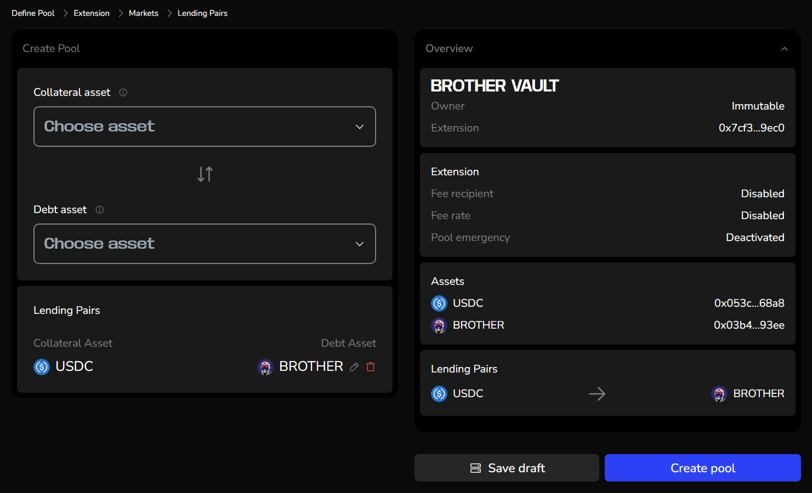

## The New Pools Page Is Here: A New Chapter for Vesu!

The wait is over: Vesu's new **Pools Page** is live! This update empowers anyone to create custom lending pools, opening up new opportunities for creators, curators, and users alike. 

### What’s New?

The Pools Page makes it easier than ever to create and manage lending pools. Anyone can now launch new markets, no technical expertise or approval from others required. You’re in control! Customize your pool to align with your vision and goals.

Choose to make your pool immutable or if you want to enable pool emergency procedures, giving borrowers and lenders extra trust in its stability & security. Prefer a flexible approach? Curate your pool as it grows and be able to adjust settings to meet evolving needs.

### Why Create Your Own Pool?

As the only neutral lending protocol on Starknet, Vesu serves as the ultimate launchpad for its thriving ecosystem. Unlock new possibilities:

- **Add Utility to Your Token**: Let your community earn yield or use your token as collateral.
- **Innovate and Experiment**: Launch markets for untapped assets, tailor liquidations or oracles, and fine-tune risk strategies.
- **Fuel Ecosystem Growth**: Attract users, capital, and game-changing use cases to push DeFi forward on Starknet.

Whether you're a community builder or an innovator, the new **Pools Page** equips you with everything needed to bring your ideas to life.

:::note
Creating a new pool is simple, but finding the right parameters to attract demand from both lenders and borrowers can be challenging. We’re here to help! Contact us via Discord for support with your new pool: https://discord.com/invite/G9Gxgujj8T
:::

### What’s in It for Users?

Vesu users also benefit from this update:

- **More Liquidity**: New pools mean new opportunities for earning and borrowing.
- **New Strategies**: Increase your STRK exposure with Vesu's Multiply feature.
- **Exciting Collaborations:** Re7 Labs and other upcoming curators bring innovation and expertise to the ecosystem.

We’re committed to unlocking the next level for DeFi on Starknet. With innovative products, expert curators, and expanding integrations, the journey is just getting started!

Discover all the new markets approved by the Vesu Team on [vesu.xyz/markets](https://vesu.xyz/markets

:::note

Make sure to familiarize yourself with the new pools. A detailed guide on what to watch out for will be available soon!
:::

### Get Started Today

Ready to dive in?
As user: Visit the updated **[Markets Page](https://vesu.xyz/markets)** page to explore the new pools launched by Re7 Labs.

As creator: Visit the **[Pools Page](https://vesu.xyz/pools)** now and take your DeFi journey to the next level.

Any questions, feedback or ideas for a new pool? Join us on Discord!

**Links**  
**Vesu.xyz**: [Earn, Borrow, Multiply!](https://vesu.xyz/)  
**X/Twitter**: [Follow us!](https://twitter.com/vesuxyz)  
**Discord**: [Join the community!](https://discord.com/invite/G9Gxgujj8T)  