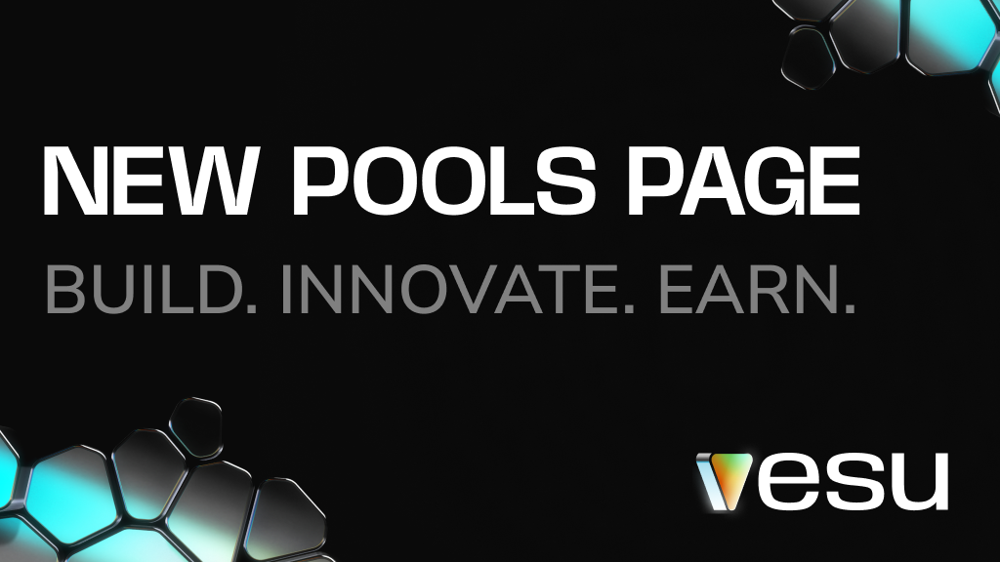
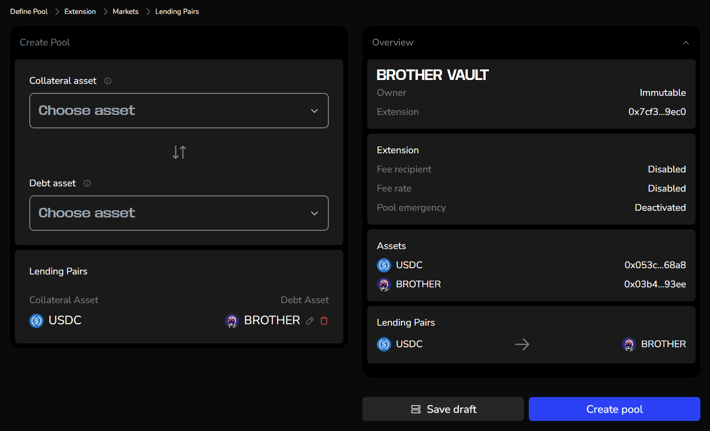

## The New Pools Page Is Here: A New Chapter for Vesu!

**The wait is over: Vesu's new Pools Page is live! This update empowers anyone to create custom lending pools, unlocking exciting opportunities for creators, curators, and users alike.** 

### What’s New?

The Pools Page makes it easier than ever to create and manage lending pools. Anyone can now launch new markets, no technical expertise or approval from others required. You’re in control! Customize your pool to align with your vision and goals.

Choose to make your pool immutable or if you want to enable pool emergency procedures, giving borrowers and lenders extra trust in its stability & security. Prefer flexibility? Curate your pool as it grows, adjusting settings to adapt to evolving needs.

_The new pool creation UI._

### Why Create Your Own Pool?

As the only neutral lending protocol on Starknet, Vesu is the ultimate launchpad for its thriving ecosystem. Here’s what you can achieve:  

- **Add Utility to Your Token**: Enable your community to earn yield or use your token as collateral.
- **Innovate and Experiment**: Launch markets for untapped assets, tailor liquidations or oracles, and fine-tune risk strategies.
- **Fuel Ecosystem Growth**: Attract users, capital, and innovative use cases to push DeFi forward on Starknet.

Whether you're a community builder, an innovator, or simply looking to create a market for a token, the new pools page provides everything you need to bring your ideas to life.

:::note
Creating a new pool is simple, but finding the right parameters to attract demand from both lenders and borrowers can be challenging. We’re here to help! Contact us via [Discord](https://discord.com/invite/G9Gxgujj8T) for support with your new pool. 
:::

### What’s in It for Users?

This update is a game-changer for Vesu users, unlocking exciting opportunities:

- **More Liquidity**: New pools mean new opportunities for earning and borrowing.
- **New Strategies**: Increase your STRK exposure with Vesu's Multiply feature.
- **Exciting Collaborations:** Re7 Labs and other upcoming curators bring innovation and expertise to the ecosystem.

We’re committed to pushing DeFi on Starknet to the next level. With innovative products, expert curators, and growing integrations, this is just the beginning!

Discover all the new markets on [vesu.xyz/markets](https://vesu.xyz/markets)

:::note
Vesu is fully permissionless, allowing anyone to create a pool. Before participating, take the time to review the parameters and understand the associated risks. A detailed guide to help you get started will be available soon.
:::

### Get Started Today

Ready to dive in?

**For Creators:** Build your own pool and bring your vision to life. Start with our [Onboarding Docs](https://docs.vesu.xyz/curators/onboarding).  
**For Users:** Explore the new pools already launched by Re7 Labs on the updated [Markets page](https://vesu.xyz/markets).

Got questions or ideas for a pool? Let us know in [Discord](https://discord.com/invite/G9Gxgujj8T).

🔗 **Links**  
- **Vesu.xyz**: [Earn, Borrow, Multiply!](https://vesu.xyz/)  
- **X/Twitter**: [Follow us!](https://twitter.com/vesuxyz)  
- **Discord**: [Join the community!](https://discord.com/invite/G9Gxgujj8T)  