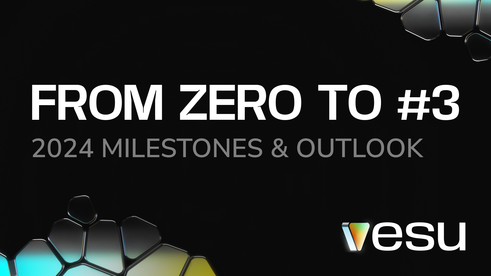

# From Zero to #3: Vibing with Vesu
## Reflecting on 2024 Milestones and What’s Next

As we step into 2025, we’re proud to reflect on our journey. In just six months, Vesu has risen to become one of Starknet’s leading protocols, now ranked 3rd by TVL among all Starknet projects!

Protocol Rankings by DeFiLlama (01/15/25)

Let’s take a moment to celebrate the milestones that made this possible.

## Key Milestones of 2024

**Launch:** 10th of July 2024 🥳

**Multiply:** Vesu became the first protocol on Starknet to introduce Multiply, allowing users to effortlessly increase exposure to their favorite assets in a single transaction.

**Custom Pools:** The launch of the [Pools Page](https://vesu.xyz/pools) enables everyone to create fully customizable pools, opening the door to new lending markets.

**Re7 Labs as Curator:** We proudly welcomed Re7 Labs, a leading risk expert, as Vesu’s first curator. Their xSTRK and sSTRK pools opened up exciting new earning opportunities.

**Stake & Earn:** Earn 20% APY with your STRK! Receive staking rewards & DeFi Spring rewards with just one transaction. Check it out [here](https://vesu.xyz/stake-and-earn).

👉 Dive into our [2024 recap on X ](https://x.com/vesuxyz/status/1871496693293744317)for more exciting highlights and milestones!

## Looking Ahead

2025 is set to be a big year for Vesu, with a sharp focus on seamless UX, innovation, and security. Here’s what’s on the horizon:

**🌸 DeFi Spring Campaign Continues**
The rewards program has been extended until all 90M STRK are distributed.

**🤖 DeFAI**
From simple rule-based automations to AI agents, we’re unlocking smarter ways to manage pools and positions.

**🌍 Expanding Ecosystem**
Welcoming new curators, liquidity providers, and partnerships within Starknet and the EVM ecosystem.

**⚡ DeFi for Bitcoin**
Bridging Bitcoin into Starknet-powered DeFi—unlocking fresh opportunities for BTC holders.

Starknet’s tech is ready to scale with lower fees and faster transactions, creating the perfect environment for DeFi innovation—and Vesu is ready to lead the way.

## Thank You!

Your feedback and engagement have made everything we’ve achieved possible. Together, we’re shaping the future of DeFi on Starknet.

Stay connected for the latest updates: 
- Follow us on **[X/Twitter](https://twitter.com/vesuxyz)**  
- Join the community on **[Discord](https://discord.com/invite/G9Gxgujj8T)**S