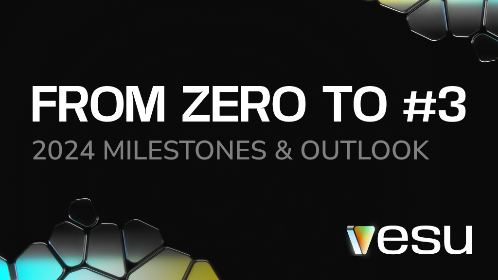
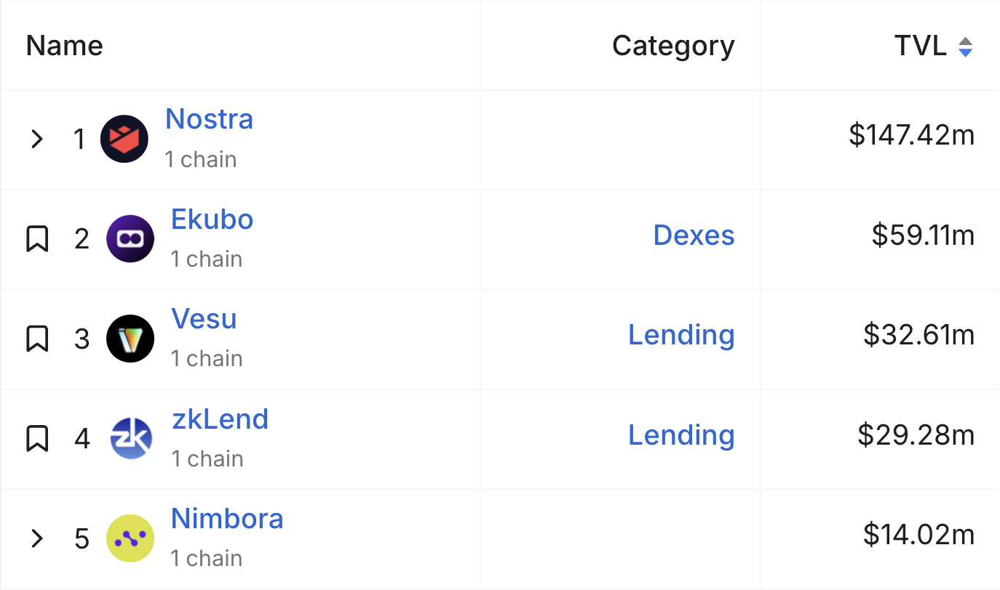

## Reflecting on 2024 Milestones and What’s Next

As we step into 2025, we’re proud to share how far we’ve come. In just six months, Vesu has risen to **3rd in TVL among all Starknet projects!** 

_Protocol Rankings by DeFiLlama (01/14/25)_

This milestone reflects the incredible support and trust from our growing community. Let’s take a moment to celebrate the key achievements of 2024 together.

## Key Milestones of 2024

**Launch Day:** July 10, 2024 – the day it all began! 🥳

**Multiply:** A game-changer for users looking to amplify exposure to their favorite assets. 

**Pools Page Launch:** Create fully customizable pools and unlock fresh, exciting lending markets. Your pool, your rules.

**Re7 Labs as Curator:** Big news for Vesu and Starknet—Re7 Labs, a leading DeFi risk expert, became our first curator. Their xSTRK and sSTRK pools opened up exciting new earning opportunities.

**Stake & Earn:** Why complicate things? With Vesu, earning 20% APY with your STRK is a breeze. Staking rewards and DeFi Spring rewards come together in one single step. Stake & earn [now](https://vesu.xyz/stake-and-earn).

👉 Dive into our [2024 recap on X](https://x.com/vesuxyz/status/1871496693293744317) for more exciting highlights and milestones!

## Looking Ahead  
2025 is set to be a big year for Vesu, with a sharp focus on seamless UX, innovation, and security. Here’s what’s on the horizon:

**🌸 DeFi Spring Campaign Continues**  
The rewards program has been extended until all 90M STRK are distributed.

**🤖 DeFAI**  
From simple rule-based automations to AI agents, we’re unlocking smarter ways to manage pools and positions.

**🌍 Expanding Ecosystem**  
Welcoming new curators, liquidity providers, and partnerships within Starknet and the EVM ecosystem.

**⚡ DeFi for Bitcoin**  
Bridging Bitcoin into Starknet-powered DeFi—unlocking fresh opportunities for BTC holders.

Starknet’s tech is ready to scale with lower fees and faster transactions, creating the perfect environment for DeFi innovation—and Vesu is ready to lead the way.

## Thank You!

Your feedback and engagement have made everything we’ve achieved possible. Together, we’re shaping the future of DeFi on Starknet.

Stay connected for the latest updates: 
- Follow us on **[X](https://twitter.com/vesuxyz)**  
- Join the community on **[Discord](https://discord.com/invite/G9Gxgujj8T)**