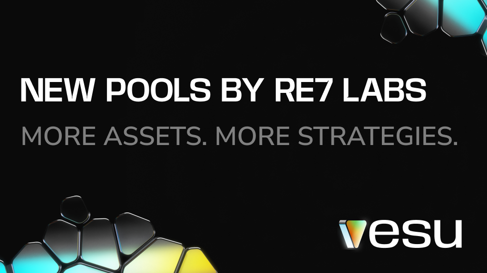

Exciting news! Two new pools, curated by Re7 Labs, are now live—offering fresh opportunities for earning, borrowing, and optimizing capital efficiency. 

And there’s more—DeFi Spring rewards for wstETH start on Feb 6, 2025, giving an extra boost to yield opportunities in one of the new pools!

Re7 Labs, known for their expertise as a leading risk curator, first launched their curated pools on Vesu in November. Learn more in our previous [Blog post](/blog/2024-11-27-welcome-re7/). 

So, what makes these new pools stand out? Let’s dive in and take a closer look.

## Re7 Starknet Ecosystem Pool
**Collateral:** EKUBO, STRK  
**Borrow:** USDC

This is the first pool on Vesu where EKUBO can be used as collateral—a long-requested feature. It introduces a new way for EKUBO holders to access liquidity.

To ensure a controlled launch, Re7 Labs has set an initial debt cap of 9,000 USDC for the EKUBO-USDC pair and 2M USDC for the STRK-USDC pair.

The curator can adjust this pool as needed—raising the debt cap or adding more tokens from the Starknet ecosystem, ensuring it remains aligned with market needs and long-term stability.

## Re7 wstETH Pool
**Collateral:** wstETH  
**Borrow/Multiply with:** ETH

The pool is designed to maximize wstETH exposure with Vesu’s Multiply feature, allowing users to boost yield by capturing both staking rewards and the new DeFi Spring rewards.

:::info 
ETH and wstETH price feeds have volatility, unlike what you might be used from Multiplying xSTRK or sSTRK. 
Users are responsible for ensuring enough buffer in their position to account for price differences between the two tokens on Starknet.
:::

## The Strengths of Vesu’s Infrastructure

Both pools leverage Vesu’s fully customizable lending architecture, allowing the curator to design pools that adapt to evolving market needs. Debt caps can be adjusted based on demand to keep the pools balanced and secure.

The parameters of each pool can be accessed via the [Pools page](https://vesu.xyz/pools).

Since Vesu’s pools are isolated, risks stay within each pool without affecting others. This keeps borrowing and lending safer, even as new assets are added.

## Discover the New Pools
- [Borrow USDC against EKUBO](https://vesu.xyz/borrow) and unlock liquidity without selling.
- [Multiply with the new wstETH pool](https://vesu.xyz/multiply) to boost exposure & maximize rewards.

Have feedback? Let us know via [X](https://x.com/vesuxyz) or [Discord](https://discord.gg/kef7VwmG).
