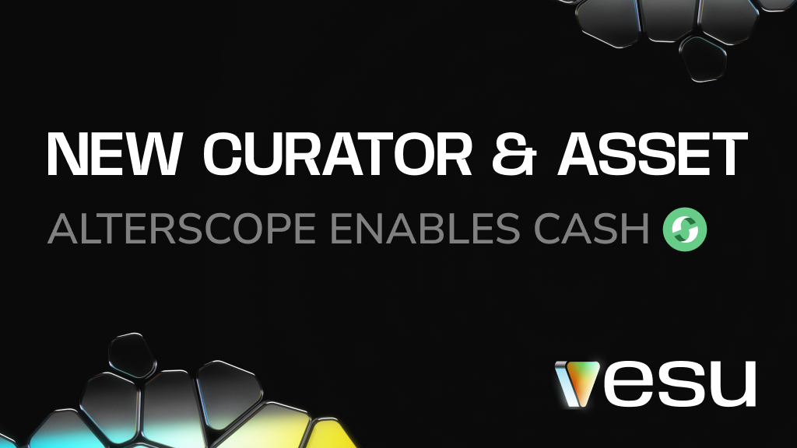

We’re thrilled to welcome Alterscope as a new curator on Vesu! 

Alterscope has earned its reputation for expertise in risk management and data-driven analytics, driving security and innovation across DeFi ecosystems. They’ve already integrated Starknet into their risk tools, offering transparent insights and a clear view of the network’s mechanics. Explore their detailed analytics for Starknet [here](https://app.alterscope.org/projects/starknet/layer2(zk)/chain#analytics).

Let’s take a look at the new opportunities they bring to the ecosystem!

## Alterscope CASH Pool (add exact name)
**Collateral:** ETH, wstETH, STRK, xSTRK, USDC, USDT, wBTC  
**Borrow:** CASH, STRK, ETH, USDC, USDT, wBTC

This pool introduces the CASH stablecoin to Vesu, giving users more borrowing options. For example, deposit xSTRK as collateral to borrow CASH, unlocking stable liquidity while continuing to earn staking and DeFi Spring rewards on STRK.

The parameters of the pool can be accessed via the [Pools page](https://vesu.xyz/pools).

:::note
The same asset provided as collateral cannot be borrowed, ensuring stability and minimizing risk.
:::

## Discover the New Pools
- Supply CASH...
- Deposit ETH and Borrow CASH against it...

Got feedback? Let us know via [X](https://x.com/vesuxyz) or [Discord](https://discord.gg/kef7VwmG).
