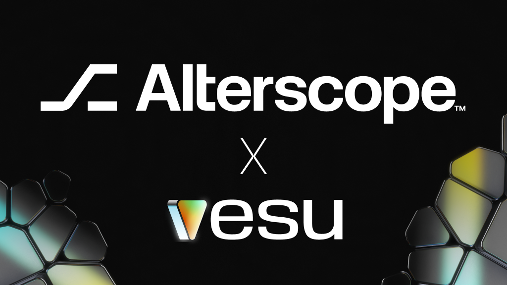

We’re thrilled to welcome Alterscope as a new curator on Vesu! 

Alterscope is known for its expertise in risk management and data-driven analytics, shaping secure and efficient DeFi markets. Now, they’re bringing their experience to Starknet with a set of new curated pools—introducing new assets and expanding opportunities for DeFi users.

Let’s check them out!

## Alterscope CASH Pool
**Collateral:** ETH, STRK, USDC, USDT, WBTC  
**Borrow:** CASH

This pool introduces the CASH stablecoin to Vesu, unlocking a new way to borrow against key assets. Users can keep assets like ETH or USDC working while unlocking fresh liquidity in CASH to use as they like.

:::info
CASH is an overcollateralized stablecoin issued by Opus. Learn more in the [Opus Docs](https://docs.opus.money/).
:::

## Alterscope wstETH Pool

**Collateral:** wstETH  
**Borrow/Multiply with:** STRK, ETH, WBTC, USDC, USDT  

This pool lets wstETH holders borrow assets or multiply their exposure—all while still earning staking rewards and DeFi Spring incentives.

## Alterscope xSTRK Pool

**Collateral:** xSTRK  
**Borrow:** STRK, ETH, WBTC, USDC, USDT  

This pool enables borrowing against Endur’s xSTRK, a liquid staking token for STRK. Depositors receive staking and DeFi Spring rewards while being able to borrow other key assets.

## Alterscope Cornerstone Pool

**Collateral:** STRK, ETH, WBTC, USDC, USDT  
**Borrow:** STRK, ETH, WBTC, USDC, USDT  

A broader lending market for multiple assets, designed for diverse borrowing and lending strategies. Optimized loan-to-value (LTV) and utilization settings make this pool highly capital-efficient.

:::note
The same asset provided as collateral cannot be borrowed, ensuring stability and minimizing risk.
:::

## Discover the New Pools

Alterscope’s new curated pools bring new strategies to optimize your assets—whether you’re unlocking liquidity, multiplying exposure, or making the most of staking rewards. Here are a few:

- [Borrow CASH against USDC](https://vesu.xyz/borrow) to access liquidity while earning with your USDC.
- [Multiply wstETH with ETH](https://vesu.xyz/multiply) to boost your ETH exposure.
- [Use xSTRK as collateral to borrow USDC](https://vesu.xyz/borrow) to get more liquidity while receiving staking & DeFi Spring rewards for xSTRK.  

All settings of the new pools can be accessed via the [Pools page](https://vesu.xyz/pools).

Got feedback? Let us know via [X](https://x.com/vesuxyz) or [Discord](https://discord.gg/kef7VwmG).
