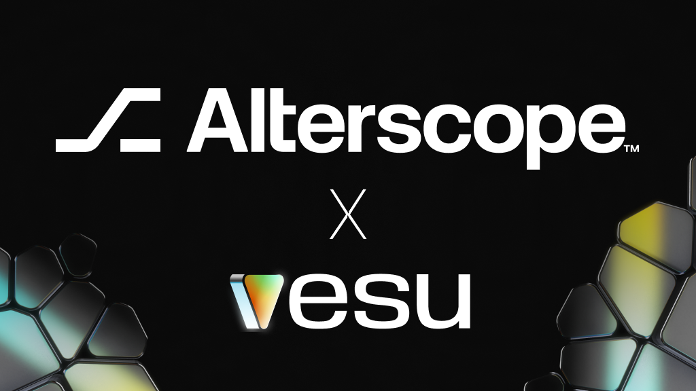

We’re thrilled to welcome Alterscope as a new curator on Vesu! 

Alterscope is known for its expertise in risk management and data-driven analytics, shaping secure and efficient DeFi markets. Now, they’re bringing their experience to Starknet with a set of new curated pools—introducing new assets and expanding opportunities for DeFi users.

Let’s check them out!

## Alterscope CASH Pool
**Collateral:** ETH, STRK, USDC, USDT, WBTC  
**Borrow:** CASH

This pool introduces the CASH stablecoin to Vesu, unlocking a new way to borrow against key assets. Users can keep assets like ETH or USDC working while unlocking fresh liquidity in CASH to use as they like.

:::info
CASH is an overcollateralized stablecoin issued by Opus. Learn more in the [Opus Docs](https://docs.opus.money/).
:::

## Alterscope wstETH Pool

**Collateral:** wstETH  
**Borrow/Multiply with:** STRK, ETH, WBTC, USDC, USDT  

This pool lets wstETH holders borrow assets or multiply their exposure—all while still earning staking rewards and DeFi Spring incentives.

## Alterscope xSTRK Pool

**Collateral:** xSTRK  
**Borrow:** STRK, ETH, WBTC, USDC, USDT  

This pool enables borrowing against Endur’s xSTRK, a liquid staking token for STRK. Depositors receive staking and DeFi Spring rewards while being able to borrow other key assets.

## Alterscope Cornerstone Pool

**Collateral:** STRK, ETH, WBTC, USDC, USDT  
**Borrow:** STRK, ETH, WBTC, USDC, USDT  

A broader lending market for multiple assets, designed for diverse borrowing and lending strategies. Optimized loan-to-value (LTV) and utilization settings make this pool highly capital-efficient.

:::note
The same asset provided as collateral cannot be borrowed, ensuring stability and minimizing risk.
:::

## Discover the New Pools

Alterscope’s curated pools offer new ways to optimize your assets—unlock liquidity, multiply exposure, or maximize staking rewards. Here are a few:

- [Borrow CASH against USDC](https://vesu.xyz/borrow?form=true&poolId=3496574735728882918499284446337009546448797063742922299223215375275805529443&collateralAddress=0x53c91253bc9682c04929ca02ed00b3e423f6710d2ee7e0d5ebb06f3ecf368a8&debtAddress=0x498edfaf50ca5855666a700c25dd629d577eb9afccdf3b5977aec79aee55ada) to access liquidity while earning with your USDC.
- [Multiply wstETH](https://vesu.xyz/multiply?poolId=2612229586214495842527551768232431476062656055007024497123940017576986139174&targetAddress=0x0057912720381af14b0e5c87aa4718ed5e527eab60b3801ebf702ab09139e38b&debtAddress=0x049d36570d4e46f48e99674bd3fcc84644ddd6b96f7c741b1562b82f9e004dc7) to boost your ETH exposure.
- [Deposit xSTRK to borrow fresh liquidity](https://vesu.xyz/borrow?form=true&poolId=1129317009595740662798266590704690378283717359139782594834794341553978002262&collateralAddress=0x028d709c875c0ceac3dce7065bec5328186dc89fe254527084d1689910954b0a) while receiving staking & STRK rewards for xSTRK. 

:::note
These pools are new and may need more liquidity to become fully active. If borrowing or multiplying isn’t available yet, start by depositing to help bootstrap liquidity.
:::

All parameters of the new pools can be accessed via the [Pools page](https://vesu.xyz/pools).

Got feedback? Let us know via [X](https://x.com/vesuxyz) or [Discord](https://discord.gg/kef7VwmG).
