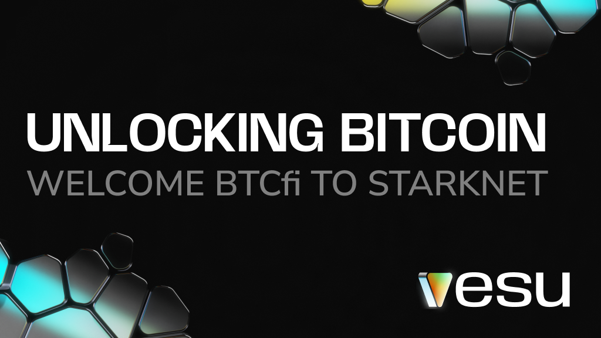

Bitcoin is the most secure and decentralized asset, yet most BTC sits idle or locked in centralized platforms. Starknet changes that by introducing scalable, trustless, and programmable Bitcoin finance. Secured by STARK proofs.

It’s time for Bitcoin to go beyond HODLing. Welcome to BTCfi.

## What Vesu Has to Offer  

Bitcoin’s liquidity is trapped—held on exchanges, locked in custodial solutions, or simply collecting digital dust. The problem? No native DeFi, high fees, and security risks.  

**With Starknet scaling Bitcoin, Vesu enables Bitcoiners to:**  

- Earn yield on BTC by putting your Bitcoin to work while HODLing.  
- Borrow with BTC to access liquidity without selling.  
- Multiply BTC to increase exposure and maximize yield.  

**All while benefiting from:**

- Low fees, keeping more of your BTC instead of losing it to transaction costs.  
- A frictionless experience** thanks to smart wallets like [Ready](https://www.ready.co/).
- Full self-custody, eliminating reliance on centralized entities or third parties.  
- Proven security** with every line of Vesu’s smart contract code audited.  

## What This Means for Starknet & Vesu  

Bringing Bitcoin to Starknet is the next logical step:  

- Bitcoin’s market cap dwarfs existing DeFi TVL. Unlocking BTC liquidity brings new users, strengthens network effects, and expands DeFi on Starknet.
- More liquidity strengthens lending markets.** Better rates, deeper composability, and new integrations follow.  
- New Bitcoin-native DeFi primitives are possible. Vesu has the infrastructure ready.  
- STARK proofs provide the security Bitcoin needs. BTC moves on-chain without intermediaries.  

Both Starknet and Vesu offer scalable, trustless finance, powered by math and cryptography. Together, we bring native BTCfi to Bitcoiners. 

## What’s Next? The Future of BTCfi  

Scaling **native BTCfi** is a long-term roadmap, with **OP_CAT** as a key upgrade to enable smart contract functionality on Bitcoin.  

But we don’t wait for OP_CAT. In the meantime, we’re bringing Bitcoiners into BTCfi by:  

- Bootstrapping BTC liquidity through bridged BTC, restaked BTC, and BTC derivatives.  
- Enabling BTC lending strategies tailored specifically for Bitcoiners.  
- Maintaining strong security on Vesu to give Bitcoiners peace of mind when using BTCfi.  

**This isn’t just an experiment. The future of BTCfi starts now.**  