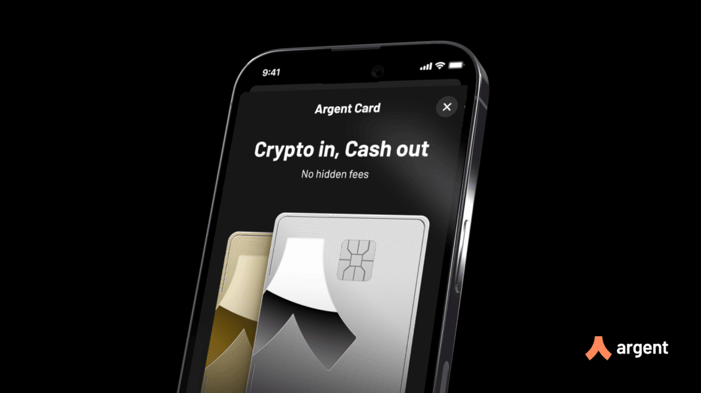
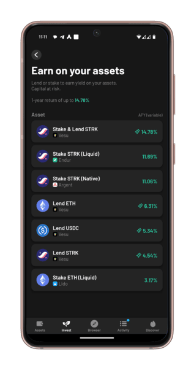

Argent has just launched **Argent Metal**, a self-custodial crypto card that makes spending USDC effortless anywhere Mastercard is accepted. Unlike other crypto cards that require preloading or custodial accounts, Argent Metal lets users **spend directly from their wallet** while maintaining full ownership of their assets.

### Why Argent Metal?

- No FX fees (1 USD = 1 USDC)
- Earn cashback rewards. Up to $1,800 in the first year.
- Exclusive perks and benefits.
- Full self-custody. Funds stay in your control until spent.

Argent Metal isn’t just powerful, it looks good too. Choose your 16g metal card in Gold or Platinum. 

## Power to DeFi with Vesu

Argent Metal gives you full control over your assets. With Vesu, you can take it even further and access true financial freedom:

- Earn yield on your idle USDC. Let your assets work for you.
- Borrow USDC against your holdings (ETH, BTC, etc.) to access liquidity without selling.  
- Compound cashback rewards to maximize returns.

Easily accessible via [vesu.xyz](https://vesu.xyz/) or directly in the Argent Wallet’s Invest tab, delivering a true Web2-like experience.

## Get Started

- **Sign up for Argent Metal**: [argent.xyz/metal-card](https://www.argent.xyz/metal-card)  
- **Explore Vesu for top borrowing and yield opportunities**: [vesu.xyz/markets](https://vesu.xyz/markets)

The way you spend crypto just changed. Keep control, keep earning, and unlock true financial freedom.