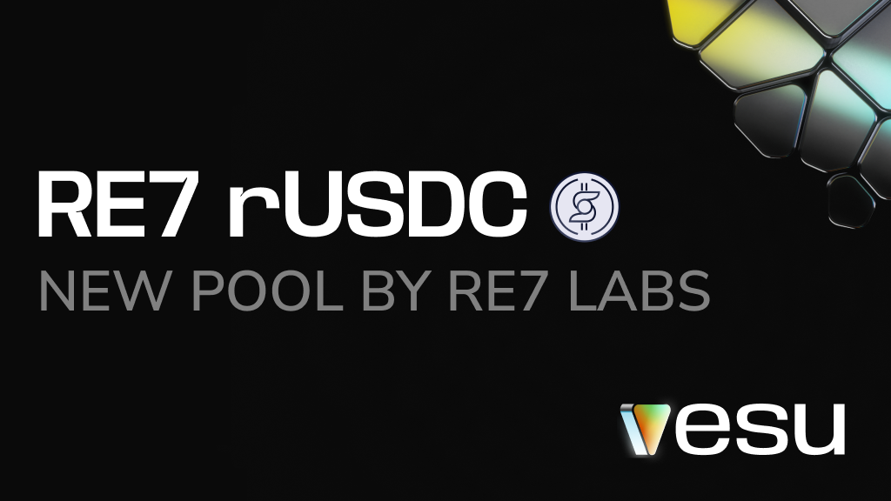

Starknet is growing—more assets, more players, more opportunities. rUSDC, a stablecoin by Relend Network, has now a new home in the Re7 rUSDC pool on Vesu. Curated by Re7 Labs and seeded with $15m from Relend Network, this pool expands borrowing and lending opportunities while making capital more efficient.

Let’s take a look at what this new pool brings.

## Re7 rUSDC Pool

**Borrow:** rUSDC  
**Collateral:** ETH, wstETH, WBTC, USDC, STRK, xSTRK  

This pool lets users borrow rUSDC against key assets. Users can keep assets like wstETH or xSTRK working while unlocking fresh liquidity to use as they like.

To bootstrap the new pool, Re7 Labs has set debt caps to manage liquidity and risk, ensuring a secure launch with room to scale. The initial limit is 500k rUSDC per asset (100k rUSDC for WBTC), with potential adjustments as the pool grows.

All parameters of the new pool can be accessed via the [Pools page](https://vesu.xyz/pools).

:::info
rUSDC is a CDP-based stablecoin issued by Relend Network. It is backed by USDC and lending market collateral, designed to provide scalable and stable liquidity across L2s. rUSDC can be redeemed 1:1 for USDC on Ethereum mainnet.  
Learn more in the [Relend Docs](https://docs.relend.network/).
:::

## Discover the New Pools & the Curator

With the new pool you can now:

- [Supply wstETH and borrow rUSDC against it.](https://vesu.xyz/borrow?form=true&poolId=0x3de03fafe6120a3d21dc77e101de62e165b2cdfe84d12540853bd962b970f99&collateralAddress=0x0057912720381af14b0e5c87aa4718ed5e527eab60b3801ebf702ab09139e38b&debtAddress=0x02019e47a0bc54ea6b4853c6123ffc8158ea3ae2af4166928b0de6e89f06de6c)
- [Supply xSTRK as collateral and borrow rUSDC.](https://vesu.xyz/borrow?form=true&poolId=0x3de03fafe6120a3d21dc77e101de62e165b2cdfe84d12540853bd962b970f99&collateralAddress=0x028d709c875c0ceac3dce7065bec5328186dc89fe254527084d1689910954b0a&debtAddress=0x02019e47a0bc54ea6b4853c6123ffc8158ea3ae2af4166928b0de6e89f06de6c)

Learn more about Re7 Labs and their previously launched pools:

- [Re7 Labs Comes to Starknet](https://docs.vesu.xyz/blog/2024-11-27-welcome-re7)
- [New Pools by Re7 Labs](https://docs.vesu.xyz/blog/2025-02-06-new-pools-by-re7)

Got feedback? Let us know on [X](https://x.com/vesuxyz) or [Discord](https://discord.com/invite/G9Gxgujj8T).