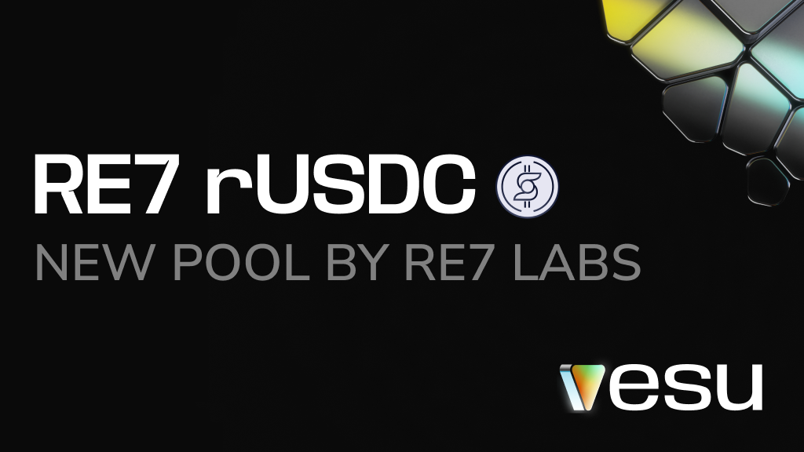

We are thrilled to celebrate the 10-month anniversary of Vesu and its initial Genesis pool. Over the past ten months, Vesu has grown to become Starknet's largest lending market. The Genesis pool, the first and largest lending pool, stands as a testament to our commitment to innovation, user experience, and security.

### A Journey of Growth and Innovation

Since its inception, Vesu has operated autonomously, governed solely by math and code, without reliance on third-party interventions. This approach aligns perfectly with Starknet's ZKP-powered technology, ensuring a trustless and efficient lending environment.

On that journey, we have achieved significant milestones including the following;

🏆 Grow to the largest lending market on Starknet
🛡️ Onboard best-in-class pool curators like Re7 Labs
👛 Native wallet integration with Argent and Braavos
✨ Enable new products like Braavos' Bitcoin Earn
✅ Securely navigate various market crashes

We invite everyone to track and verify Vesu's progress for which we have built an extensive Dune dashboard that you can finde [here](https://dune.com/vesu/vesu).

### Evolving with the Ecosystem

As the Starknet ecosystem matures, we recognize the need to make few adjustments to the Genesis pool configuration, the first in its 10-months existence. These updates aim at reflecting the increased liquidity, availability of proven liquidation bots, and overall confidence in Vesu's robust design;

1. **Minimal Loan Amounts**: Reduce the minimal loan amounts in the Genesis pool to $10, making lending more accessible to a broader range of users.

2. **Liquidation Loan-to-Value**: Increase the LLTV ratios on certain lending pairs where Starknet liquidity has increased to improve capital efficiency. Find the details in this [sheet](https://docs.google.com/spreadsheets/d/1C9FzJscdDvfEa1Vf1Yzqp_NHswezpQFTBJE5S52DmOc/edit?gid=120755677#gid=120755677).

3. **Interest Rate Curve**: Increase rate halving to 5 days (reduce the autonomous curve adjustment speed) and the minimal 100%-utilization rate to 5% improving market efficiency and UX for both lenders and borrowers. Read more on Vesu's adaptive curve design [here](https://docs.vesu.xyz/blog/2024-04-03-vesu-lending-hooks#adaptive-interest-rates).

### What You Need to Do

No action is required from your side.

These updates do not have an immediate impact on your existing positions in Vesu's Genesis pool. However, you may observe elevated market activity as users take advantage of the new configurations such as the lower loan amount requirements or increased LLTVs, resulting in a change in Supply and Borrow APRs.

If you have any questions, please reach out on the Vesu [Discord](https://discord.gg/G9Gxgujj8T) or [Telegram](https://t.me/VesuChat).

### Stay Tuned

It has been an incredible first 10-months on this journey and that is mostly thanks to the trust our users and partners put into Vesu. We are even more excited for the next months as we continue to push the boundaries of DeFi and build a future where BTC is a productive asset onboarding millions to Starknet🧡