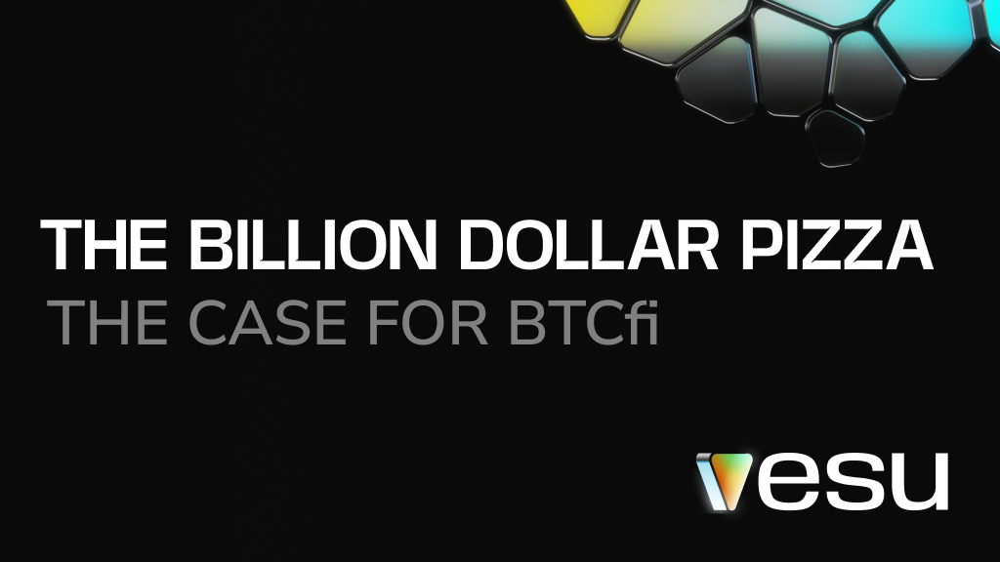
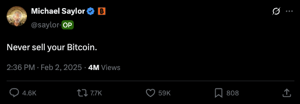
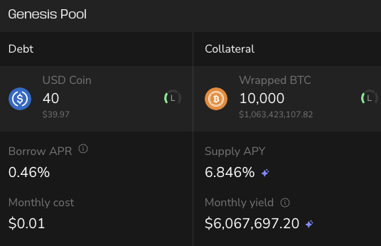

### The most expensive pizza ever. And the best case for BTCfi.

You already know the story. In 2010, Laszlo paid 10,000 BTC for two pizzas. One supreme, one cheese. It was the first time anyone bought something physical with Bitcoin. Back then, those 10k BTC were worth about $41. Today? Over $1 billion.

It’s crypto history. And if you ask Saylor? The takeaway is simple: **Never sell your Bitcoin.**

Because what if Laszlo had borrowed instead? He could’ve kept the BTC, borrowed a few dollars for lunch, and still had a billion-dollar bag years later. That’s what BTCfi is here for.

Bitcoin began as an experiment. A wild idea shared in forums and mined on laptops. Then it became digital gold. Now it’s time to actually use it. Borrow against it. Earn with it. That’s BTCfi.

### BTCfi is live on Starknet
Here’s what you can already do today:

- [Earn 6% APY on your Bitcoin](https://app.vesu.xyz)  
- [Borrow USDC at just 0.5% APR against your Bitcoin](https://app.vesu.xyz/borrow)  
- [Borrow USDC spend it with your Argent Card](/blog/2025-03-18-argent-metal-launch/)  

More opportunities incoming soon. Stay tuned!

**This Bitcoin Pizza Day, maybe just borrow for the pizza.**