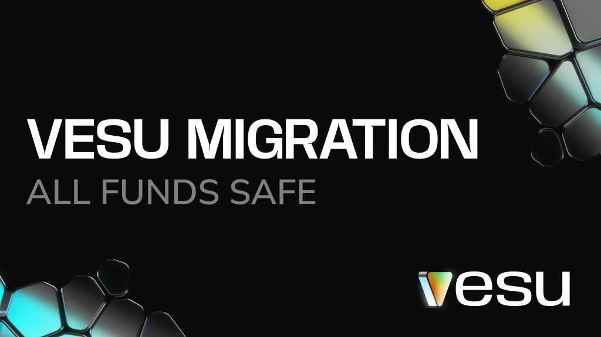

**Vesu has successfully completed a planned migration to address a security related disclosure and strengthen the protocol's long-term security.**  

## What this means for you 

All funds are safe and positions continue to work as expected, earn interest and DeFi Spring rewards.

:::info Update June 9, 2025
Your Earn position will now be automatically migrated the next time you interact with it, such as modifying or withdrawing the position.

Your wallet will show an additional Multicall for the vToken migration.  
Nothing changes in value: your old vTokens are just swapped for the new version.
:::

## Why we migrated
As protocols grow, so does the complexity of maintaining and securing them.
This migration addresses a bug responsibly disclosed through Immunefi and resolved in close collaboration with Chainsecurity, our curators, and wallet partners.

 User funds are safe, and the fix is now fully implemented through this migration. Vesu continues to operate normally.

Thanks to Chainsecurity, Immunefi, and our partners across the Starknet ecosystem for making this transition seamless.

Questions? Reach us anytime on [Discord](https://discord.gg/8QeGhHch).