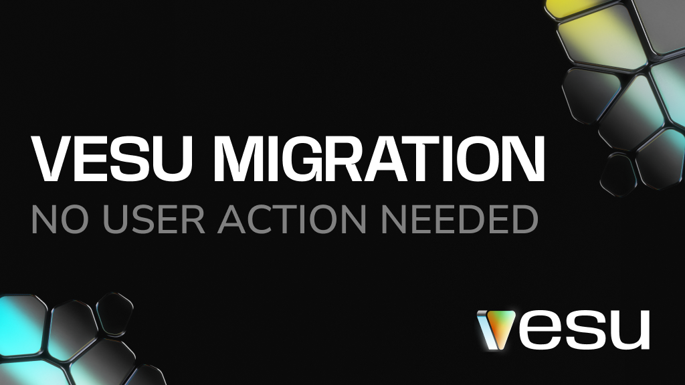

**We’re carrying out a planned migration on Vesu. This includes changes at the smart contract level and improvements to Vesu’s security architecture that strengthen the protocol for the long term.**

**No customer funds are at risk.**

## Timing

**The migration will take place on May 28, 2025 at 9:00 UTC.** During this window, some features may be temporarily limited. Positions will remain visible, and core actions like closing positions will still be available.

## What to expect during the upgrade

- Positions remain safe and visible.
- Temporary frontend limitations may occur. A fallback UI is available [here](https://migration.vesu.xyz).
- Updates will be posted  on [X](https://x.com/vesuxyz).

## What this means for you 

Most users won’t need to do anything, but here’s how the migration affects each position type.
- **Borrow and Multiply positions:**
    
    No action needed. 
    
- **Earn positions:**
    
    After the migration, you’ll see a “migrate” button in your position overview. Just follow the flow, one transaction and you’re done. 

## Why this is happening
As protocols grow, so does the complexity of maintaining and securing them.
This migration addresses a bug responsibly disclosed through Immunefi and resolved in close collaboration with Chainsecurity, our curators, and wallet partners.

No user funds were at risk, and the fix is now fully implemented through this migration. Vesu continues to operate as normal.

Thanks to Chainsecurity, Immunefi, and our partners across the Starknet ecosystem for making this transition seamless.

Questions? Reach us anytime on [Discord](https://discord.gg/8QeGhHch).