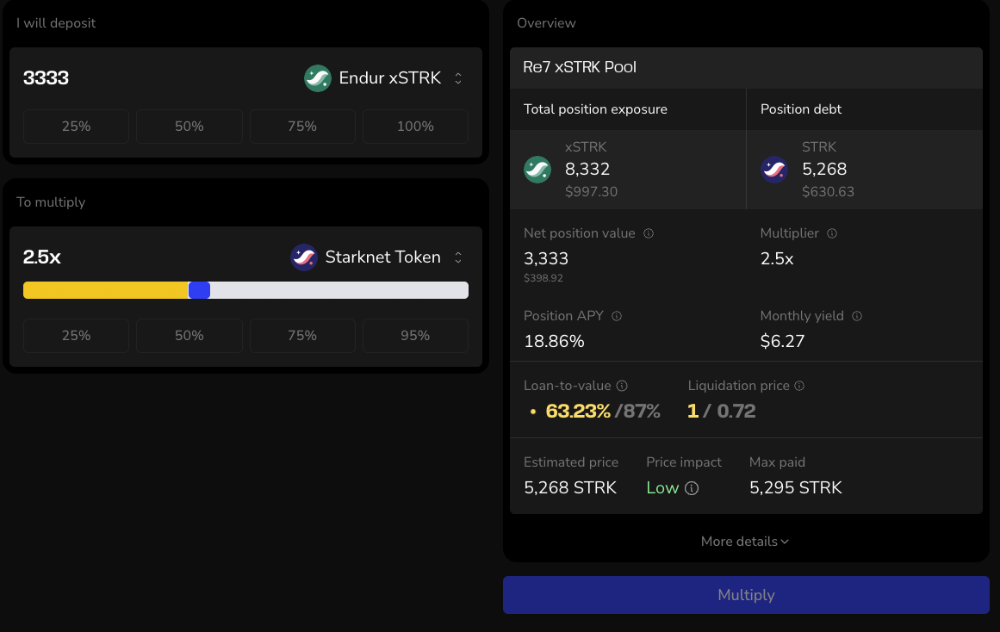

STRK is everywhere on Starknet: held in wallets, staked & supplied in DeFi. But are you using it in the way that fits you best?

This post kicks off **Unlocking Vesu**, a new series that dives into strategies on Vesu. No advice, no hand-holding. Just straightforward takes on yield, risk, and what to watch for.

Today’s focus is STRK. We present three levels of yield for you. This is your starting point to earn.

## Level 1: Simple lending

**Plug and earn**  
If you want passive yield with minimal setup: Supply STRK directly to a Vesu pool.  
You earn lending yield and DeFi Spring rewards.

| **Pool**     | **APY** | **Notes**                               |
|--------------|--------|------------------------------------------|
| Genesis      | 4.5%  | most liquid pool on Vesu, best to borrow other assets     |
| Re7 xSTRK    | 8.4%  | high borrowing demand from Multiply |

**Risk:** Like any DeFi lending platform, there are risks around smart contracts, oracles, and pool settings. Vesu reduces these with full audits and curators that are known teams in the Starknet ecosystem.

## Level 2: Extra rewards with xSTRK

**Liquid Stake and supply**  
You want to earn more while staying relatively low risk.

Stake STRK via [Endur](https://endur.fi) to mint xSTRK, then supply it to Vesu.
If you want to deposit into the Re7 xSTRK pool you can also use the shortcut via [Stake & Earn](https://vesu.xyz/stake-and-earn).

**What you earn:**
- Lending yield  
- DeFi Spring incentives  
- Staking rewards via Endur  
- Endur Points (learn more [here](https://x.com/vesuxyz/status/1932796193085563379))

| **Pool**     | **APY** | **Notes**                               |
|--------------|--------|------------------------------------------|
| Re7 xSTRK     | 11.6%  | biggest xSTRK pool, STRK available to borrow     |
| Re7 rUSDC     | 11.6%  | use xSTRK as collateral to borrow rUSDC    |

:::tip 
With **[Stake & Earn](https://vesu.xyz/stake-and-earn)**, you can deposit STRK and supply xSTRK to the Re7 pool in one smooth transaction.
:::

**Risk:** Additional risks from liquid staking provider (Endur).

## Level 3: Max xSTRK exposure

**Full send**  
You want to increase exposure and farm harder.

It works like this: Supply xSTRK as collateral → borrow STRK → convert to xSTRK → repeat.  
But don't worry, Vesu's [Multiply](https://vesu.xyz/multiply) feature does all of this for you in one click. Learn how it works in our [Docs](https://docs.vesu.xyz/users/multiply-basics).

| **Pool**     | **Notes**                                                  |
|--------------|------------------------------------------------------------|
| Re7 xSTRK    | Uses the same oracle for STRK and xSTRK. Strong correlation, but not risk-free |

**What you earn:**
- Boosted staking yield
- Boosted Endur Points
- Boosted DeFi Spring rewards
- Higher organic yield from increased position size

**Risk:** If xSTRK depegs from STRK, you can be liquidated. Oracle settings reduces this risk, but it’s not zero.

## TL;DR

| **Level** | **What you supply** | **What you earn**                                 | **Main risk**                     | **Pools**             |
|-----------|----------------------|---------------------------------------------------|-----------------------------------|------------------------|
| 1         | STRK                 | Organic yield, DeFi Spring rewards                | Smart contracts, pool utilization      | Genesis, Re7 xSTRK     |
| 2         | xSTRK                | Level 1 + staking rewards, Endur Points      | Endur protocol risk               | Re7 xSTRK, Re7 rUSDC   |
| 3         | xSTRK (Multiply)     | All of Level 2, multiplied with STRK             | Liquidation, xSTRK depeg          | Re7 xSTRK              |

**Which level fits your style?**
We’re always curious how people are using Vesu. Drop feedback or questions in [Discord](https://discord.gg/g9ahVeyp). Or tell us what you’d like to see next in Unlocking Vesu.

