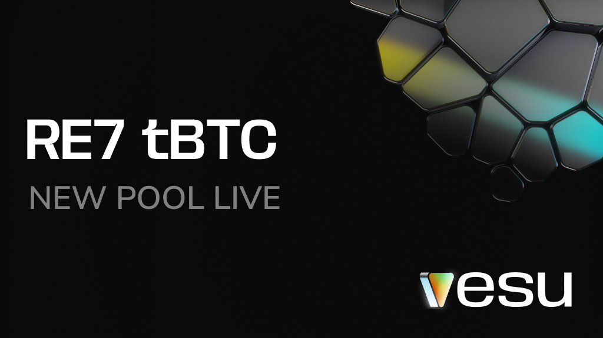

Re7 Labs just launched the first tBTC lending pool on Starknet.

tBTC is issued by Threshold Network and is one of the most proven trust-minimized Bitcoin assets. It’s backed 1:1 by native BTC and secured by a decentralized network of signers. No centralized custody. No wrapped-token shortcuts.

Now is the time to use BTC, not just hold it. Starknet makes it easy: fast transactions, ultra-low fees, and a smooth UX with multicalls and account abstraction.

BTCfi is kicking off on Starknet. More assets and rewards coming soon.

## RE7 tBTC Pool

**Collateral:** tBTC  
**Borrow:** USDC

This pool makes it simple. Deposit tBTC to earn, or borrow extra liquidity against it. No LP tokens to manage, no need to give up control.

The pool is isolated and designed for long-term stability. Additional assets can be added by the curator in the future to the pool. 

## Get tBTC on Starknet

You can use tBTC in the new Vesu pool via:

- Mint tBTC via [Threshold Network](https://dashboard.threshold.network/tBTC/mint)
- Swap any asset on Starknet to tBTC via [Avnu](https://avnu.fi)
- Bridge from Ethereum via the [official Starknet bridge](https://starkgate.starknet.io/ethereum/bridge?mode=deposit)

## Explore the Pool

The RE7 tBTC pool is ready. You can now:

- [Supply tBTC to earn](https://vesu.xyz/lend)
- [Borrow USDC against your tBTC](https://vesu.xyz/borrow)

All pool parameters are available on the [Pools page](https://vesu.xyz/pools).  
Questions? Join us on [Discord](https://discord.gg/4mXeXeZu).