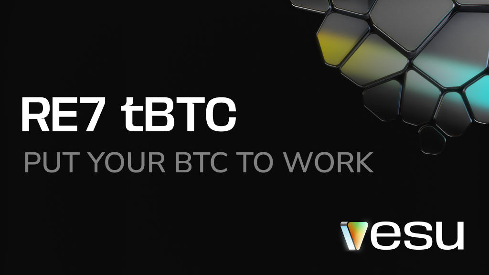

**Re7 Labs just launched the first tBTC lending pool on Starknet.**

tBTC, issued by Threshold Network, is one of the most proven trust-minimized Bitcoin assets. It’s backed 1:1 by native BTC and secured by a decentralized network of signers. No centralized custody. No wrapped-token shortcuts.

Now’s the time to start using your BTC, not just holding it. Starknet makes it easy with fast transactions, ultra-low fees, and top-tier UX thanks to multicalls and account abstraction.

BTCfi is just getting started. More assets and rewards coming soon.

## RE7 tBTC Pool

**Collateral:** tBTC  
**Borrow:** USDC, wBTC, ETH

This pool makes it simple. Deposit tBTC to earn, or borrow extra liquidity against it. No LP tokens to manage, no need to give up control.

The pool is isolated and designed for long-term stability. Additional assets can be added by the curator in the future to the pool. 

## Get tBTC on Starknet

You can use tBTC in the new Vesu pool via:

- Mint tBTC via [Threshold Network](https://dashboard.threshold.network/tBTC/mint)
- Swap any asset on Starknet to tBTC via [Avnu](https://avnu.fi)
- Bridge from Ethereum via the [official Starknet bridge](https://starkgate.starknet.io/ethereum/bridge?mode=deposit)

## Explore the Pool

The RE7 tBTC pool is ready. Start now

- [Supply tBTC to earn](https://vesu.xyz/lend)
- [Borrow USDC against your tBTC](https://vesu.xyz/borrow)

All pool parameters are available on the [Pools Page](https://vesu.xyz/pools).  
Questions? Join us on [Discord](https://discord.gg/4mXeXeZu).