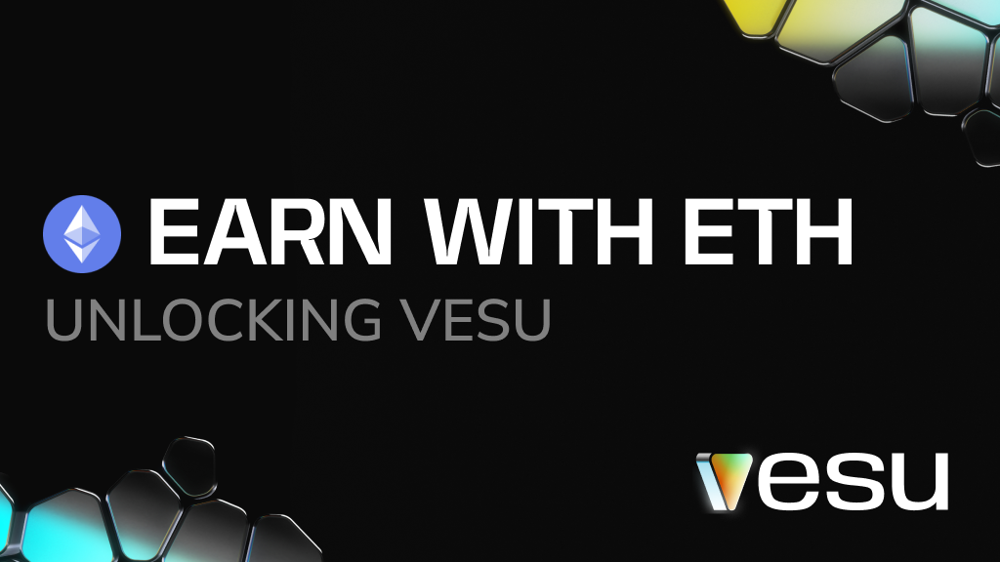
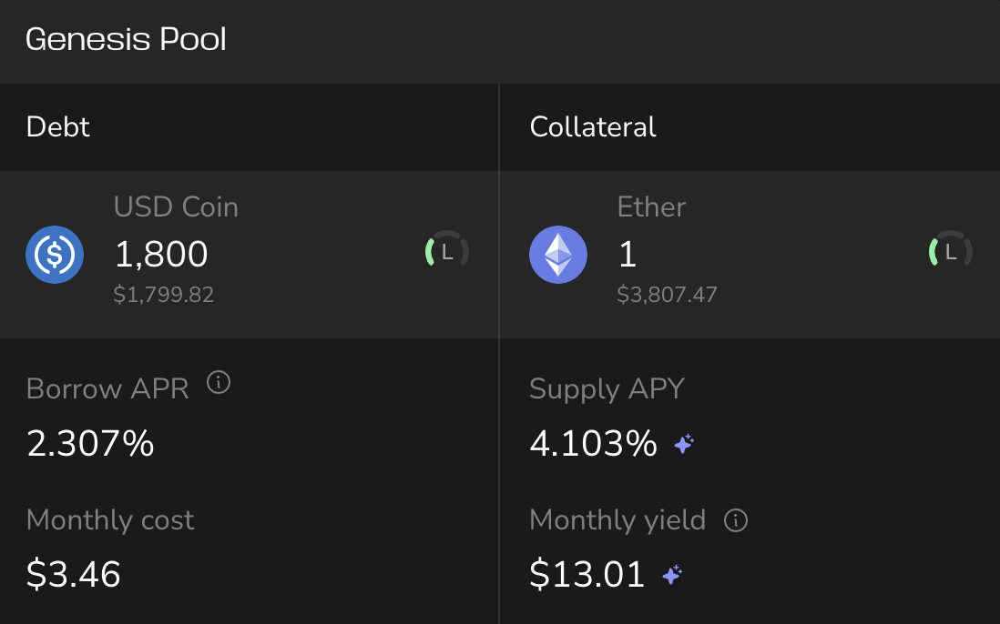
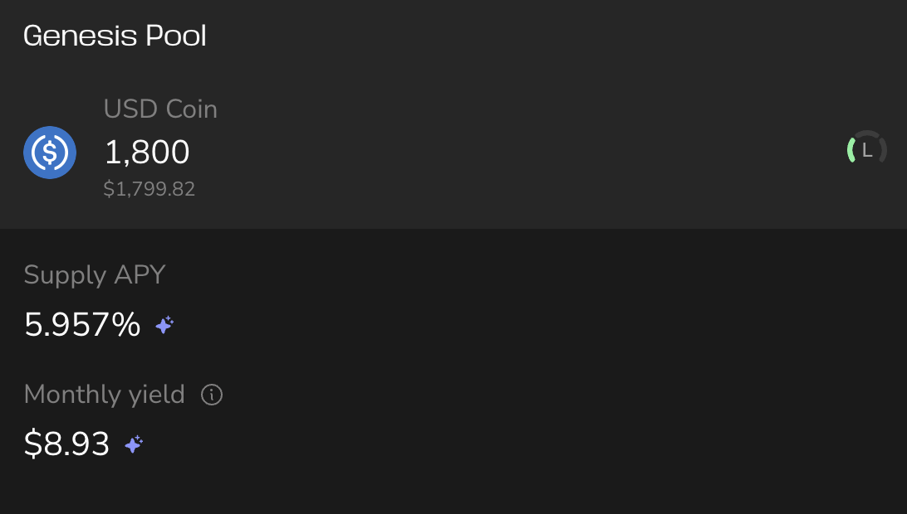
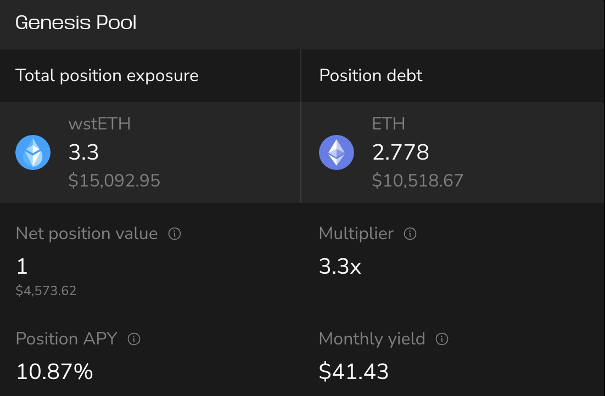

ETH has been running for 10 years and it’s not slowing down.
Are you really making the most of it?
This post breaks down three ways to put your ETH to work on Starknet.

We break it down into three levels. Let’s start with the basics.

## Level 1: Simple lending
**Basic yield, zero stress**
If you want passive yield with minimal setup: supply ETH or wstETH to a Vesu pool.

You earn lending yield and DeFi Spring rewards. wstETH also earns staking rewards on top.

Current rates are around 4%, and go higher when markets heat up.

**Risk:** Like all lending platforms, there are smart contract, oracle, and pool config risks. Vesu reduces these with [audits](https://docs.vesu.xyz/security/security-basics) and known curators.

## Level 2: Lending & Borrowing
**Double the yield**
Deposit ETH or wstETH, then borrow stablecoins like USDC or USDT.

You can then deposit those stables into another Vesu pool to earn even more yield.

Right now, you earn around 4% on your ETH, and 5–6% on the borrowed USDC.
Your ETH stays in the pool earning, while the borrowed stables generate yield on top.

**Risk:** Same as Level 1, plus exposure to ETH price drops.
If ETH falls too much, your position can be liquidated. Start with low borrow amounts and monitor your loan-to-value ratio.

## Level 3: Multiply it
**More exposure, more yield**
Multiply lets you increase your exposure to Ethereum.
You supply wstETH, borrow ETH, and use it to buy more wstETH — all in one transaction.

Current examples show around 10% APY with a 3x multiplier. You can pick your own level, but higher yield comes with more risk.

**Risk:** ETH and wstETH prices are correlated, but extreme market stress can break that link.
If prices decouple too much, your position could be at risk of liquidation.
Learn more about Multiply in our [Docs](https://docs.vesu.xyz/user-guides/multiply-risks) and choose a multiplier that fits your risk tolerance.

## Make your ETH work

Three levels, one goal: **more ETH**

Whether you’re lending, borrowing, or multiplying, Vesu gives you the right tools to reach your goal.
Explore the strategies, choose what fits, and grow your stack.

Got questions or feedback? Come hang in [Discord](https://discord.gg/g9ahVeyp).
Check out the [Docs](https://docs.vesu.xyz/user-guides) or [Security Center](https://docs.vesu.xyz/security/security-basics) if you want to dig deeper.

Ethereum isn’t slowing down. Neither should your yield.