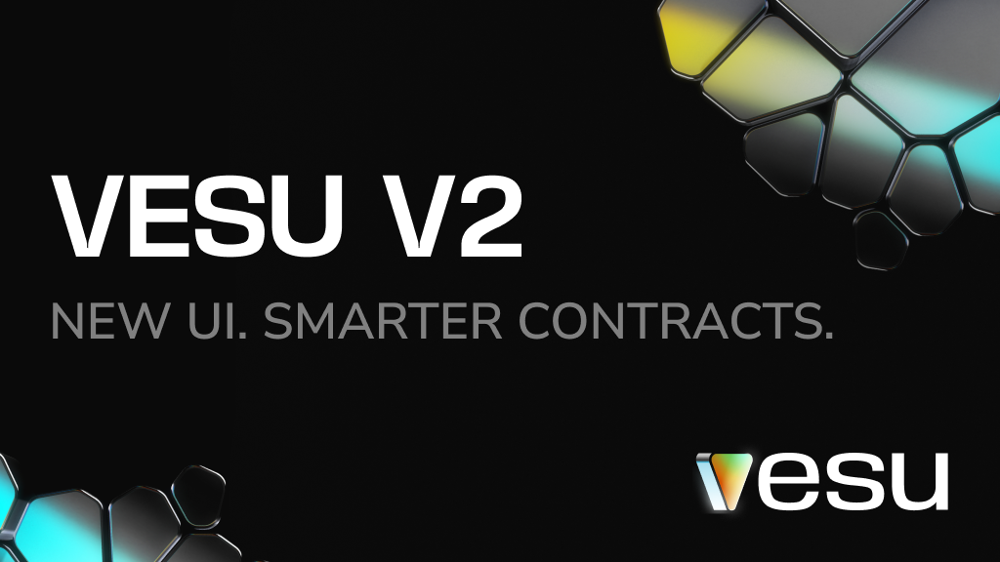

**Vesu V2 is live! Just in time for the BTCFi Season on Starknet.**

To kick things off, the Starknet Foundation is allocating **100M STRK** in rewards to anyone who brings their Bitcoin onchain and puts it to work. 

Vesu V2 makes that easier than ever. With a fully redesigned frontend, smarter contracts, and new curated pools by Re7Labs, Vesu is the main lending market powering BTCFi from day one.

Borrow against Bitcoin, earn yield and more. All without giving up custody.  

## Do More With Your Bitcoin
Bitcoin is great, but using it has been tough. Until now, choices were limited: sell and lose exposure, trust a centralized lender, or pay high borrow rates. BTCFi on Starknet changes that.

For the first time, you can access cheap liquidity. Without selling or giving up self-custody.

**Example**: Deposit **LBTC** into the new **Re7 USDC Core** pool to borrow **USDC**. Your borrow costs get subsidized by STRK rewards.

Use the extra liquidity as you like, deploy it into yield strategies, or spend with the Ready Card.

## Supply BTC to Earn 
Supplying Bitcoin earns BTCFi rewards and interest from borrowers.

The new **Re7 xBTC** pool pairs staked Bitcoin with their native assets and creates strong borrow demand as users boost exposure and yield with Vesu’s Multiply feature. This leads to a healthy organic yield on top.

**Looking for something even simpler?** Vesu V2 introduces Vaults. A new strategy layer that automates yield on autopilot. At launch, we’re kicking things off with Bitcoin Vaults curated by 0D. Deposit BTC once. It gets supplied into Vesu, borrows stablecoins, and allocates them into 0D institutional-grade yield strategies. No micromanaging, no more chasing APRs.

## Multiply your staked Bitcoin
Stake your Bitcoin on Starknet through Endur.fi to earn STRK staking rewards. For example, stake tBTC to receive xtBTC in return. Multiply the xtBTC against tBTC, increasing your exposure and boosting your yield.

Because the assets are expected to move closely together, this strategy carries lower liquidation risk while still stacking staking rewards.

## Claim and Supported Assets
Rewards are based on real usage. Borrowing earns rewards according to interest paid. Supplying BTC also qualifies, provided it’s non-recursive. They’re distributed weekly and become claimable every Friday (or anytime after that).

**The following assets are eligible for BTCFi rewards:**  
Lending: wBTC, tBTC, LBTC, SolvBTC  
Borrowing: USDC, USDT, CASH  
More assets and ways to earn will be added as BTCFi Season continues. 

## Vesu V2: Making DeFi simpler
Vesu V2 takes everything learned from V1 and builds an even stronger foundation for DeFi on Starknet.
- **Modern UX:** A clean, fast interface makes it easier to find the right opportunity
- **Simplified Contracts:** Each pool now runs on its own isolated contract, improving security, reducing complexity, and lowering gas costs
- **Vaults:** simply deposit to the vault to enjoy complex yield strategies on autopilot, enforced fully on-chain
- **Security first:** Multiple audits; $100K Immunefi bug bounty and new features like onchain monitoring by Hypernative.

Vesu V2 strengthens UX and security while unlocking support for new assets and strategies. It is the liquidity hub for BTCFi on Starknet.

## The Big Picture
BTCFi isn’t just a rewards program. It's Bitcoin’s next chapter. Capital comes in through staking, Vesu makes it productive, and users borrow, lend, and spend. This approach rewards real activity, not idle deposits that leave when incentives end.

Vesu becomes the bank for your Bitcoin, with liquidity ready to use anywhere.

### Explore Vesu V2 now:
- [Deposit tBTC](https://vesu.xyz/borrow/0x03976cac265a12609934089004df458ea29c776d77da423c96dc761d09d24124/0x04daa17763b286d1e59b97c283c0b8c949994c361e426a28f743c67bdfe9a32f/0x053c91253bc9682c04929ca02ed00b3e423f6710d2ee7e0d5ebb06f3ecf368a8) into the Re7 USDC Core pool.
- [Borrow USDC](https://vesu.xyz/borrow/0x03976cac265a12609934089004df458ea29c776d77da423c96dc761d09d24124/0x036834a40984312f7f7de8d31e3f6305b325389eaeea5b1c0664b2fb936461a4/0x053c91253bc9682c04929ca02ed00b3e423f6710d2ee7e0d5ebb06f3ecf368a8) against your LBTC. 
- [Multiply xsBTC](https://vesu.xyz/multiply/0x03a8416bf20d036df5b1cf3447630a2e1cb04685f6b0c3a70ed7fb1473548ecf/0x0580f3dc564a7b82f21d40d404b3842d490ae7205e6ac07b1b7af2b4a5183dc9/0x0593e034dda23eea82d2ba9a30960ed42cf4a01502cc2351dc9b9881f9931a68) with solvBTC.
- Explore the new Bitcoin [Vaults](https://vesu.xyz/vaults). 
- Learn more about V2 in our [docs](https://docs.vesu.xyz/). 
