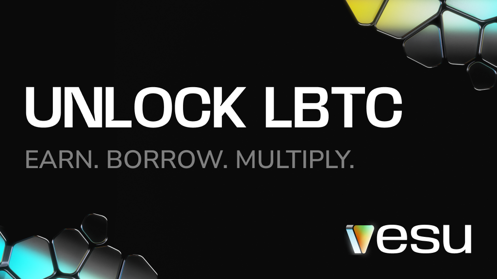
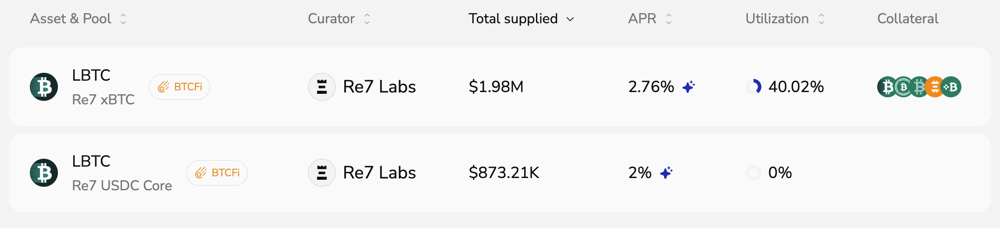
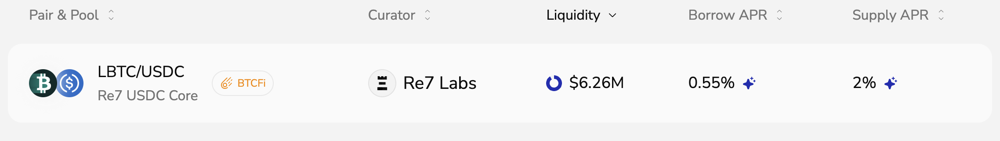
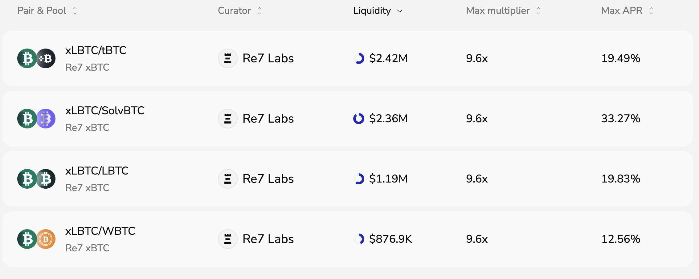

Bitcoin isn’t just a store of value anymore. It’s becoming the foundation for a new financial layer, one where BTC itself can earn, move, and work across chains. Lombard makes this possible with LBTC, a liquid, yield-bearing version of BTC that brings native Bitcoin yield into DeFi.  

And now on Vesu, LBTC goes even further. You can earn, borrow, or multiply your position directly on Starknet, the home of permissionless BTCFi.

:::info new here?
Start here → [Starknet Wallets & Bridging](https://docs.vesu.xyz/user-guides/start)  
You’ll be ready in 2 minutes.
:::

## Earn passive yield

Earn >2% APR on your LBTC deposit. Two pools by Re7 Labs are currently available.

**Re7 xBTC**  
This pool is built to Multiply staked Bitcoin. Deposited LBTC earns BTCFi rewards and organic yield driven by user-demand from Multiply and Borrow.

**Re7 USDC Core**  
The LBTC you deposit is not lent out, and can be withdrawn anytime. It earns BTCFi rewards while continuing to accrue staking rewards via Lombard.

[Earn more yield with your LBTC.](https://vesu.xyz/earn?collateralAssets=0x036834a40984312f7f7de8d31e3f6305b325389eaeea5b1c0664b2fb936461a4)

## Borrow stablecoins at top rates

Use your LBTC as collateral to borrow USDC within the Re7 USDC Core pool. It’s the easiest way to unlock liquidity without selling your Bitcoin.

Your borrowed USDC stays flexible. Use it to farm additional yield on Vesu, buy more Bitcoin, or spend it with the Ready Card.

[Borrow USDC against your LBTC.](https://vesu.xyz/borrow?collateralAssets=0x036834a40984312f7f7de8d31e3f6305b325389eaeea5b1c0664b2fb936461a4)

## Multiply your Bitcoin

LBTC is already staked Bitcoin, earning yield while staying liquid. But on Starknet, you can take it one level deeper.

Stake LBTC via Endur to mint **xLBTC**. It keeps earning staking rewards within the token, around 5% APY.

Now, Vesu lets you use that yield-bearing BTC as collateral to multiply your exposure, boosting yield up to 30% APY.

The Re7 xBTC pool is designed to multiply staked Bitcoin. Users can supply xLBTC to increase exposure and staking rewards. Available to multiply are LBTC, tBTC, SolvBTC, and WBTC. The correlated setup helps smooth volatility and improve stability for positions.

[Multiply staked LBTC (xLBTC) for higher exposure & yield.](https://vesu.xyz/multiply?collateralAssets=0x07dd3c80de9fcc5545f0cb83678826819c79619ed7992cc06ff81fc67cd2efe0)

## Make more with your Bitcoin

Vesu turns LBTC into productive collateral. Earn consistent yield, access stable liquidity at top rates, or multiply your exposure.  

Vesu is built for those who want their Bitcoin to do more: to stay self-custodial, secure, and earning while remaining entirely onchain.  

Security is non-negotiable when it comes to Bitcoin. Vesu’s smart contracts have been [audited by multiple independent firms](https://docs.vesu.xyz/security/audits), and there is a [$100K Immunefi bug bounty](https://docs.vesu.xyz/security/bounties). Additionally, if the main interface is ever unavailable, users can still access their positions through Vesu’s [lite frontend](https://lite.vesu.xyz/).  

It’s time to put your LBTC to work.