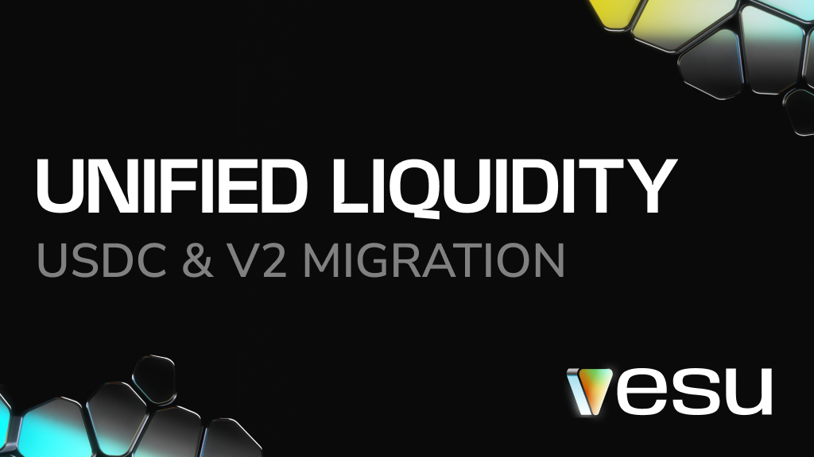
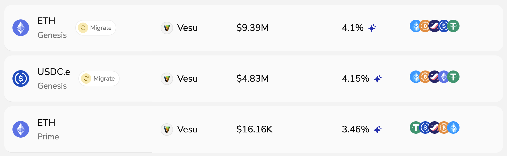

In December, liquidity on Vesu will be unified. With native USDC arriving on Starknet, users will migrate their USDC positions into the improved V2 pools. This is the next step in the shift from V1 to V2, and a simple migration tool will handle the move for you.

## What you need to know

:::info TL;DR
- All USDC.e and V1 positions will move to native USDC and V2 pools
- STRK rewards continue for native USDC 
- V1 pools will stay active but in a limited mode
- A 1-click migration will be available in the Vesu UI
:::

The current bridged USDC will be renamed USDC.e and native USDC will take over the USDC ticker across Starknet apps and explorers.

Once the migration begins, V1 pools will enter a limited mode. Opening new debt or increasing Multiply positions will no longer be possible. 

The migration tool will support both steps: moving from USDC.e to native USDC and shifting V1 positions into the newer V2 pools. Open positions and affected markets will show a Migrate button in the UI, as in the preview below.

## V2 as the New Standard

Vesu currently has 18 pools across V1 and V2, which makes it harder to find the right market and spread liquidity across many smaller pools. Consolidating liquidity in the V2 pools reduces this fragmentation and creates a simpler setup.

V2 pools run on improved smart contracts that have been audited by Zenith, ChainSecurity and OpenZeppelin. Their full reports are available in the [docs](https://docs.vesu.xyz/security/audits). Each pool uses its own isolated contract, with less complexity and better gas efficiency.

**Benefits for users:**
- Less fragmentation: liquidity concentrated in stronger pools
- Better UX: simpler to find the right markets
- Future-proof: all new features and improvements will focus on V2

## Strengths of native USDC

Native USDC is issued directly by Circle and comes with clear benefits:

- One unified, canonical USDC  
- Lower risk and fewer trust assumptions  
- Fully reserved and redeemable 1:1
- Faster, more reliable cross-chain transfers through CCTP
- Opens the door for institutional players on Starknet

It is the version exchanges, custodians and market makers prefer. 

## Next steps
There’s nothing you need to do right now. Just keep an eye on our socials. We’ll post the exact go-live announcement on [X](https://x.com/vesuxyz) and [Discord](https://discord.gg/G9Gxgujj8T) once everything is ready.

If you have any questions, now or during the migration, feel free to open a ticket in our [Discord](https://discord.gg/G9Gxgujj8T). We’re here to help.