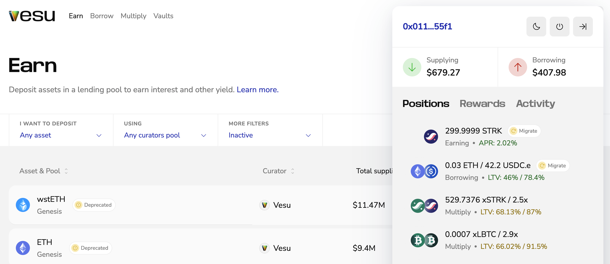

# Re7 Pool Upgrade

Re7 Labs, the main curator behind Vesu’s BTCFi pools, has moved their remaining legacy pools to V2.

Any position that can be upgraded will now show a Migrate button in the Vesu UI, guiding you through a simple, one-click migration flow.

## TL;DR

- Re7 Labs’ remaining V1 pools are migrating to V2   
- The Re7 USDC V1 pool is being deprecated
- Migration is live and handled directly in the app  
- Funds remain safe throughout  

For a step-by-step walkthrough, see the guide in the [docs](https://docs.vesu.xyz/user-guides/migrate).

## New Re7 Pools

| V1 pool | New V2 pool |
|--------|-------------|
| Re7 xSTRK | Re7 STRK |
| Re7 wstETH | Re7 ETH |
| Re7 Starknet Ecosystem | Re7 Labs Starknet Ecosystem |

#### Note on Re7 STRK

Previously, the Re7 xSTRK pool priced xSTRK using the STRK price, as this was the most reliable oracle available at the time of launch.

The Re7 STRK pool now uses the xSTRK conversion rate price feed, so xSTRK positions will reflect their full underlying value in the new pool.

## Re7 USDC pool deprecation

The **Re7 USDC** pool is being deprecated.

Markets from this pool are migrated as follows:
- ETH and wstETH → Re7 ETH  
- STRK → Re7 STRK  
- USDC.e → native USDC in Re7 USDC Core  
- WBTC → Re7 USDC Core

BTCFi rewards for WBTC continue in the Re7 USDC Core pool.

## V2 going forward

With this upgrade, all liquidity is coming fully to V2.

This allows:
- Fewer markets and less fragmentation  
- A simpler, clearer UX  
- Full focus on V2 going forward  
- Improved smart contracts as the single standard  

V2 is now the foundation for all future improvements on Vesu.

If you have any questions, feel free to reach out in Discord. We’re happy to help.