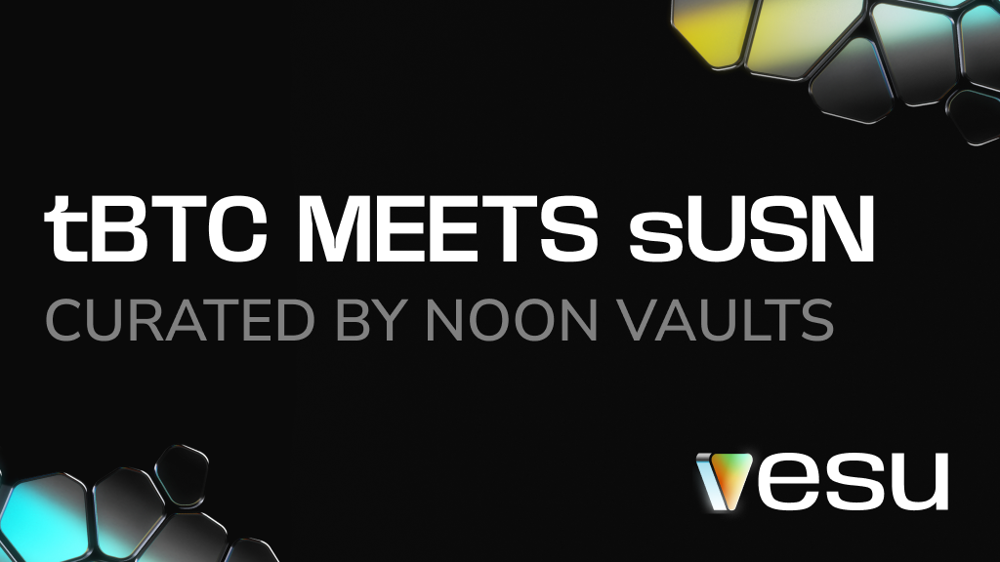

A new Bitcoin strategy is live on Vesu.

The **Noon tBTC Vault** is built for Bitcoin holders looking for strong yield. Users deposit tBTC and earn yield through an automated, fully onchain setup that builds on sUSN yield and Vesu’s low borrow rates.

We’re excited to welcome **Noon Vaults** as a new curator, expanding the range of Bitcoin strategies available on Starknet.

## The Noon tBTC Vault

The Noon tBTC Vault is designed for users who want to put their Bitcoin to work without selling it or actively managing positions.

The setup combines BTC-backed borrowing with yield generated via sUSN, allowing returns to compound back into tBTC over time. Position management, rebalancing, and execution are fully abstracted away.

The curator targets **~10% yield**. All funds remain non-custodial and fully transparent onchain.

## About Noon and sUSN

Noon issues USN, a USD-backed stablecoin designed with a focus on sustainable yield, safety, and long-term use. Its staked version, sUSN, accrues yield directly within the token over time.

With sUSN live on Vesu, users can use it as collateral, borrow against it, and combine it with Vesu’s vaults and Multiply to access more advanced onchain strategies.

## Vesu Vaults

Vesu Vaults are designed to make onchain yield more accessible by abstracting away complexity, while remaining fully non-custodial.

Vaults follow strict, onchain strategy mandates and are operated by independent curators. Deposited funds can only be used as defined by the strategy, and performance is reported transparently onchain.

The Vesu Vaults framework has undergone multiple independent audits. Full details are available in the [Vesu docs](https://docs.vesu.xyz/security/audits).

## Get started

You can now:
- Deposit tBTC into the new [Noon tBTC Vault](https://vesu.xyz/vaults/0x04424dec8280f518b35be33139f44ef9fa0855b117f16cda2a30f1b64c27864a)  
- [Multiply sUSN](https://ntbtc.vesu.xyz/multiply/0x073702fce24aba36da1eac539bd4bae62d4d6a76747b7cdd3e016da754d7a135/0x02411565ef1a14decfbe83d2e987cced918cd752508a3d9c55deb67148d14d17/0x033068f6539f8e6e6b131e6b2b814e6c34a5224bc66947c47dab9dfee93b35fb) to increase your exposure & yield  
- [Borrow USDC against sUSN](https://ntbtc.vesu.xyz/borrow/0x073702fce24aba36da1eac539bd4bae62d4d6a76747b7cdd3e016da754d7a135/0x02411565ef1a14decfbe83d2e987cced918cd752508a3d9c55deb67148d14d17/0x033068f6539f8e6e6b131e6b2b814e6c34a5224bc66947c47dab9dfee93b35fb)  

Explore the new tBTC Vault and sUSN on Vesu and see what’s possible.