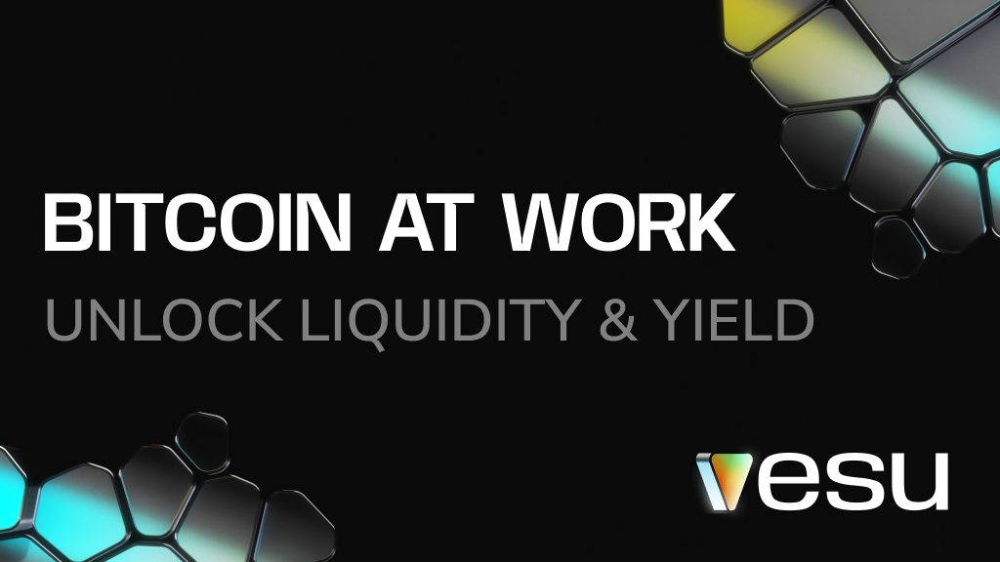

Most Bitcoin holders share the same problem.

You don’t want to sell your BTC, but sometimes you need liquidity. To cover expenses. To deploy capital. To earn yield instead of letting it sit idle.

Bitcoin is great for holding. It has been less great for actually using. That changes now.

If you use a Bitcoin wallet like Xverse, you already have access to the tools you need. 

## BTCFi on Starknet

tarknet is becoming Bitcoin’s execution layer, a place where Bitcoin-backed assets can be used in fast, low-cost way. It’s built on leading zero-knowledge technology with a roadmap toward quantum-resistant cryptography.

There’s real momentum behind BTCFi on Starknet. A 100M STRK incentive program is live, rewarding real usage and helping bootstrap liquidity.

Xverse fully supports Starknet and provides the rails to move beyond just holding:
- Swap directly into Bitcoin assets on Starknet  
- Gas fees on Starknet are sponsored by Xverse  
- Starknet apps are one click away  

That makes the move to start using your Bitcoin straightforward.

## What you can do with BTC on Vesu

Vesu has a dedicated BTCFi mode built specifically for Bitcoin holders. The interface focuses on one thing: putting your BTC to work without adding unnecessary complexity.

Supply BTC-backed assets and earn yield from borrowers and BTCFi rewards.

Need liquidity? Use the same collateral to borrow stablecoins. No selling required.

Example: deposit 1 tBTC earning around 2% APR, then borrow USDC at roughly 1.5% APR. Your BTC keeps earning while you unlock spending power.

---insert screenshot

There are also vaults earning up to 10% APY on your BTC deposit. These strategies run fully onchain and aim for stronger returns on Bitcoin.

Want more? Switch to PRO mode and use Multiply to increase BTC exposure and yield.

## Built for long-term Bitcoin finance

Vesu is built as infrastructure, not a short-term campaign.

Fully onchain. Non-custodial. Audited by multiple firms. Backed by a $100k bug bounty. Markets are monitored onchain and overseen by professional curators.

## Ready to explore?

If you’re holding BTC in Xverse and want to do more with it, connect your wallet and explore BTCFi mode here: https://vesu.xyz/btcfi/

Your Bitcoin doesn’t have to just sit still.