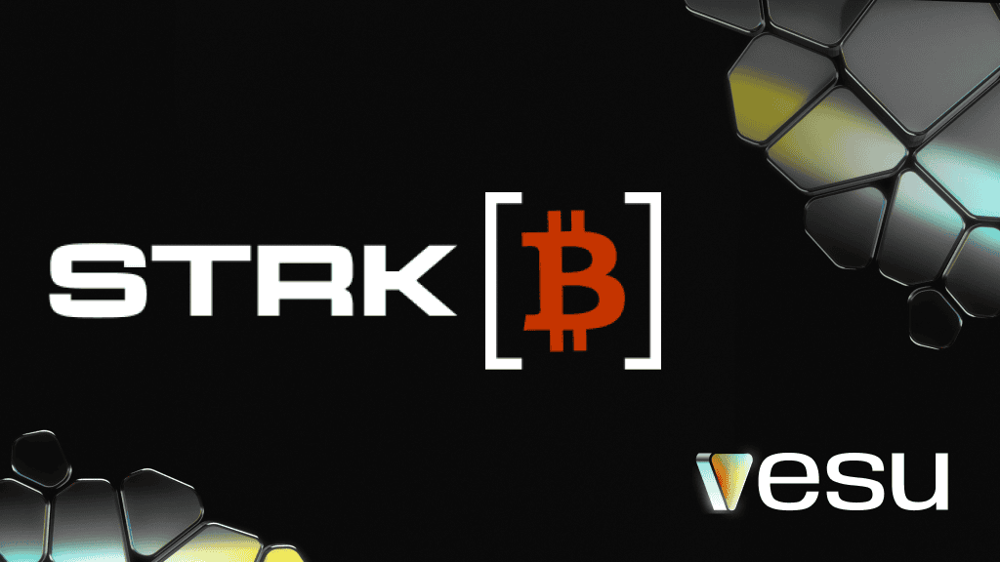

A new kind of Bitcoin just landed on Starknet. strkBTC is now available on Vesu.

Powered by the new STRK20 standard, strkBTC brings optional privacy to Bitcoin on Starknet.

## Re7 USDC Prime

strkBTC is live in Re7 USDC Prime, curated by Re7 Labs. The pool keeps things simple with BTC collateral and native USDC: 

**Collateral**
- strkBTC
- WBTC

**Borrow**
- USDC

## BTCFi rewards

strkBTC deposits earn 2% APR in STRK rewards. USDC borrowing is also subsidized through the BTCFi program, bringing borrow rates down to around 2% APR.

STRK rewards can be claimed every Friday, or any day after.

## Staked strkBTC

xstrkBTC, the liquid staked version of strkBTC by Endur, is also available on Vesu. It earns staking rewards while remaining usable as collateral.

**Available pools and use case:**
- Re7 USDC Core to borrow USDC
- Re7 xBTC to increase exposure & yield via Multiply

## Security

All Vesu pools are isolated with their own liquidity and parameters. Onchain monitoring through Hypernative is active. If unusual activity is detected, affected pools are automatically paused.

Vesu has undergone multiple independent audits and runs a live bug bounty program.

## Get started

- [Deposit strkBTC ](https://vesu.xyz/btcfi/markets/0x02eef0c13b10b487ea5916b54c0a7f98ec43fb3048f60fdeedaf5b08f6f88aaf/0x0787150e306e6eae6e3f79dea881770e8bbff2c1b8eb490f969669ee945b3135?collateralAssetAddress=0x0787150e306e6eae6e3f79dea881770e8bbff2c1b8eb490f969669ee945b3135) 
- [Borrow USDC against strkBTC](https://vesu.xyz/btcfi/markets/0x02eef0c13b10b487ea5916b54c0a7f98ec43fb3048f60fdeedaf5b08f6f88aaf/0x0787150e306e6eae6e3f79dea881770e8bbff2c1b8eb490f969669ee945b3135/borrow?collateralAssetAddress=0x0787150e306e6eae6e3f79dea881770e8bbff2c1b8eb490f969669ee945b3135&debtAssetAddress=0x033068f6539f8e6e6b131e6b2b814e6c34a5224bc66947c47dab9dfee93b35fb)  
- [Borrow USDC against xstrkBTC](https://vesu.xyz/btcfi/markets/0x03976cac265a12609934089004df458ea29c776d77da423c96dc761d09d24124/0x047751b3532fabca89b0f2e35ca1cb45e5a7b11d5e3d3663dfa1f4406b45fd88/borrow?collateralAssetAddress=0x047751b3532fabca89b0f2e35ca1cb45e5a7b11d5e3d3663dfa1f4406b45fd88&debtAssetAddress=0x033068f6539f8e6e6b131e6b2b814e6c34a5224bc66947c47dab9dfee93b35fb)
- [Explore Re7 USDC Prime](https://vesu.xyz/btcfi/markets?poolId=0x02eef0c13b10b487ea5916b54c0a7f98ec43fb3048f60fdeedaf5b08f6f88aaf)

Got a question or want to receive weekly updates? Join the [Discord community](https://discord.com/invite/G9Gxgujj8T).