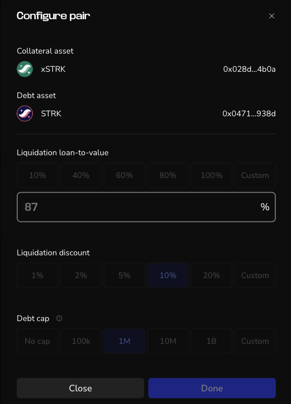
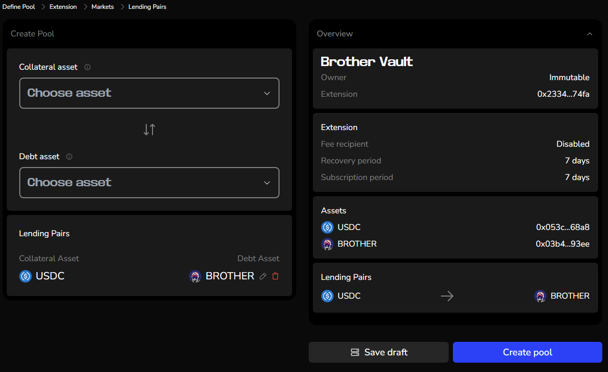
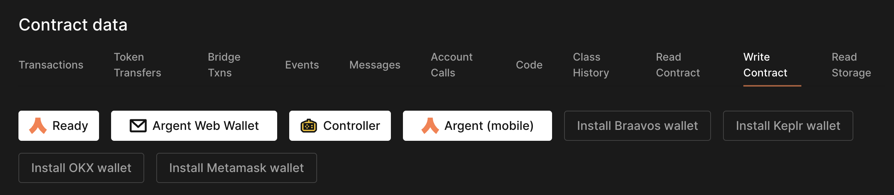
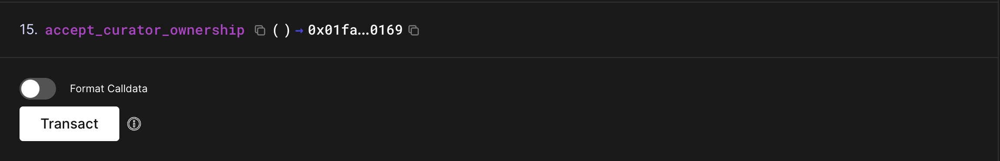

In this section, we'll learn how to create new Vesu markets.

Vesu's permissionless nature enables everyone to create new lending pools calling the respective protocol function directly (e.g. through a block explorer). An easier way to do it is with the Pools page.

## Requirements

- Starknet Wallet: A multisig setup is strongly recommended for the curator role to minimize risks.
- Small Token Amount: A small amount of the token is required to seed the pool (at least 1,000 units in the smallest denomination, such as 0.001 USDC for a USDC pool). This amount is burned to prevent share inflation attacks and ensure pool integrity.

## Step-by-step Guide

Click the blue __Create Pool__ button on the Pools [page](http://vesu.xyz/pools).

**1. Define Pool**
- Name of your pool.
- Set a Starknet account as owner or choose Immutable. If Immutable is selected no changes are possible after the creation of the new pool.
- Choose the extension contract with lending hook implementations to use for the pool. For the launch there is just one extension from Pragma available. 

(update image)

**2. General Settings**
- Fee recipient: Set a Starknet account as recipient for fees, or check the Box for “No fees”

Choose if __Emergency pause agent__ should be activated. If activated, specify:
If enabled, this Hypernative agent will pause the pool in case of an emergency to protect users. As the pool curator, you will be able to unpause the pool again at any time.

(update image)

**3. Choose the assets for your pool and define the parameter for each token.**

Add all the assets and their configuration that should be enabled as market or collateral (or both) in the pool.

For each asset, configure the following parameters:

- Liquidation loan-to-value & Liquidation discount
- Debt cap
- Max Utilization
- Oracle Method
- vToken Name
- Interest Rate Model Specifications

(update image, check setting Lending pairs above and update)

**4. Define Lending Pairs**

Add all the lending pairs, consisting of a collateral asset and debt asset, and their configuration that should be enabled in the pool.

**5. Create pool**

Check all settings and verify that everything is correct. Especially if it is an immutable pool, as then you can’t change any settings after the creation. If you click in one of the sections, you can go back to this step to make changes.

When everything is correct, click __Create Pool__ and confirm the transaction in your wallet.

:::info
Reminder: A small amount of the token is required to seed the pool (at least 1,000 units in the smallest denomination, such as 0.001 USDC for a USDC pool). This amount is burned to prevent share inflation attacks and ensure pool integrity.
:::

**6. Accept curator ownership**
After creation of the pool, the ownership must be claimed via a blockexplorer like [Voyager](https://voyager.online/). Open the address of your pool, click on **Write Contract** and connect your wallet.

Sroll down to `15. accept_curator_ownership`, click on **Transact** and confirm the transaction in your wallet.
