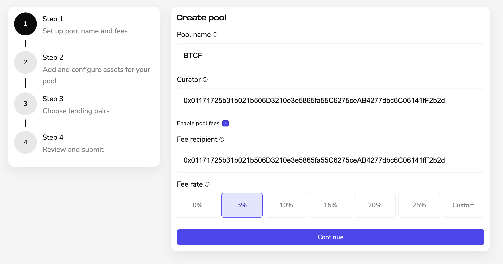
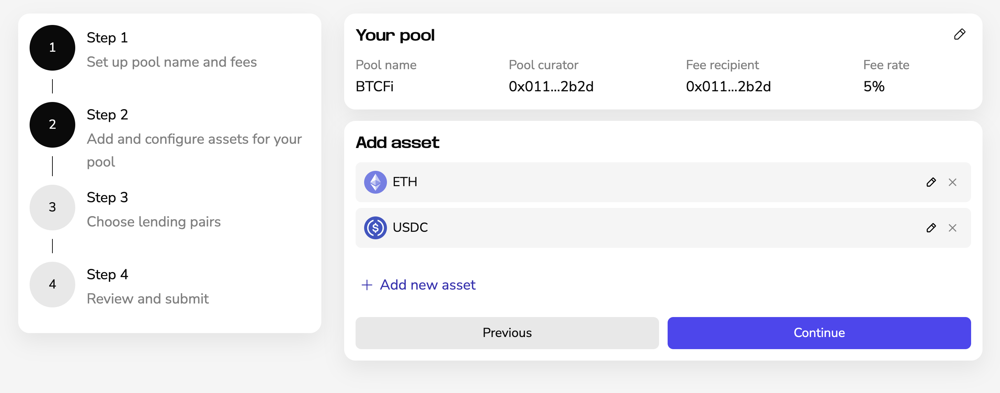
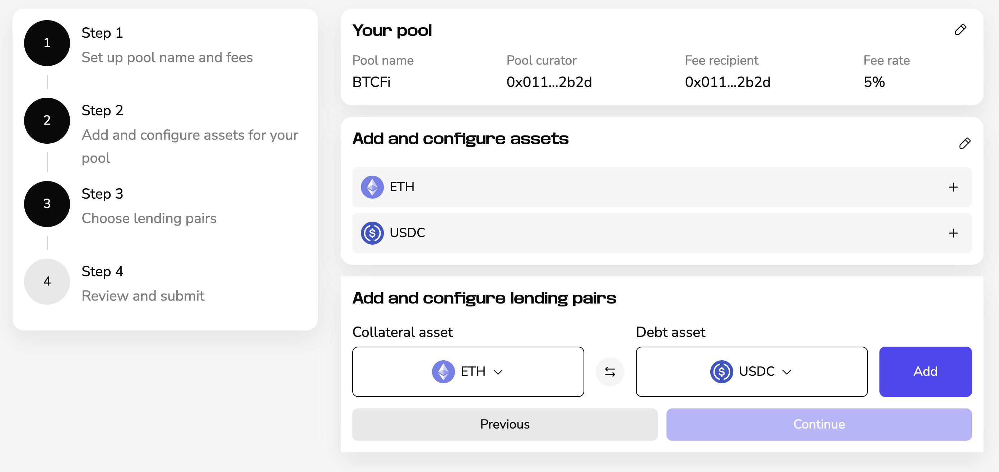
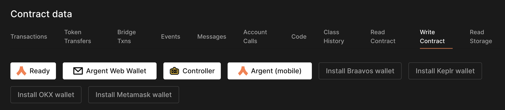
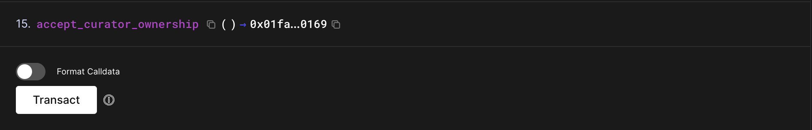

In this section, we'll learn how to create new Vesu pools.

Vesu's permissionless nature allows anyone to create new lending pools directly through the protocol contracts (e.g. via a block explorer).

## Requirements

- Starknet wallet: A multisig setup is strongly recommended for the curator role to minimize risks.
- Small token amount: A small amount of the token is required to seed the pool (at least 1,000 units in the smallest denomination, such as 0.001 USDC for a USDC pool). This amount is burned to prevent share inflation attacks and ensure pool integrity.

## Step-by-step Guide

Click the blue __Create new pool__ button on the [Pools Dashboard](https://vesu.xyz/pro/pools).

### 1. Set up Pool
- Enter a name for the pool.
- Enter the Starknet wallet address that will be the curator (pool owner).
- Enable or disable pool fees.
- If fees are enabled, set the fee recipient and fee rate.

### 2. Add and Configure Assets

Add the assets that should be available in the pool.

For each asset, configure:
- Debt floor
- Max utilization
- Interest rate model parameters
- vToken name and symbol 

### 3. Configure Lending Pairs
After adding the assets, configure the lending pairs by selecting a collateral asset and a debt asset.

For each lending pair, configure:

- Liquidation loan-to-value (LTV)
- Liquidation discount
- Debt cap

Repeat this process for any additional lending pairs.

### 4. Review and Submit

Check all settings and verify that everything is correct. 

When everything is correct, click __Create Pool__ and confirm the transaction in your wallet. Once the pool is created, the curator must claim ownership via the contract (see next section).

:::info
Reminder: A small amount of the token is required to seed the pool (at least 1,000 units in the smallest denomination, such as 0.001 USDC for a USDC pool). This amount is burned to prevent share inflation attacks and ensure pool integrity.
:::

## Accept Curator Ownership

After creation of the pool, the ownership must be claimed via a blockexplorer like [Voyager](https://voyager.online/). Open the address of your pool, click on **Write Contract** and connect your wallet.

Scroll down to `15. accept_curator_ownership`, click on **Transact** and confirm the transaction in your wallet.

Ownership of a pool can be transferred to another account. As an added security layer, the new owner must manually accept ownership via the contract.