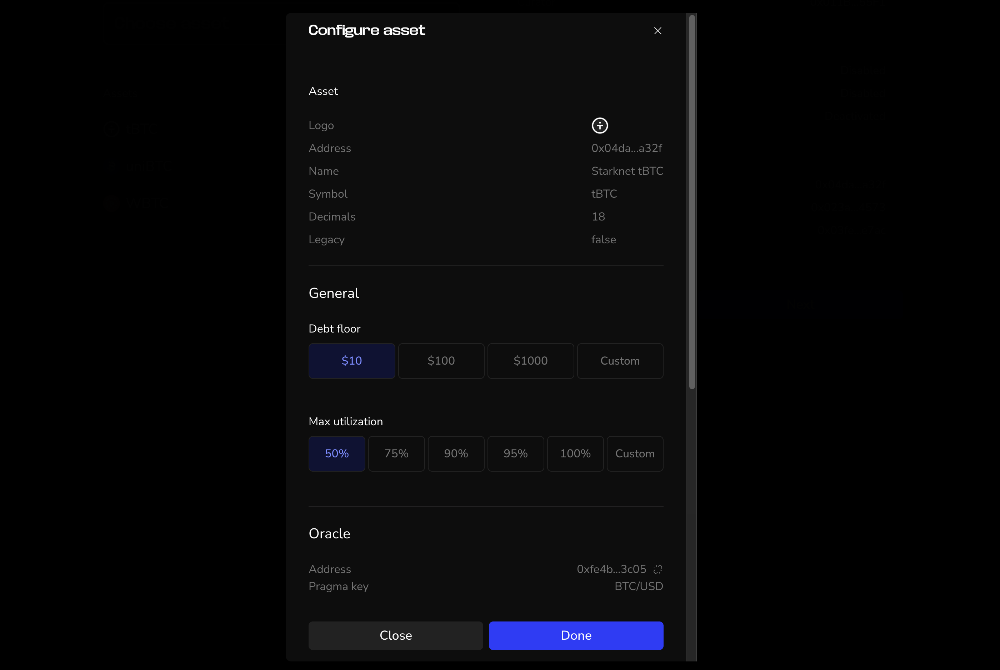

In this section, we'll learn how to create new Vesu pools.

Vesu's permissionless nature enables everyone to create new lending pools calling the respective protocol function directly (e.g. through a block explorer). An easier way to do it is with the Curator Dashboard.

## Requirements

- Starknet wallet: A multisig setup is strongly recommended for the curator role to minimize risks.
- Small token amount: A small amount of the token is required to seed the pool (at least 1,000 units in the smallest denomination, such as 0.001 USDC for a USDC pool). This amount is burned to prevent share inflation attacks and ensure pool integrity.

## Step-by-step Guide

Click the blue __Create Pool__ button on the [Curator Dashboard](http://curator.vesu.xyz).

**1. Define Pool**
- Name of your pool.
- Set a Starknet account as owner.

**2. General Settings**
- Fee recipient: Set a Starknet account as recipient for fees, or check the Box for “No fees”

The __Emergency pause agent__ can be activated after the creation of the pool. The Hypernative agent will pause the pool in case of an emergency to protect users. As the pool curator, you will be able to unpause the pool again at any time. Please contact the Vesu team if you want to activate this feature.

**3. Choose the assets for your pool and define the parameter for each token.**

Add all the assets and their configuration that should be enabled as market or collateral (or both) in the pool.

For each asset, configure the following parameters:

- Debt floor
- Max utilization
- vToken name and symbol (optional)
- Interest Rate Model parameters

**4. Define Lending Pairs**

Set up lending pairs by selecting a collateral asset and a debt asset. Configure:
- Liquidation loan-to-value (LTV): triggers liquidation once the LTV is reached
- Liquidation discount: the reward for liquidators when repaying debt
- Debt cap limits how much of the debt asset can be borrowed in this pair

**5. Create pool**

Check all settings and verify that everything is correct. Especially if it is an immutable pool, as then you can’t change any settings after the creation. If you click in one of the sections, you can go back to this step to make changes.

When everything is correct, click __Create Pool__ and confirm the transaction in your wallet. Once the pool is created, the curator must claim ownership via the contract (see next section).

:::info
Reminder: A small amount of the token is required to seed the pool (at least 1,000 units in the smallest denomination, such as 0.001 USDC for a USDC pool). This amount is burned to prevent share inflation attacks and ensure pool integrity.
:::

## Accept Curator Ownership

After creation of the pool, the ownership must be claimed via a blockexplorer like [Voyager](https://voyager.online/). Open the address of your pool, click on **Write Contract** and connect your wallet.

Sroll down to `15. accept_curator_ownership`, click on **Transact** and confirm the transaction in your wallet.

Ownership of a pool can be transferred to another account. As an added security layer, the new owner must manually accept ownership via the contract.