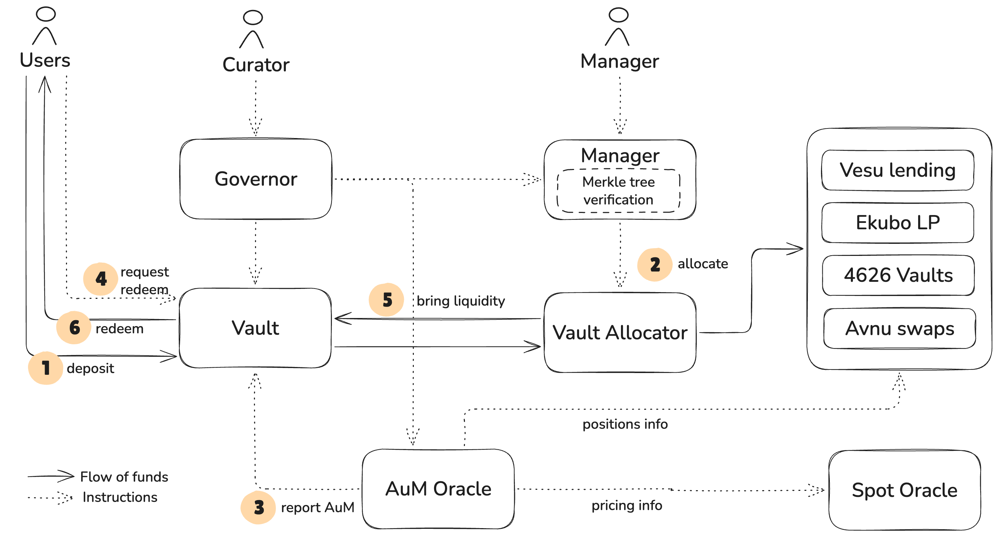

Vesu Vaults are built from the ground up to to serve as an open protocol for professional curators to launch and manage flexible yield strategies with enterprise-grade security and minimal trust-assumptions.

## How it works

Vesu Vaults is a modular vault infrastructure allowing third-party curators to launch and manage yield strategies with minimal overhead. At its core, the system builds on the proven [starknet-vault-kit](https://github.com/ForgeYields/starknet_vault_kit) and extends this in a number of ways to minimize the dependence on curators and maximize security for users.

### Vault

The _Vault_ allows users the deposit and withdraw funds to/from a Vesu Vault. It follows the ERC-4626 standard with an asynchronous redemption process. It mints an ERC-20 compatible token representing vault shares and tracking user deposits. The _Assets under Management_ and vault share price is informed by a trustless _AuM Oracle_. The Vault further handles the asynchronous redemptions and fees.

### Vault Allocator

The _Vault Allocator_ executes strategy actions initiated and verified by the _Manager_. It allocates the _Vault_'s funds in accordance with the pre-approved strategy mandate and maintains positions in the respective DeFi protocols. It further rebalances and unwinds these positions to return funds back to the _Vault_ to honor users' redemptions.

### Manager & Merkle tree verification

The _Manager_ allows the strategy manager to allocate the vault's funds within its strategy mandate. This strategy mandate is defined by the curator in form of a _Merkle tree_ whose leafs consist of approved onchain actions (such as _deposit_ in a Vesu lending pool or _swap asset A for asset B_ on Avnu). To allocate vault funds, the manager thus provides a _Merkle proof_ that a certain action is in fact a valid leaf in the _Merkle tree_ and thus permitted by the strategy mandate.

### NAV Oracle

The _AuM Oracle_ is responsible for computing the vault's _Assets under Management_ across all positions in external DeFi protocols and idle asset balances. It is therefore configured with the vault's strategy mandate and in particular the list of DeFi protocols the strategy has pre-approved to maintain positions in.

### Governor

The _Governor_ is the owner of all the components of a Vesu Vault. It delegates curator permissions, including changing the strategy mandate or fee configurations, to the vault curator and upgrade permissions to the _Vesu Security Council_.

### Vault Factory

The _Vault Factory_ (not included in the diagram above) offers curators a simple and secure way to create new Vesu Vault instances. It deploys the different vault components, initializes the roles, computes the strategy mandate's merkle tree and it initializes the _Manager_ and _NAV Oracle_ with this strategy setup in order to ensure consistent management and pricing of the vault.

## Flow of Funds

The following steps outline a common sequence of interactions with Vesu Vaults and the corresponding flow of funds:

1. User deposits funds in the _Vault_ and receives ERC-4626 vault shares in return, with the share conversion rate being reported through the onchain _NAV Oracle_.
2. Funds sit in the vault contract until allocated by the strategy manager. Allocations are only possible within the vault's strategy mandate which is enforced through an onchain _Merkle tree verification_ step.
3. The onchain _AuM Oracle_ continuously reports the vault's _Assets under Management_ in a fully trustless manner.
4. In order to withdraw funds, users _request redemptions_ by sending the desired vault shares to the vault. Redemptions are batched in epochs with a certain delay (e.g. 1 day).
5. The manager observes redemption requests and ensures sufficient liquidity is in the vault to honor all redemptions.
6. After the redemption delay has passed, users claim their funds from the vault.

## Secure strategy mandates

Based on the built-in _Merkle tree verification_ system, Vesu Vaults ensure that yield strategies are "enshrined" and always enforced by the vault. This reduces both the trust assumptions in the strategy manager and operational security. Specifically, Vesu Vaults offer the following guarantees:

- Vault curators are able to express a strategy mandate by encoding every action a manager can perform as a leaf in a merkle tree and to embedd this tree in the vault itself.
- Vault managers are able to execute any action that is pre-approved in its embedded merkle tree by submitting a corresponding merkle proof.
- The vault enforces all manager actions to be pre-approved by the curator by verifying the submitted action and merkle proof.
- The vault thus makes it impossible for the manager to execute arbitrary, non pre-approved, actions and thus minimizes trust assumptions.

## Protocol integrations

Vesu Vaults currently integrates with the following DeFi protocols on Starknet:

- Vesu lending pools
- Avnu DEX aggregator for asset swaps
- Third-party ERC-4626 vaults

More integrations, such as LPing on the Ekubo DEX, are planned to be added over time.

## Roles

Vesu Vaults can be configured with a set of roles and permissions: 

- Curator: Governs over the vault and strategy including the strategy mandate, fees and roles.
- Manager: Is able to execute the strategy within the enabled mandate.
- Pauser: Has the permission to pause a vault and strategy in case of an emergency.

## Fees

As a vault curator you are able to specify a number of fees:

- Management fee: An annual percentage rate applied on the vault's NAV.
- Performance fee: A percentage rate applied on the vault's P&L.
- Redemption fee: A percentage rate applied to a user's redemption amounts.

Note that multiple fees can be specified at the same time, thus applying in parallel.

## Protocol fee

The development, maintenance and operation of the Vesu Vaults infrastructure comes at a cost for Vesu. In order to cover this cost, Vesu Vaults are equipped with a _Fee Sharing_ mechanism that directs 10% of the curator's total fee revenue to Vesu. Note that curators still have full control over the fees applicable in a certain Vesu Vault and the fee sharing is limited to whatever fee configuration is made in a vault.

## Security

As with all of the Vesu infrastructure we put a strong focus on the security of Vesu Vaults. Among other aspects, this involves that 100% of the production smart contract code is audited and covered by a bug bounty. You can learn more about our rigorous security process, our security partners, our audits and other resources in our Security [docs](/docs/security/index.md).