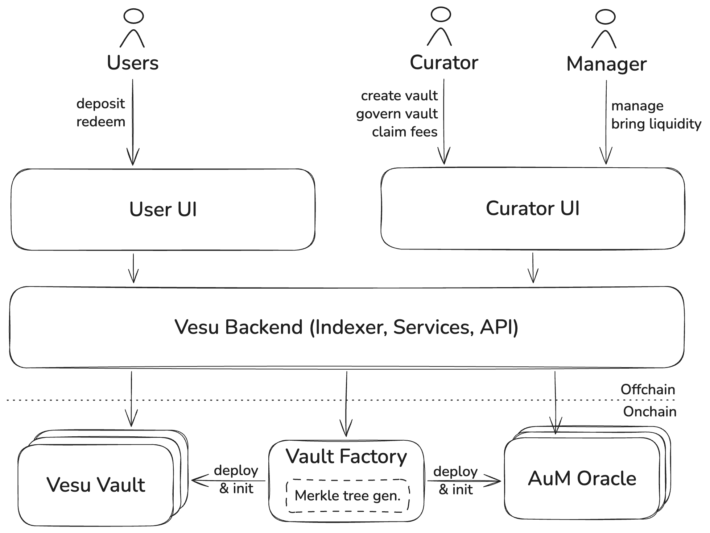

Launching and managing yield strategies can come with significant overhead in terms of setting up and maintaining infrastructure. With Vesu Vaults we have reduced this overhead to a minimum, significantly reducing the initial and ongoing cost for vault curators.

## Vault Factory

This is a smart contract that simplifies the creation of a new vault and increases security for curators and users by: bundling the deployment of all Vault components, configuring roles and oracles, emitting the respective onchain events for vault tracking.

## AuM Oracle

This is a smart contract that computes and reports the vault's __Assets under Management__ (AuM) onchain, reducing the dependence on offchain infrastructure and increasing the operational security.

## Vault indexing & backend

Vesu Vaults, including all curator, strategist and user actions, are indexed directly in the Vesu backend and information available through our API.

## Curator UI

Currently we do not offer a Curator UI. Instead, curators and strategists can use the Vault Curator SDK which is documented [here](/curators/vaults/curator-sdk).

## User UI

Vesu Vaults are embedded in Vesu's main UI, allowing vault curators to launch new strategies without having to build a new app from scratch and leverage the existing Vesu user base from day 1.

## Automations

Certain operational processes of Vesu Vaults can be automated to reduce the overhead both for vault curators and managers. All Vesu Vaults, and curators, have access to the following default automations:
- __Assets under Management__ reporting through the __AuM Oracle__
- Claiming of user redemptions

Please reach out to us, if you want to explore automating more processes for your vault strategy.