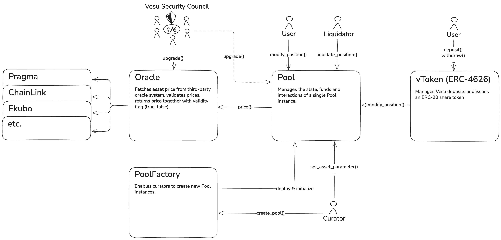

The Vesu V2 protocol is built with a focus on simplicity and security. It consists of a few building blocks that aim at maximally isolate user funds and reduce bug and attack surface. The architecture of the Vesu V2 protocol and its building blocks is outlined in the figure below.

Each lending pool is therefore isolated in a separate instance of the `Pool` contract. This contract manages all state, user funds and interactions related to that specific pool. 

For each asset in the pool a corresponding `vToken`, following the ERC-4626 standard, is deployed which allows lenders to deposit funds into the pool and receive a share token in return. 

The `Pool` contract fetches asset prices from the `Oracle` (adapter) contract. This contract fetches the raw asset prices from a third-party oracle provider, currently Pragma, validates these prices and returns both the price and validity flag (true, false) to the `Pool` contract. The `Pool` contract pauses all asset withdrawals in case it recieves an invalid asset price from the `Oracle`.

Finally, the `PoolFactory` allows curators to create new `Pool` instances through a simple interface, `create_pool`. Upon pool creation, the `PoolFactory` deploys a new `Pool` contract, initializes it with the provided asset and pair parameters and deploys the respective `vToken`s.

For security purposes, the `Pool` and `Oracle` contracts are upgradeable with the permission to upgrade owned by the Vesu Security Council. This council is explained in more details in the [Security docs](/docs/security/security-council.md).
