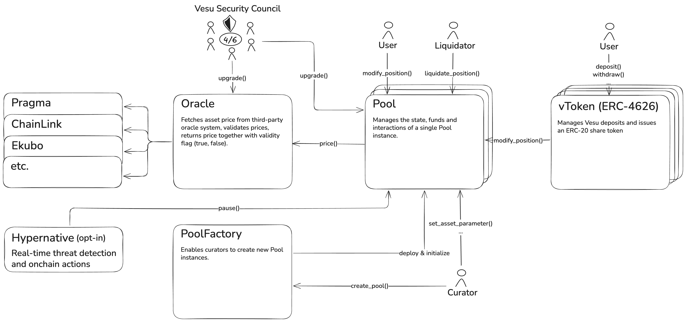

The Vesu V2 protocol is built with a focus on simplicity and security. It consists of a few building blocks that aim at maximally isolate user funds and reduce the bug and attack surface. The architecture of the Vesu V2 protocol and its building blocks is outlined in the figure below.

Each lending pool is isolated in a separate instance of the `Pool` contract. This contract manages all state, user funds and interactions related to that specific pool. This way, in Vesu V2 user funds are isolated by design in separate `Pool` instances.

At the same time, the concept of lending pairs and positions remains exactly the same as in the Vesu V1 protocol. Thus, Vesu V2 pools remain as flexible as it gets when it comes to the configuration of different loan structures within a pool. Similarly, pool curators keep the granular level of control over risk exposures and parameters as known from Vesu V1.

For each asset in the pool a corresponding `vToken`, following the ERC-4626 standard, is deployed which allows lenders to deposit funds into the pool and receive a share token in return. 

The `Pool` contract fetches asset prices from the `Oracle` (adapter) contract. This contract fetches the raw asset prices from a third-party oracle provider, currently Pragma, validates these prices and returns both the price and validity flag (true, false) to the `Pool` contract. The `Pool` contract pauses all asset withdrawals in case it recieves an invalid asset price from the `Oracle`.

An additional highlight introduced with the Vesu V2 protocol is the ability for curators to opt-in to having a lending pool being monitored by Hypernative's real-time threat detection and onchain actions infrastructure. This enables the respective pool's to be continuously monitored and temporarily paused in case of a potential threat, thereby serving as a crucial layer of protection for users and the Starknet ecosystem. 

Finally, the `PoolFactory` allows curators to create new `Pool` instances through a simple interface, `create_pool`. Upon pool creation, the `PoolFactory` deploys a new `Pool` contract, initializes it with the provided asset and pair parameters and deploys the respective `vToken`s. Pool creation and curation remains a permissionless activity continuing Vesu's legacy of empowering fully open, global and secure lending markets on Starknet.

For security purposes, the `Pool` and `Oracle` contracts are upgradeable with the permission to upgrade owned by the Vesu Security Council. This council is explained in more details in the [Security docs](/docs/security/security-council.md).
