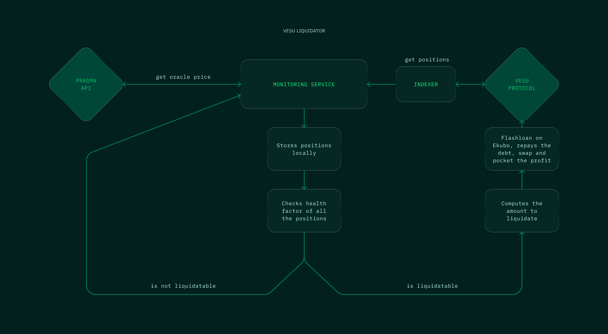

Liquidations on the Vesu lending protocol are permissionless creating an efficient market for liquidations and resulting in the best market conditions for lenders and borrowers.

In order to make it as simple as possible for new liquidators to entering the Vesu liquidations market, we have developed an open-source liquidation bot in collaboration with the Pragma team.

The following diagram outlines the bot's architecture and main components:

_Source: Publication in Pragma's blog [here](https://blog.pragma.build/announcing-the-open-source-liquidation-bot-for-vesu/)._

The liquidation bot indexes and monitors Vesu positions continuously to identify insolvent positions. Such positions are then immediately executed in a fully capital-neutral manner using our `Liquidate` periphery contract and _flash loans_. 

You can find more information on the liquidation bot under the following links:

V1
- Liquidate contract source code on Vesu's [GitHub](https://github.com/vesuxyz/vesu-periphery/blob/main/src/liquidate.cairo)
- Liquidation bot source code on Pragma's [GitHub](https://github.com/astraly-labs/vesu-liquidator)
- Pragma explainer blog post [here](https://blog.pragma.build/announcing-the-open-source-liquidation-bot-for-vesu/)

V2
- Liquidate contract source code on Vesu's [GitHub](https://github.com/vesuxyz/vesu-v2-periphery/blob/main/src/liquidate.cairo )
- Liquidation bot source code on Pragma's [GitHub](https://github.com/astraly-labs/vesu-v2-liquidator)

