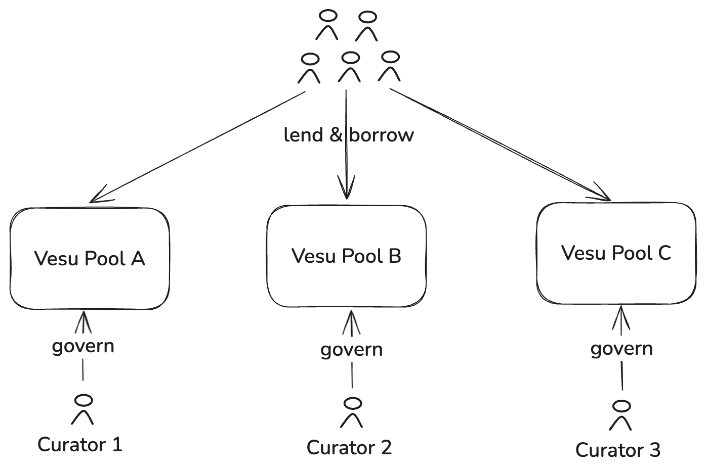

The Vesu lending protocol does not rely on centralized governance but on an open lending pool curation model. Professional, third-party _Curators_ create and manage lending pools as market demand arises. This model removes barriers and creates a market around what is traditionally occupied by an inefficient onchain governance process.

The diagram above shows a hypothetical market structure with three Vesu lending pools governed by three curators. It is important to understand that curators are third parties and have full control over and take full responsibility of the initial set up and continuous management of Vesu lending pools. In general, curators are thus professional entities with long experience and a strong track record in assuming this role across various lending protocols and ecosystems.

## Role of curators

Generally speaking, curators manage Vesu lending pools and ensure efficient and secure lending markets for the users involved. This includes, but is not limited to, the following activities:

- Creation and initial setup of new lending pools
- Monitoring of Vesu market conditions
- Monitoring of external market conditions, eg liquidity on DEXs required for efficient liquidations
- Managing of Vesu risk parameters, eg in response to changing market conditions

## Outside the scope of curator responsibilities

The objective of the open curator model is to empower open, efficient and secure lending markets. At the same time, the role & responsibilities of curators in this model is very limited with the goal to minimize the trust assumptions towards these third parties. In particular, the following activities, a non-exhaustive list, are strictly outside the scope of the responsibilities of curators:

- Custody of user funds
- Management of, investment with or any other form of control over user funds
- Valuation of assets & liabilities, or user positions, in the Vesu lending protocol
- Execution of liquidations

## Curator fees

Curators play an important role in the Vesu lending protocol in order to enable open, efficient and secure lending markets. For this service, curators may take a fee that is defined as a percentage of the interest generated on the assets in a lending pool. This fee can be configured at the sole discretion of the curator itself and is communicated on the Vesu website for all pools.