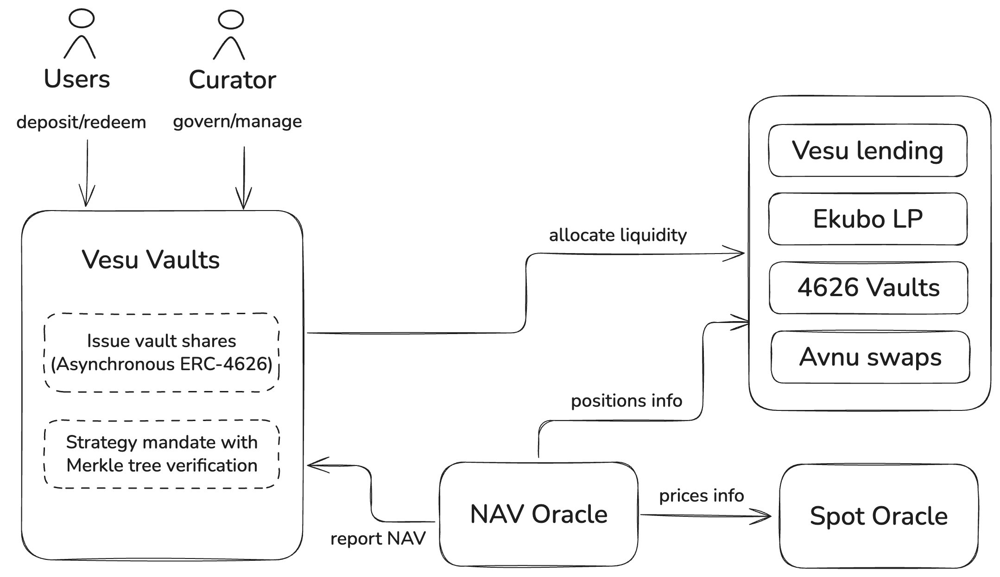

Vesu Vaults offers a new way for users to __earn yield on any asset__. Vaults are automated, trust-minimized DeFi strategies built on top of Vesu lending markets and other Starknet DeFi platforms. Vault curators are able to launch flexible vault strategies through Vesu Vaults, bringing yield to any asset on Starknet.

## What to know

The following key characteristics summarize the main aspects to know about Vesu Vaults:

- Vesu Vaults are launched and operated by professional third-party Curators
- User deposits into a vault are instant
- User withdrawals follow a strategy-specific delay, enabling the strategy to maintain a minimal liquidity buffer
- Configuration of vaults include a specific _strategy mandate_ that is verifiable and enforced onchain
- A vault's _Assets under Management_ (AuM), and vault share price, is informed by a trustless onchain _AuM Oracle_
- Vaults may implement different fees: management fee, performance fee, redemption fee

## Use cases

Vesu Vaults is a flexible vault strategy infrastructure capable of serving a variety of use cases. In particular, Vesu Vaults is designed to enable automated, trust-minimized strategies that generate yield on a particular strategy asset such as _USDC_, _WBTC_ or _ETH_. Examples of such strategies are:

- Diversified _USDC_ yield by lending on different Vesu pools
- _WBTC_ yield by borrowing _USDC_ with _WBTC_ collateral to generate yield on the borrowed _USDC_
- Automated looping of _ETH_ staking yield
- Basis trade strategy
- and much more ...

## How it works

The Vesu Vaults infrastructure is built in a modular way allowing curators to design and launch flexible yield strategies, while ensuring minimal trust assumptions for users. Key to this are the following innovations:

- Vaults are built on top of the [_starknet-vault-kit_](https://github.com/ForgeYields/starknet_vault_kit), an extension to the proven ERC-4626 standard comparable to an _asynchrounous redemption ERC-7540 vault_.
- Onchain enforced _strategy mandate_, that is the funds deposited in a strategy can only be used according to the vault's stated strategy.
- Onchain _AuM Oracle_ that trustlessly computes and reports the vault's _Assets under Management_.
- Supports yield strategies integrating with Vesu for lending and borrowing, Avnu for swapping, and arbitrary third-party ERC-4626 vaults.

## Curator model

In the spirit of Vesu's open and permissionless market model, Vesu Vaults adopts the same open curator model. Vault strategies can be launched by anyone using Vesu's flexible and secure vault infrastructure. Vault curators are professional third-parties and their responsibilities includes, but are not limited to, the following:

- Careful design and backtesting of yield strategies
- Creation and initial setup of new yield strategies
- Ongoing management of the yield strategy, eg rebalancing across different yield sources
- Ongoing management of the strategy's liquidity buffer to honor users' redemptions
- Monitoring of market conditions and risk management

Opening the Vesu Vaults infrastructure to third-party curators creates a healthy market around yield strategies resulting in diversity and efficiency for users.

## Security

As with all of the Vesu infrastructure we put a strong focus on the security of Vesu Vaults. Among other aspects, this involves that 100% of the production smart contract code is audited and covered by a bug bounty. You can learn more about our rigorous security process, our security partners, our audits and other resources in our Security [docs](/docs/security/index.md).