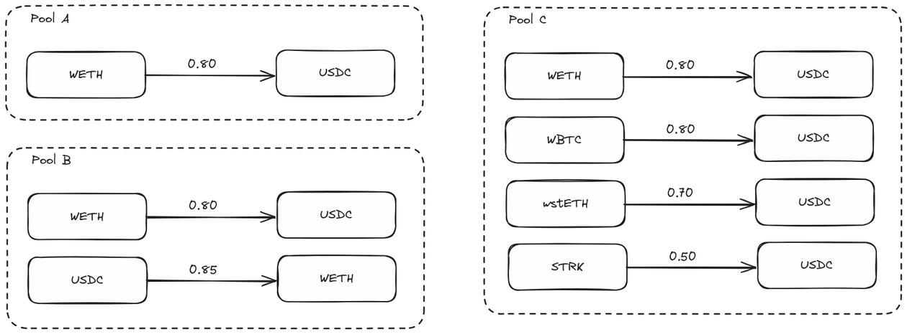

We here explain the basic concepts behind the Vesu lending protocol.

## Liquidity Pooling

Todo

## Overcollateralized Lending

Todo

## Loan-to-Value Ratio

Todo

## Lending Pair

Todo

## Lending Pool

Lending pools are compartmentalized lending facilities where risks are shared among depositors of a certain asset in a pool, but are strictly isolated across one another.

Whilst lending pools can comprise of uni-directional lending pairs, they also support the creation of more complex lending configurations as a composition of various lending pairs.

Lending pools in Vesu are configured in such a way that the assets supplied in a lending pool serve as shared liquidity across all associated lending pairs, allowing for maximal capital efficiency. At the same time, this liquidity is not accessible to other Lending markets, thereby compartmentalizing risks across pools.

The diagram above, depicts a variety of lending market containing different lending pair configurations from simple uni-directional lending pairs (pool A), to reverse lending pairs (pool B) and even multi-collaterized lending pairs (pool C).

## Position

Todo

## Lend APY

Todo

## Borrow APR

Todo

## Liquidation

Todo