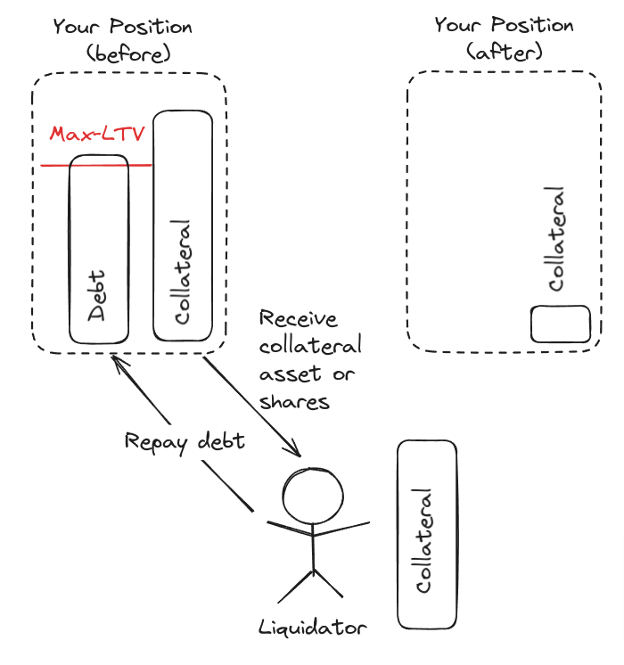
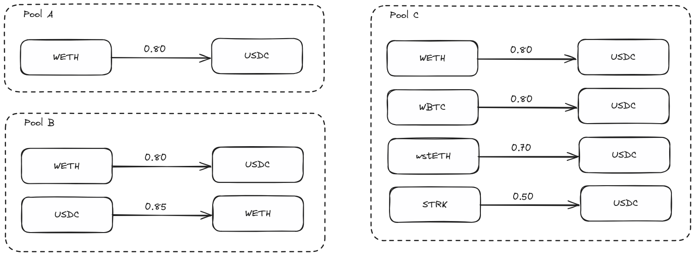
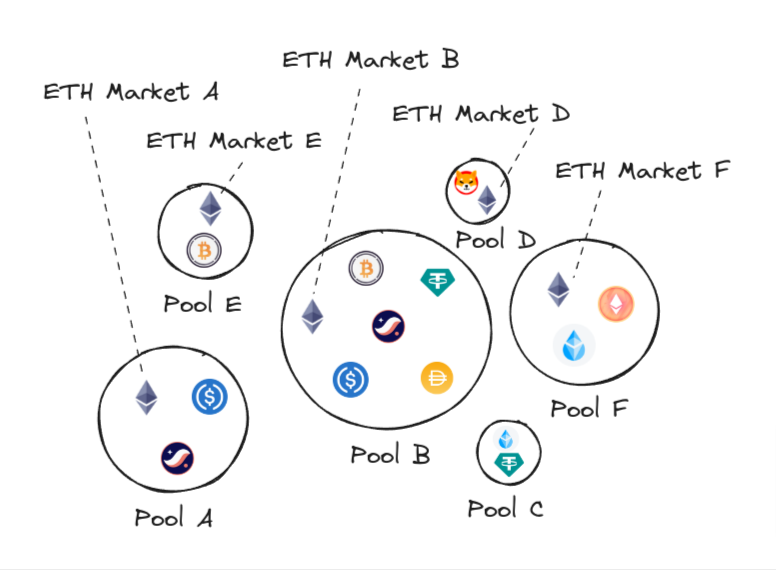
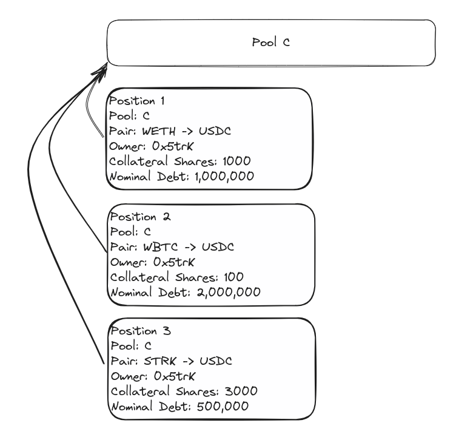

### Summary

Vesu is a fully open and permissionless lending protocol built on [Starknet](https://starknet.io). Users can supply crypto assets (earn), borrow crypto assets and build new lending experiences on Vesu without relying on intermediaries. The Vesu lending protocol is not controlled by a governance body and there exists no governance token. Instead, Vesu is built as a public infrastructure giving everyone equal access to all functions and is free for everyone to use.

### Participants

We consider the following direct participants in the Vesu lending protocol:

- Lender: provides liquidity in certain markets
- Borrower: borrows assets from certain markets
- Liquidator: liquidates insolvent positions
- Pool admin: creates new lending pools as demand arises

:::info
Every Starknet account, without limitation, can participate in Vesu through any of these roles.
:::

### Overcollateralized Lending and Liquidations

The permissionless lending and borrowing on Vesu is achieved through overcollaterized loans. Thereby, borrowers are required to provide crypto assets as collateral to secure their loan and borrowed funds respectively. The Vesu lending protocol ensures that the value of the collateral at any time exceeds the value of the borrowed funds. 

:::warning
Positions violating the *loan-to-value* invariant are are considered *insolvent" and are available for liquidation.
:::

The liquidation process may differ across lending pools but in general involves the sale of the position collateral at a discount in order to recover the position debt. Accordingly, liquidations result in a loss for the position owner who are thus incentivized to ensure position solvency.

### Lending Pools

Lending pools in Vesu are isolated lending facilities where users share the same liquidity and risks. Other than traditional DeFi lending markets, Vesu allows everyone to create new lending pools. Vesu thus enables participants and the braoder market to coordinate around capital allocation instead of designating a central party to fulfill this role.

:::info
Vesu enables permissionless lending pools giving all participant the possibility to create new pools as demand arises.
:::

Vesu lending pools enable a predefined set of assets for lending and borrowing. The liquidity supplied by lenders is "pooled", meaning that supplied assets are aggregated and serve as shared liquidity for all borrowers in the same pool. This structure allows for maximal capital efficiency within a lending pool while strictly segregating liquidity across pools. On the other hand, lenders in a pool are exposed to the same risks for instance in terms of potential liquidation shortfalls. It is thus critical for users to understand the risk profiles of individual lending pools and to supply (or borrow) only in pools with risk levels they find acceptable.

:::info
Vesu enables modular lending pools allowing for complex pool structures to be composed of basic *lending pairs*. 
:::

The diagram above, depicts a variety of lending pools containing different lending pair configurations from simple uni-directional lending pairs (pool A), to reverse lending pairs supporting collateral re-hypothecation (pool B) and multi-collaterized lending pairs (pool C).

### Markets

A *market* describes a certain asset deposited and borrowed in a specific lending pool. Lenders supply liquidity to this market which borrowers compete over under the market's terms. The characteristics of a market are primarily defined by the configuration of the respective lending pool. 

For example, the image above highlights different markets for ETH liquidity which can be supplied and borrowed in different pools. Each of those pools exposes its own (risk) characteristics resulting in different supply-demand dynamics across markets.

A list of all active Vesu markets can be found on the [Markets page](https://vesu.xyz/markets).

### Positions

A position reflects a user's assets supplied and borrowed in a certain lending pair. An important difference to the global account model that is applied in other lending markets is that in Vesu positions are not agregated to a gross collateral and debt value. Instead, Vesu maintains positions strictly separate across lending pairs. 

For instance, if a user borrows USDC by supplying ETH, WBTC and STRK as collateral, these are three separate positions with separate *loan-to-value* ratios. As a result, positions can be liquidated independently if one violates the *loan-to-value* invariant and thus have to be managed separately by users.

### Lending Hooks

One of Vesu’s biggest differentiators in the lending space is the concept of lending hooks. Hooks, a term popularized by [Uniswap v4](https://docs.uniswap.org/contracts/v4/overview), are external code segments triggered during various stages of a user interaction. Examples of such hooks are triggers of external code segments before and after a call to supply assets, borrow assets or liquidate a position.

Lending hooks can be implemented by anyone and linked to new Vesu lending pools. These programmable features thus empower developers to use their creativity to launch entirely new lending experiences with Vesu. The flexibility offered by these hooks allows developers to tailor lending pool behaviors to specific needs or market conditions, thereby enhancing the protocol's utility and appeal for all crypto users.

:::warning
The Vesu lending protocol has no control over the implementation and safety of third-party lending hooks. Users should only interact with trusted lending pools or they risk total loss uf funds.
:::

### vTokens

Vesu markets enable the issuance of a yield-bearing token, called the vToken, reflecting the deposited assets and the accrued interest. This token implements the ERC-4626 interfaces, a “tokenized vaults” standard that extends the ERC-20 token standard and has found widespread use in the Ethereum ecosystem. Apart from the ERC-20 transfer-related and metadata interfaces, this standard also enables convenience around wallet integration and overall UX improvements for liquidity suppliers.

Note that vTokens represent a specific market's supplied assets and thus each market issues its own vToken. For example, in the diagram above a vETH token exists potentially for each of the ETH markets A, B, D, E and F. 

Furthermore, the issuance of vTokens is implemented with a lending pool's hooks and is thus not part of the standard logic. This enables developers to further innovate and unlock even more UX improvements in the future.

### Interest Rates

Interest rates apply a cost to borrowing an asset in a market. The interest rate is paid by borrowers to lenders in order to compensate those for supplying liquidity in a market. The model governing the interest rate is implemented with a lending pool's *lending hooks* and can thus differ across markets. However, in general the interest rate adjusts with the demand for the market's liquidity and should thus express the market's equilibrium borrow cost.

### Price Oracle

Vesu relies on an (external) price feed, the *price oracle*, for the valuation of a position's collateral and debt. Therefore, Vesu's lending hooks enable to integrate with any third-party or special purpose Oracle system on a pool-by-pool basis. 

In a first implementation, the factory extension utilizes the [Pragma](https://www.pragmaoracle.com/) oracle system, which offers robust price feeds for a variety of assets on Starknet. Pragma's innovative design allows the factory extension to derive high-quality asset prices and implement advanced sanity checks using additional contextual data such as the number of active price sources.

While this first implementation offers highly robust and (fail-) safe prices feeds it should be noted that this can be adjusted by anyone to serve other use cases or integrate with a different oracle provider for future pools.

### Loan-to-Value

The *loan-to-value* is a financial metric used to express the ratio of a loan's (USD-) value to the value of the supplied collateral. 

The *loan-to-value* is a crucial factor in assessing the risk of a loan. A higher *loan-to-value* indicates a higher risk for the lenders, as it means the loan is a larger portion of the collateral value and vice versa.

In Vesu, for each lending pair in a pool a specific *maximal loan-to-value* threshold is defined at which a position in violation, that is with a *loan-to-value* larger than the threshold, can be liquidated.

### Lend APY

The Lend APY refers to the annual percentage yield, that is the annualized yield assuming compounding of the (per-second) interest rate, accrued to the lenders from supplying liquidity in a market.

### Borrow APR

The Borrow APR refers to the simple annual percentage interest rate, without compounding, that borrowers pay for burrowing liquidity in a market.