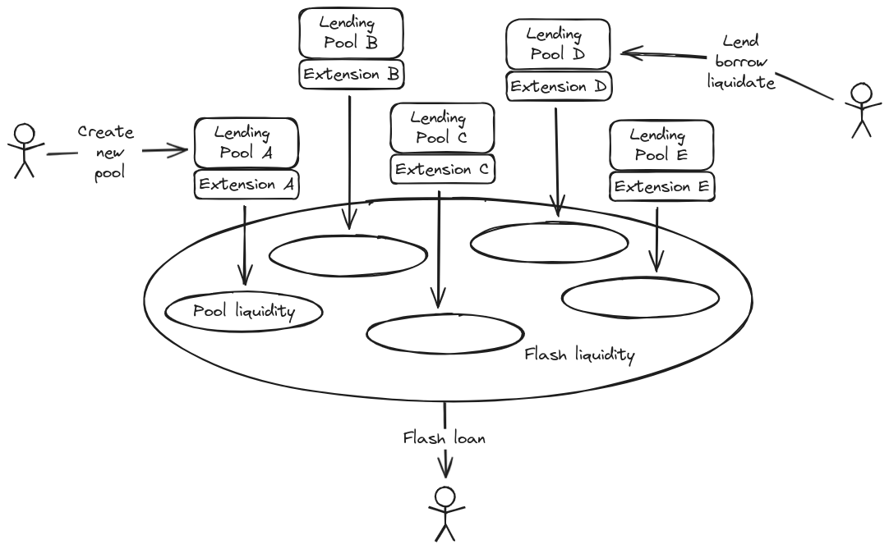
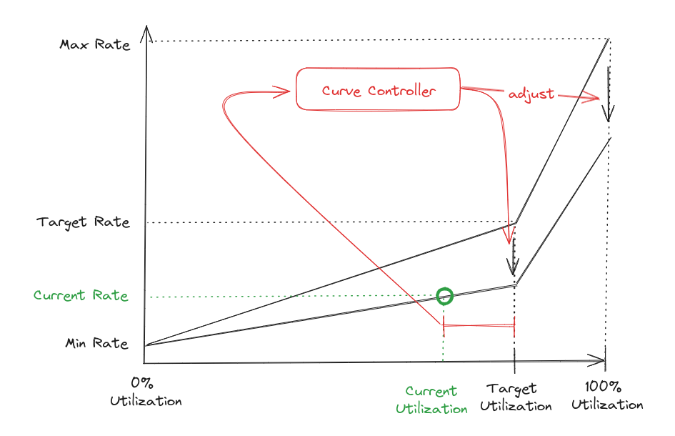

## Summary

Vesu is a novel fully open and permissionless DeFi lending protocol. At its core, Vesu builds on the pooled liquidity model on which DeFi and its most successful lending protocols run, but in a fully permission-less and immutable manner. Instead of an inefficient and vulnerable governance process, Vesu allows the market to create new lending pools and find an equilibrium state around liquidity distribution. Vesu achieves this with features like an adaptive interest rate model, lending pool fail-safe mechanisms, and most importantly, pool extensions. The latter allows developers to innovate new lending pool features and build their own borrower and lender experiences on top of Vesu. In short, Vesu aspires to be the credibly neutral lending settlement layer that DeFi deserves.

## 1. Introduction

The Decentralized Finance (DeFi) movement has shown that traditional financial services can be delivered as trust-minimized software via open blockchain networks. Uniswap is the most prominent example of such a public infrastructure, giving uninterrupted 24/7 global access to its asset exchange protocol on top of Ethereum. The key to this unmatched service offering is that Uniswap is an autonomous system that delegates asset custody, order matching and trade settlement to a set of immutable programs that are running on a decentralized settlement layer. It highlights DeFi’s key value proposition: the removal of individual intermediaries and the frictions and risks they introduce.

While DEXs have pioneered wholly trustless public financial infrastructure, other DeFi areas have developed in a different direction. Specifically, DeFi lending markets have adopted a model where only parts of the service are delegated to autonomous (and only sometimes immutable) programs while other parts are actively managed by an intermediary. So while assets deposited into such protocols are typically held in an immutable program with the depositor retaining control, the actual risk parameters of the lending market are controlled by one or several entities (e.g. foundations, service providers, token holder communities). By re-introducing intermediation, however, this status quo has re-introduced critical vulnerabilities at both a technical and political level. Not only can one find various governance-related exploits boasting losses in the hundreds of millions of USD among the Top 10 Rekt [leaderboard](https://rekt.news/leaderboard/), but one can also identify multiple instances where legal and regulatory pressure undermined the unstoppable delivery of protocol services. Ultimately, such designs limits the extent to which a lending protocol can scale.

We present Vesu in light of these observations and the critical role lending markets play within the broader crypto economy. Vesu is a lending protocol that takes the existing pooled liquidity model common across DeFi but minimizes the role of permissioned governance. Instead, Vesu empowers anyone to create new lending pools and thus allows the market, instead of an inefficient and opinionated intermediary, to build consensus on where liquidity is needed. This composability supports a spectrum of market types ranging from basic single-pair lending to multi-collateral money markets. Moreover, its composable approach ensures for a simple yet robust approach to risk assessment. This combination of scale and security enables Vesu to offer unmatched efficiency.

## 2. Overview

Vesu is an on-chain lending protocol that allows users to engage in fully trustless, over-collateralized lending agreements. The lending protocol is built with three main user persona in mind:

- _Lending market participants_ (**User**),
- _Lending market creators_ (**Developer**),
- _Flash loan users_ (**Flashloaner**).

Users are regular lenders, borrowers or liquidators in over-collateralized lending markets and generally seek the best lending terms or monitor protocols for liquidation opportunities. Vesu offers these users an [Aave-like](https://aave.com/) lending experience where liquidity is pooled in lending markets that allow for the lending and borrowing of a specified set of assets at certain terms. Unlike Aave, however, Vesu does not delegate any control over these markets and their parameters to an external governance process, instead remaining fully immutable. Thus, all market parameters are either dynamically adjusted by market conditions through some autonomous control mechanism or they are fixed.

Further in contrast to Aave, Vesu supports multiple lending pool configurations which can be deployed by anyone on-the-fly and customized through [Uniswap v4-like](https://docs.uniswap.org/contracts/v4/overview) hooks or extensions. This can be taken advantage of by Developers seeking out a neutral lending layer on which to build innovative new lending experiences. This makes Vesu just as much a lending protocol as it is a platform for launching lending protocols.

Lastly, while liquidity is pooled in isolated lending pools, aggregate protocol liquidity across all pools is shared and accessible for Flashloaners at zero fees.

## 3. Design Principles

Vesu reflects the learnings and shortcomings of incumbent DeFi lending protocols to date.

**Principle 1: Monolithic**

Liquidity is managed in a monolithic smart contract allowing for maximal capital efficiency and coordination. Vesu’s monolithic architecture pools liquidity at multiple layers, making it possible for flash loans to originate protocol-wide while borrowing is constrained to individual pools.

**Principle 2: Isolated**

Lending pools are compartmentalized lending facilities where risks are shared among depositors (of a certain asset) in a pool but are strictly isolated across one another.

**Principle 3: Permissionless**

All aspects of the lending protocol, including the creation of new lending pools, are 100% permissionless, allowing the _free market_ to coordinate around capital allocation instead of a central governance unit.

**Principle 4: Federated Governance**

No central governance unit is in control of any aspect of the protocol. Instead, governance is delegated to pool creators allowing for different governance models to be implemented per pool and the _free market_ to coordinate around these.

**Objective 5: Extensibility**

Lending pools can be extended with custom features empowering developers to innovate new market designs without having to forgo Vesu’s network effects.

**Objective 6: Simplicity**

All design and implementation decisions are based on the principle of simplicity over complexity in order to maximize security of the code base.

## 4. Concepts

The aforementioned principles inform the modular framework of the Vesu protocol. We discuss its key concepts in more detail below.

### 4.1. Lending Pair

A lending pair is the most basic lending primitive from which more complex arrangements can be composed. A lending pair is a uni-directional lending agreement allowing Users to deposit a specific _collateral asset_ and borrow a specific _debt asset_ whereby a certain _loan-to-value ratio_ is enforced by means of liquidations. It is important to understand the uni-directional nature of a lending pair which supports only the depositing but not the borrowing of the collateral asset and vice versa.

The diagram exhibits an example lending pair that accepts ETH (Ether) as collateral asset and allows borrowing of USDC (USD Coin) at a maximal loan-to-value ratio of 80%.

Due to the immutable nature of the Vesu lending protocol, lending pairs can only be configured when a new lending pool is created. Updating this configuration at a later point is not possible. This gives Users absolute certainty on the lending terms of a pair and mitigates critical vulnerabilities.

### 4.2. Lending Pool

Lending pools support the creation of more complex lending configurations as a composition of various lending pairs. Thereby, assets supplied in a lending pool serve as shared liquidity across all associated lending pairs to allow for maximal capital efficiency. At the same time, this liquidity is not accessible by other lending pools, thus compartmentalizing risks across pools. In other words, **liquidity and risks are shared** only among the lenders in a lending pool, not to those outside of it. One can easily see that this modular approach allows for the configuration of a divers set of lending arrangements.

The diagram above depicts a variety of lending pool configurations highlighting Vesu’s modular design.

- Pool A (upper left) demonstrates the most basic pool configuration with only a single lending pair allowing for the borrowing of USDC against WETH collateral at a maximal loan-to-value ratio of 80%.
- By adding the reverse lending pair, Pool B shows a bi-directional pool configuration where both collateral assets serve as both debt and collateral assets. Note that this configuration effectively reflects the traditional financial practice of rehypothecation in which collateral assets are re-used to increase capital efficiency. This practices introduces new risks within so-called collateral chains, leading to other protocols offering users the ability to preclude their collateral from being used as such. While Vesu lending pools do not offer this optionality to individual borrowers inherently, the concept of uni-directional lending pairs allows for more granular control over how collateral rehypothecation is enabled on the pool level (e.g. which collateral can be used to borrow a rehypothecated asset).
- Finally, Pool C shows yet another configuration which supports borrowing USDC with various collateral assets. Note that each lending pair defines a fixed, collateral specific maximal loan-to-value ratio which is critical for enabling both capital efficiency and liquidation safety.

### 4.3. Position

Deposits and debt are tracked with positions. A single position keeps track of the collateral assets supplied and debt assets borrowed by the position owner in a specific lending pair or pool respectively. As a result, a User can have only one position per lending pair but multiple positions in a pool. This is different e.g. from Aave where a global (pool) account model is implemented resulting in there being only a single “position” tracked per pool. The reason for tracking positions per lending pair is that Vesu can then enforce a pair-specific loan-to-value ratio and thus account for the pair’s idiosyncratic risk profile. This design decision is further motivated by the principle of _simplicity over complexity_ discussed above and significantly reduces implementation complexity.

The diagram shows a User, Owner: 0x5trK, that owns three positions split across different lending pairs in Pool C, WETH → USDC, WBTC → USDC, STRK → USDC, and with an overall nominal debt outstanding of 3.5M USDC. Note that the positions in fact track _Supply Shares_ and _Nominal Debt_ which are explained in more detail in the following sections.

### 4.4. Collateral Shares

Positions record a User’s supplied assets by means of a Collateral Shares balance. These shares give the position owner a claim on the respective asset’s total balance in the pool. Thereby, an asset’s total balance consists of two parts:

1. the available liquidity reserves, and
2. the total debt outstanding.

Recording shares instead of the supplied asset balance allows a position to directly reflect the effect of lenders earning interest debited to borrowers in a continuously (per second) increasing amount of total debt outstanding. It further allows for the implementation of effective strategies for the redistribution of _bad debt_ accumulated in a liquidation shortfall event among current lenders.

### 4.5. Nominal Debt

Positions further record the nominal debt outstanding in the respective lending pair’s debt asset. In simple terms, this nominal debt can be interpreted as the position’s outstanding debt balance excluding any accumulated interest due. On the other hand, interest accrues at the same rate for all lenders of a specific asset within a specific pool and can thus be tracked separately with a [MakerDAO-like](https://docs.makerdao.com/smart-contract-modules/rates-module) pool _rate accumulator_. The position’s gross debt is then derived by simply multiplying the recorded nominal debt with the pool’s rate accumulator. This efficient accounting technique allows for the _interest collection_ across any number of positions in a pool with O(1) complexity.

### 4.6. Interest Rate Model

Interest rates are an important tool for lending markets to find an equilibrium in supply and demand for a certain asset. Similar to the spot price on an exchange, interest rates express the current price for borrowing the asset. Allowing supply and demand to efficiently discover the equilibrium rate is in fact the main purpose of a lending market. Thus, the interest rate model plays a central role in any lending market design. DeFi lending markets have explored various interest rate model designs from [governance-set rates](https://docs.makerdao.com/smart-contract-modules/rates-module/pot-detailed-documentation#id-4.-gotchas-integration-concerns), to [utilization-based curves](https://docs.aave.com/risk/liquidity-risk/borrow-interest-rate), and to PID-inspired (Proportional-Integral-Derivative) [adaptive designs](https://docs.frax.finance/fraxlend/advanced-concepts/interest-rates). These models all have their pros and cons making the right choice dependent on the use case a lending pool serves. The Vesu lending protocol thus remains agnostic towards the choice of interest rate model but delegates the implementation to a lending pool's extension through the _Interest Rate Accumulator Hook_.

### 4.7. Oracles

Lending protocols determine the solvency of a position as an answer to the following question:

**Is the value of the position’s collateral sufficient to recover its debt in case the borrower cannot repay?**

This solvency can be determined in different ways, with the most common being that an external data feed, the oracle, provides the respective price data points at any point in time. While this is generally understood to be the most efficient design, other approaches exist that usually rely on an internal price discovery mechanism. Vesu delegates this responsibility to a lending pool’s extension through the _Price Hook_.

That said, when designing and implementing an oracle solution it is important to take into account the immutable nature of lending pools and to implement appropriate fail-safes such that user funds are not stuck in a pool due to, for example, a stale oracle price feed. In fact, different mitigation strategies exist, such as a fallback oracle. Since the appropriate strategy depends on the oracle design itself, Vesu does not enforce a specific solution but assumes this to be implemented in the extension. As a result, Vesu remains fully agnostic towards the oracle implementation and is able to embrace further innovation in this area.

### 4.8. Pool Extension

Vesu introduces the concept of lending pool extensions, or simply extensions, that allow developers to customize pool features and innovate entirely new lending experiences. An extension is a separate program that can be invoked through [Uniswap v4-like](https://docs.uniswap.org/contracts/v4/overview) _hooks_ called from the Vesu lending protocol upon certain user actions. In the following paragraphs we discuss the various extension hooks.

**Interest Rate Accumulator Hook**

It is called prior to every position change and effectively asks the extension to compute and collect interest on all positions. As noted earlier, the implementation of the interest rate model is entirely delegated to the extension. In general, however, the approach of computing and collecting interest can be divided in the following steps:

1. Compute liquidity utilization of the respective asset,
2. Compute the interest rate as a function of liquidity utilization,
3. Accrue interest according to the interest rate by updating a (global) _rate accumulator_.

Based on this rate accumulator, Vesu then evaluates the gross debt outstanding at both the position and global levels. By delegating the implementation of the interest rate model to a lending pool’s extension, developers are able to further innovate and adopt state-of-the art interest rate models for future lending pools.

**Oracle Price Hook**

It is called to fetch the current price of either a supply or debt asset in order to verify the solvency of a position. The implementation of the oracle price feeds is thus also delegated to an extension, making the Vesu lending protocol agnostic towards the oracle provider itself. Given the important function of the oracle price feed in any over-collateralized lending protocol, it goes without saying that this extension critically alters a lending pool’s risk profile.

**Modify Position Hook**

It is called with every position update and allows for the execution of custom logic in the extension. This allows for the introduction of new pool features in the extension such as:

- deposit tokenization
- position rebalancing
- pool pausing
- p2p lender and borrower matching
- etc.

**Liquidate Position Hook**

It is called with every liquidation of an insolvent position with the expectation that the extension implements the logic for computing and returning the liquidation amounts. Thereby, the lending protocol is agnostic to the details of the liquidation strategy, like support for partial liquidations or dynamic liquidator incentives. Moreover, apart from computing the regular debt-in and collateral-out amounts, the extension may also return a liquidation shortfall (aka bad debt) which is then instantly redistributed among existing asset suppliers.

## 5. Actions

Below, we briefly discuss the different ways Users can interact with Vesu, its lending pools and their positions. Technically speaking, the following sections outline all public, state-changing functions (i.e. permissionless features) that Vesu exposes.

**Create Pool**

Allows for the creation of new lending pools. The caller specifies the lending pair configurations and extension with which the new lending pool should be created. Once created the lending pool parameters cannot be changed anymore.

**Modify Position**

Allows for the creation and updating of positions. In other words, through this feature Users are able to supply and borrow assets to and from a certain lending pool.

**Transfer Position**

Allows for internal transfers of supply and debt assets across different lending pairs and pools. Thereby, the transfer only updates the internal accounting of the position owner’s balances but does not invoke transfers on the respective token contracts.

**Liquidate Position**

Allows for the liquidation of insolvent positions. Thereby, the actual liquidation strategy is implemented in the lending pool’s extension and can thus differ between different pools. Note that details on the liquidation strategy implemented in the _Factory Extension_ can be found in Section 3.8.

**Flash Loan**

Allows for taking Flash Loans which are characterized as unsecured loans that have to be repaid in the same transaction in which have been initiated. Note that Flash Loans are risk neutral from the perspective of the Vesu lending protocol since the entire transaction reverts if this requirement is not met. As a result, Flashlenders are able to access the full liquidity reserves available in the protocol across all lending pools.

**Donate**

Allows for the donation of supply assets to a lending pair without receiving supply shares in exchange. The Donate action can thus be used for setting up native reward programs targeting specific lending pools or pairs, as well as supply assets.

**Modify Delegation**

Allows for updating delegation permissions on a specific lending pool. A delegation grants a third party permission over a User’s positions in a certain pool and can only be defined and changed by the position owner.

## 6. Factory Extension {#6-factory-extension}

While developers are free to design their own extensions by implementing the various hooks discussed above, we have created a first extension, the _factory extension_, with the goal of showcasing the power of this novel concept and allowing non-developers to deploy first pools. Here we discuss the specific design of this factory extension.

### 6.1. Adaptive Interest Rate Model

As mentioned before, a variety of interest rate model designs has been proposed and used in DeFi lending markets. In the spirit of empowering _free markets_ to coordinate around capital allocation the factory extension implements a fully autonomous, adaptive interest rate model that was originally proposed by [Fraxlend](https://docs.frax.finance/fraxlend/advanced-concepts/interest-rates). This model consists of two main parts:

1. a utilization-based interest rate curve, and
2. a controller adjusting the interest rate curve in response to market imbalances.

This design choice is motivated by the model’s simplicity, in light of our simplicity over complexity principle, and its existing track record, as the controller has been successfully used in Fraxlend for over a year now.

The diagram above shows the high-level concept of the adaptive interest rate model implemented in the factory extension. As can be seen, the curve controller adjusts the max interest rate and target rate based on a time-weighted distance of the (current) utilization from the target utilization. The current interest rate is then found on this adjusted curve using the current utilization.

### 6.2. Pragma Oracle Implementation

As discussed above, Vesu delegates the implementation of oracle price feeds to a lending pool’s extension. The factory extension thus integrates with the [Pragma oracle](https://www.pragmaoracle.com/) which offers robust price feeds for a variety of assets on Starknet. Pragma leverages a network of price providers and a variety of on-chain and off-chain price sources. Pragma's innovative design consists of pushing individual price data points to an on-chain contract and applying different statistical operators such as the _average_, _median_ or _variance_. Additional contextual data is also available, such as the number of active data providers and the timestamp of the latest data point. This unique design gives developers more control over how price feeds are consumed and allows for more resilient oracle integrations.

The factory extension makes use of these powerfull features in two ways:

1. Compute a robust oracle price from all data points using the Median aggregator, and
2. Use contextual data for advanced sanity checks and oracle fail-safes.

For the second point, the extension utilizes an oracle trust score that consists of two data points: first, the number of active data providers, and secondly the timeliness of data points or the timestamp of the latest data point respectively. Based on this score, oracle prices are accepted by the extension or, if not trustworthy, the lending pool enters an _Emergency Shutdown_ mode (read more below). Thereby, the factory extension implements an effective and autonomous fail-safe strategy mitigating oracle manipulation and staleness risks.

### 6.3. Partial Liquidation Strategy

The factory extension implements a very simple yet robust liquidation strategy that allows for _full_ or _partial liquidations_ of insolvent positions. This means that for any insolvent position, a liquidator may purchase all or parts of the position’s collateral assets by repaying a respective amount of its debt at a discounted price. Thereby, this _liquidation discount_ is a fixed percentage.

Partial liquidations are an effective device ensuring that large insolvent positions can be liquidated part by part in case insufficient liquidity results in excessive price impact for a collateral or debt asset.

This simple liquidation strategy is chosen as it offers a sensible tradeoff between code simplicity and borrower convenience.

### 6.4. Liquidation Shortfall Redistribution

Liquidation shortfall, also referred to as bad debt, accumulates in a lending pool if a liquidation fails to recover the full amount of outstanding debt by selling all of the position’s collateral.

Similar to bank runs, the perceived risk of bad debt, without bad debt actually having accumulated, can already lead to runs on the remaining liquidity in a pool. An effective way to mitigate the risk of runs on a pool’s liquidity that has been implemented in various DeFi contexts such as Yearn vaults [5] is to socialize a shortfall as it accrues among the pool’s liquidity suppliers.

The factory extension implements a similar strategy in order to mitigate the risk of liquidity runs. Thereby, the accrued shortfall is allocated to liquidity suppliers in proportion to their ownership in the respective supply shares (see Section XX) in the same transaction as the shortfall occurs. This redistribution scheme thus immediately reflects in a proportional reduction of a User’s claim on the remaining total supplied assets.

### 6.5. Pool Emergency Shutdown

The factory extension introduces an orderly lending pool shutdown mechanism with the following objectives:

1. limit the risk for losses to accumulate in a pool, and
2. prevent race conditions and a subsequent _bank run_.

An orderly pool shutdown mechanism is specifically important for an immutable protocol like the one proposed in this paper as no governance is able to step in and pause or dissolve failed pools manually.

The shutdown mechanism considered here centers around the idea that similar to individual positions, pool safety can be expressed by the aggregate pool solvency. The extension thus autonomously _pauses_ and eventually _shuts down_ the pool if any of the pool’s lending pairs falls into insolvency. Thereby, pair insolvency is defined as a pool state where any of the pool’s lending pairs violates the insolvency invariant, which is that the pair’s total debt value divided by the total collateral value cannot exceed a certain threshold.

Insolvent lending pools then implicitly fall into _pause_ mode which means that interactions with the pool are only allowed if they improve the pool’s solvency. This means that only asset deposits, collateral deposits, debt repayments or pool donations are supported. This way, the lending pool can recover and establish a solvent pool state during a predefined _recovery period_. If the pool does not recover, it falls into shutdown mode from which no recovery is possible. Instead, lenders and borrowers are required to withdraw their assets along a 3-phased redemption process:

**Phase 1 (Subscription)**: Positions subscribe for redemption eligibility during a predefined _subscription period_. However, in order to successfully subscribe, any outstanding debt balance needs to be repaid beforehand.

**Phase 2 (Redemption)**: Eligible positions may redeem their collateral shares for a proportional amount of collateral assets during a predefined _redemption period_.

**Phase 3 (Collection)**: In this final phase, all successful redeemers are able to collect a proportional share of any unclaimed residual collateral amount.

To summarize, the pool shutdown mechanism pauses insolvent pools and allows lenders and borrowers to only deposit assets in, but not withdraw from the paused pool. This allows paused pools to recover during a predefined recovery period. However, non-recovered pools are dissolved automatically by enabling lenders and borrowers to redeem their assets in an orderly manner.

## 7. Risk Framework

The fact that the lending pool behavior may be customized with user-defined extensions introduces new risks for Users in a pool. These risks include technical failures, or bugs, flaws in the economic models implemented or intentionally malicious features built in by the extension developers. Following our design principles, we do not intend to prevent extension developers to introduce such flaws as this would require some form of (on-chain) governance. Instead we advocate for trusted access points for users which analyze pool extensions, curate pools with a risk profile that is compliant with the targeted user group’s risk capacity and transparently disclose risks to their users. In fact, we have developed a risk framework that reports lending pool risks along a number of dimensions including extension risks.
