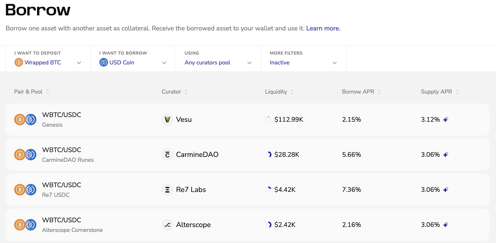
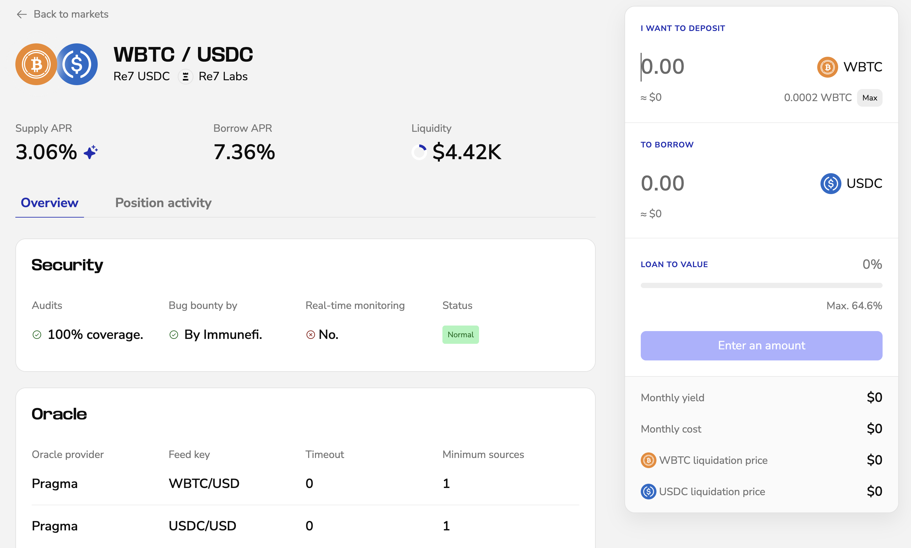
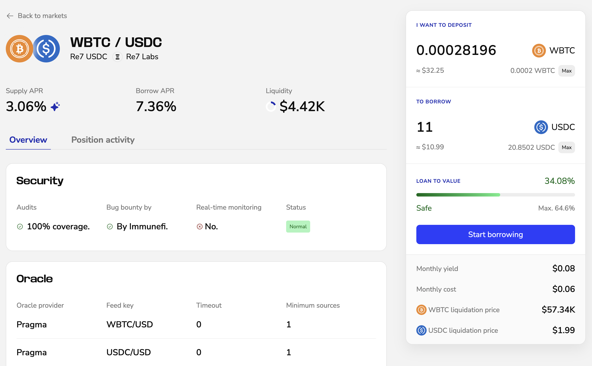

Borrow one token using another as collateral. This guide explains how to open and close a borrow position using the Pro interface on Vesu.

Vesu also offers a [LITE](./lite-mode.md) and a [BTCFI](./btcfi-mode.md) mode, designed for users who want a more guided borrowing experience with curated default markets.

## Opening a Position

1. Open [vesu.xyz/pro/borrow](https://vesu.xyz/pro/borrow) to see available markets. Select your collateral and borrow asset. 
You can also filter by curator, pool, or show only tokens in your wallet. Click on a market to view details or start borrowing.

2. Review the market details.
You’ll see current rates, available liquidity, audit coverage, oracle settings, liquidation thresholds, and how utilization affects rates.  

3. Enter the amounts for your collateral and borrow. 
Review the expected yield, costs, and liquidation price. Choose a loan-to-value you’re comfortable with. 
See the [Glossary](../explore/glossary.md#positions) for definitions and formulas.

4. Click **Start borrowing** and confirm in your wallet. 
Once confirmed, your position appears in your overview with the borrowed amount and collateral balance.

## Closing a Position
To close a borrow position, you first need to have the borrowed asset in your wallet to repay the debt. You will also need to pay the borrow costs for the debt. Make sure you got enough in your wallet to repay.

1. Click the button showing your connected wallet in the top-right corner.
This opens the side navigation with your open positions. Select the position you want to close. 

2. Click **Close** and confirm in your wallet to repay your debt.  
3. Once confirmed, you receive your collateral back to your wallet.

